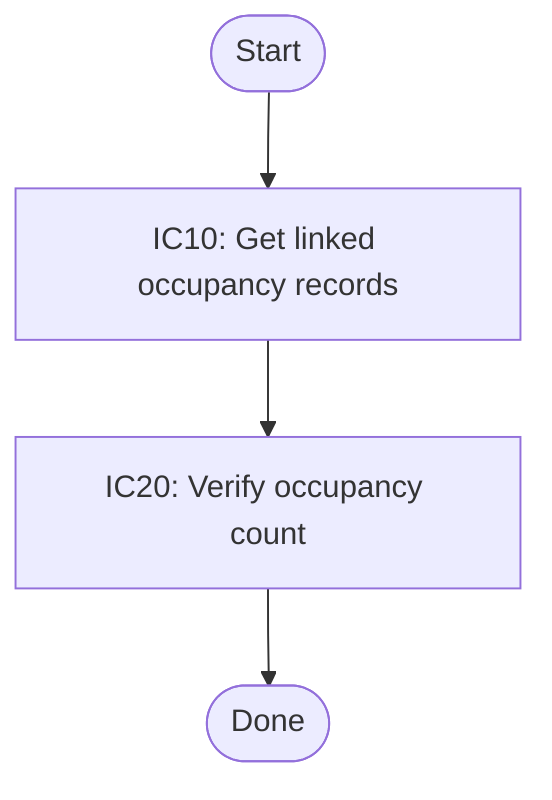

# Core API

const validations = createAsyncFlow('IC10', async ({ form }) => ({ occupancyCount: form.occupantCount }), { description: 'Get linked occupancy records' })

const result = await validations.run({form: {id: '200', occupantCount: 2, requiresManualReview: false}})

# Resolver Flow

createSyncFlow({ resolver }).step(stepInfo) resolves id, description, and an optional default step function from the step info object.

## Core API

Basic async validation flow with a fixed input ctx.

<!-- structured-process-demo:core-api-flow-html:html-table:start -->
<table style="width:100%;border-collapse:collapse;font-size:13px;"><thead><tr><th style="text-align:left;padding:8px;border-bottom:1px solid #d0d7de;width:32%;">Step</th><th style="text-align:left;padding:8px;border-bottom:1px solid #d0d7de;">Branches</th></tr></thead><tbody><tr>
<td style="padding:10px;border-bottom:1px solid #d0d7de;vertical-align:top;width:32%;">
<strong>IC10</strong>

IC10

Get linked occupancy records
</td>
<td style="padding:10px;border-bottom:1px solid #d0d7de;vertical-align:top;">
-
</td>
</tr><tr>
<td style="padding:10px;border-bottom:1px solid #d0d7de;vertical-align:top;width:32%;">
<strong>IC20</strong>

IC20

Verify occupancy count
</td>
<td style="padding:10px;border-bottom:1px solid #d0d7de;vertical-align:top;">
-
</td>
</tr></tbody></table>
<!-- structured-process-demo:core-api-flow-html:html-table:end -->

<!-- structured-process-demo:core-api-static-graph:mermaid:start -->

<!-- structured-process-demo:core-api-static-graph:mermaid:end -->

## Resolver-based flow

Flow created with resolver so step ids carry their own description and optional step fn.

<!-- structured-process-demo:resolver-flow-flow-html:html-table:start -->
<table style="width:100%;border-collapse:collapse;font-size:13px;"><thead><tr><th style="text-align:left;padding:8px;border-bottom:1px solid #d0d7de;width:32%;">Step</th><th style="text-align:left;padding:8px;border-bottom:1px solid #d0d7de;">Branches</th></tr></thead><tbody><tr>
<td style="padding:10px;border-bottom:1px solid #d0d7de;vertical-align:top;width:32%;">
<strong>VALIDATE-1</strong>

VALIDATE-1

Validate request
</td>
<td style="padding:10px;border-bottom:1px solid #d0d7de;vertical-align:top;">
-
</td>
</tr><tr>
<td style="padding:10px;border-bottom:1px solid #d0d7de;vertical-align:top;width:32%;">
<strong>REVIEW-1</strong>

REVIEW-1

Route review
</td>
<td style="padding:10px;border-bottom:1px solid #d0d7de;vertical-align:top;">

<strong>auto</strong>

<table style="width:100%;border-collapse:collapse;font-size:13px;"><thead><tr><th style="text-align:left;padding:8px;border-bottom:1px solid #d0d7de;width:32%;">Step</th><th style="text-align:left;padding:8px;border-bottom:1px solid #d0d7de;">Branches</th></tr></thead><tbody><tr>
<td style="padding:10px;border-bottom:1px solid #d0d7de;vertical-align:top;width:32%;">
<strong>AUTO-1</strong>

AUTO-1

Auto approve
</td>
<td style="padding:10px;border-bottom:1px solid #d0d7de;vertical-align:top;">
-
</td>
</tr></tbody></table>

<strong>manual</strong>

<table style="width:100%;border-collapse:collapse;font-size:13px;"><thead><tr><th style="text-align:left;padding:8px;border-bottom:1px solid #d0d7de;width:32%;">Step</th><th style="text-align:left;padding:8px;border-bottom:1px solid #d0d7de;">Branches</th></tr></thead><tbody><tr>
<td style="padding:10px;border-bottom:1px solid #d0d7de;vertical-align:top;width:32%;">
<strong>MANUAL-1</strong>

MANUAL-1

Send to manual review
</td>
<td style="padding:10px;border-bottom:1px solid #d0d7de;vertical-align:top;">
-
</td>
</tr></tbody></table>

</td>
</tr></tbody></table>
<!-- structured-process-demo:resolver-flow-flow-html:html-table:end -->

<!-- structured-process-demo:resolver-flow-static-graph:mermaid:start -->

<!-- structured-process-demo:resolver-flow-static-graph:mermaid:end -->

## Referenced leaf flows

### AUTO-1

Auto approve

**Referenced from**

- Resolver-based flow
<!-- structured-process-demo:auto-1-flow-html:html-table:start -->
<table style="width:100%;border-collapse:collapse;font-size:13px;"><thead><tr><th style="text-align:left;padding:8px;border-bottom:1px solid #d0d7de;width:32%;">Step</th><th style="text-align:left;padding:8px;border-bottom:1px solid #d0d7de;">Branches</th></tr></thead><tbody><tr>
<td style="padding:10px;border-bottom:1px solid #d0d7de;vertical-align:top;width:32%;">
<strong>AUTO-1</strong>

AUTO-1

Auto approve
</td>
<td style="padding:10px;border-bottom:1px solid #d0d7de;vertical-align:top;">
-
</td>
</tr></tbody></table>
<!-- structured-process-demo:auto-1-flow-html:html-table:end -->

### MANUAL-1

Send to manual review

**Referenced from**

- Resolver-based flow
<!-- structured-process-demo:manual-1-flow-html:html-table:start -->
<table style="width:100%;border-collapse:collapse;font-size:13px;"><thead><tr><th style="text-align:left;padding:8px;border-bottom:1px solid #d0d7de;width:32%;">Step</th><th style="text-align:left;padding:8px;border-bottom:1px solid #d0d7de;">Branches</th></tr></thead><tbody><tr>
<td style="padding:10px;border-bottom:1px solid #d0d7de;vertical-align:top;width:32%;">
<strong>MANUAL-1</strong>

MANUAL-1

Send to manual review
</td>
<td style="padding:10px;border-bottom:1px solid #d0d7de;vertical-align:top;">
-
</td>
</tr></tbody></table>
<!-- structured-process-demo:manual-1-flow-html:html-table:end -->
