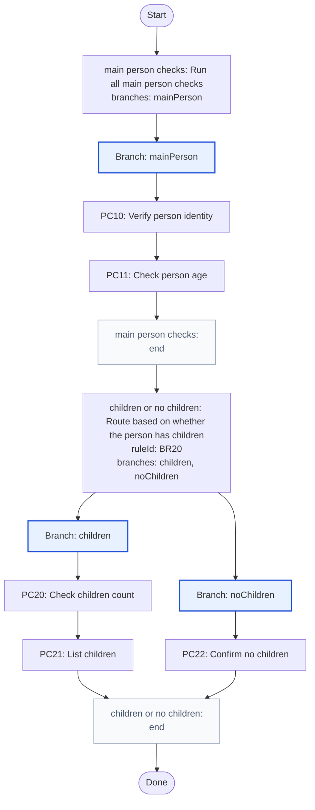
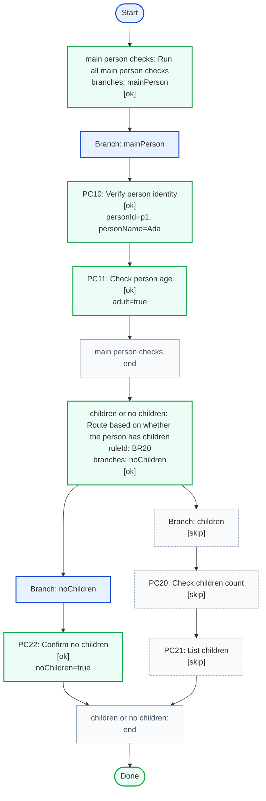
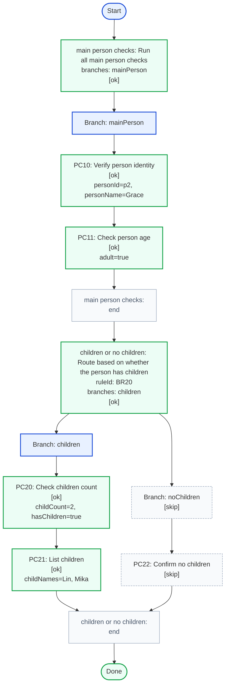
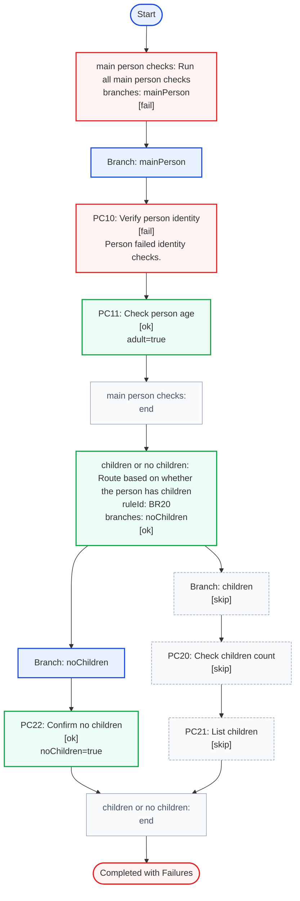
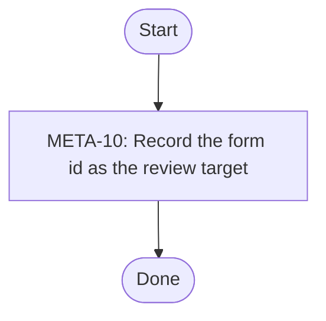
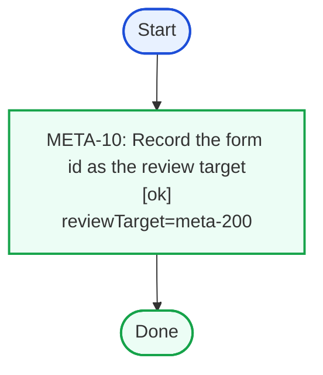
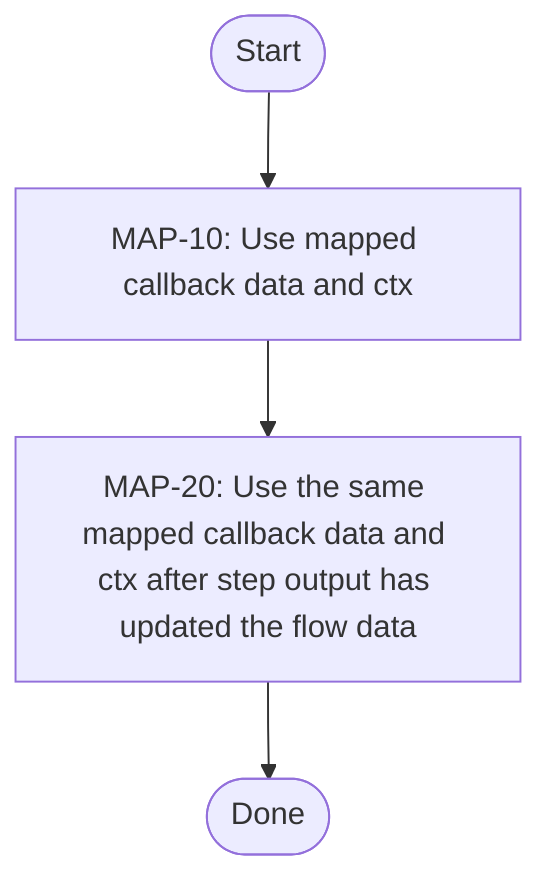
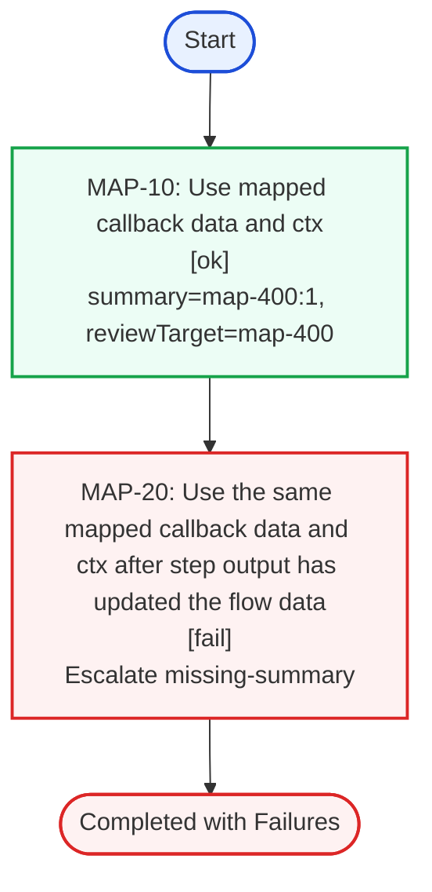
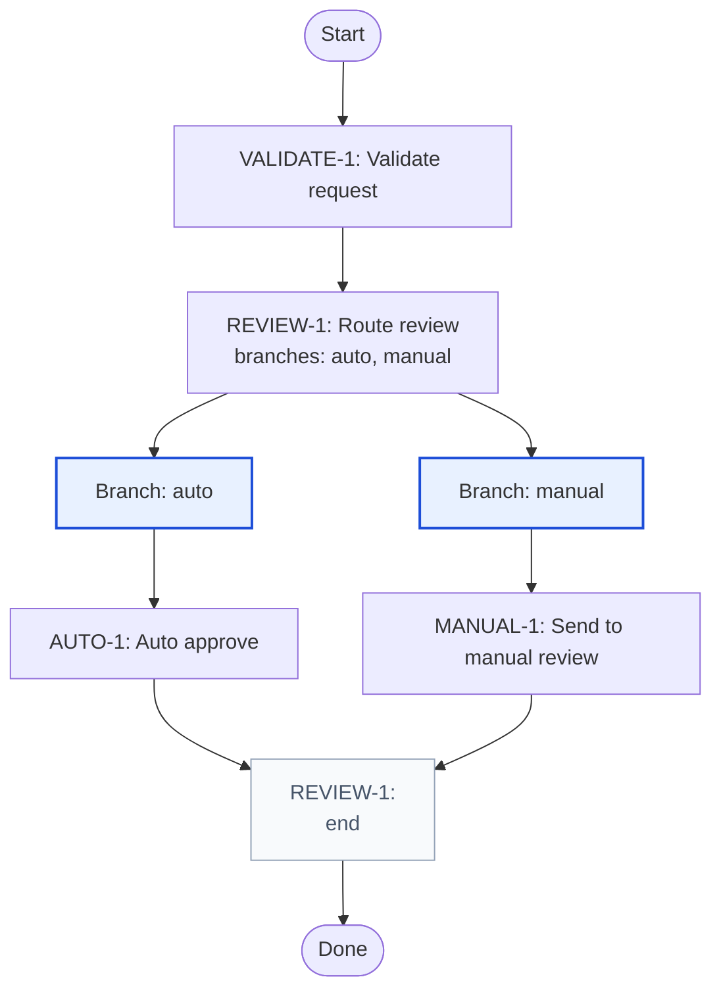
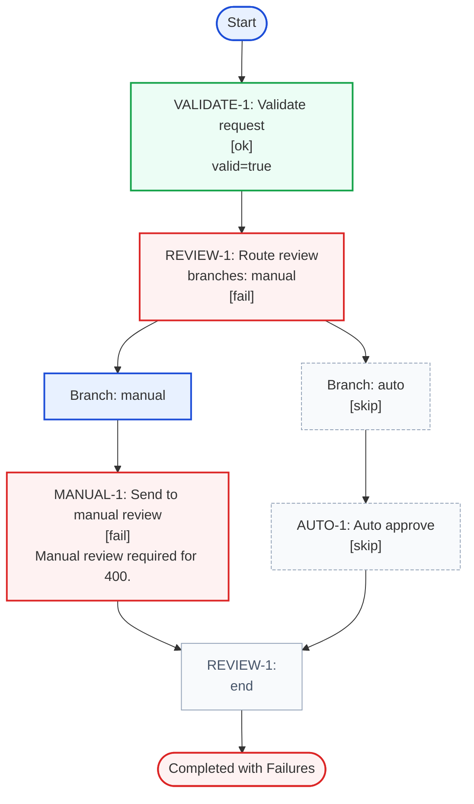

# structured-flow

Model business rules and validation pipelines with typed steps, branches, and execution results.

Structured flow gives you:

- Simple API for modeling complex structures
- Automatically generated documentation and graphs of the validation flow. You get documentation before execution:
  graphs and HTML-tables. And after execution you can render graphs based on logged events
- A way to define a flow of steps with a human-readable API and descriptions
- API that enforces correctness and scales to hundreds of rules
- Ready made tools to visualize and document the flow before and after execution
    - Mermaid graphs: the flow and flow results
    - Markdown HTML tables
- Evidence of processesed rules
- Full type enforcement: types are enforced for rule functions and flows
- Promotes splitting the program code in to smaller functions. Instead of a deep nested validation logic, there's small
  functions that are called by the flow

Contents:

- [Core API](#core-api-flow-html)
  - [No Kids](#core-api-no-kids-full-table)
  - [Two Kids](#core-api-two-kids-full-table)
  - [Missing Name](#core-api-missing-name-full-table)
- [Flow metadata](#flow-metadata-flow-html)
  - [Ok](#flow-metadata-ok-full-table)
- [Context-aware flow](#context-flow-flow-html)
  - [Reviewer](#context-flow-reviewer-full-table)
- [Mapped payload flow](#map-flow-flow-html)
  - [Manual](#map-flow-manual-full-table)
- [Rule helper flow](#rule-flow-flow-html)
  - [Manual](#rule-flow-manual-full-table)
- [PC10](#pc10-flow)
- [PC20](#pc20-flow)
- [PC22](#pc22-flow)
- [AUTO-1](#auto-1-flow)
- [MANUAL-1](#manual-1-flow)

# Core API

## Factory variants

`createSyncFlow()` and `createAsyncFlow()` support a few shapes:

```ts
createSyncFlow<Data>()
createAsyncFlow<Data>()

createSyncFlow(ruleOrFlowOptionsOrCombinedBranchOptions)
createSyncFlow(rule, { ...flowOptions, step: stepOptions })
createSyncFlow(ruleIdOrString, stepFn, { ...flowOptions, step: stepOptions })

createAsyncFlow(ruleOrFlowOptionsOrCombinedBranchOptions)
createAsyncFlow(rule, { ...flowOptions, step: stepOptions })
createAsyncFlow(ruleIdOrString, stepFn, { ...flowOptions, step: stepOptions })
```

Use the empty generic form when your first `step()` should define the flow. Use the config form when you want flow-level
metadata, a flow-level `step.resolver`, or a flow-level `step.map`. Step factories retain their positional forms. Branches use one
object containing flow options at the root and branch options under `branch`. The nested `branch` object contains mandatory
`branches`, optional `init`, and branch options. When a branch is created without `init`, every branch flow runs.

```ts
flow.branch({ branches, init, name: 'selected branch' })
createSyncFlow({
  mapResult,
  branch: { branches, init, name: 'initial branch' },
})
```

In combined factory options, flow metadata and flow-wide `resolver`, `map`, `mapResult`, and `trueIsFail` are root
properties. Direct step options stay under `step`, and direct branch options stay under `branch`.

## Flow options

Flow config currently supports:

- `syncMode: boolean`: selected by `createSyncFlow()` or `createAsyncFlow()`
- `allowContext: boolean`: starts as `false` and becomes `true` after `withContext()`
- `name?: string`: stored on the flow as metadata
- `description?: string`: stored on the flow as metadata
- `step?.resolver?: (stepId) => string | RuleId | { id: string; description?: string }`: maps each step id to its final
  recorded metadata
- `step?.map?: ({ stepInfo, processingState, data, ctx }) => { data, ctx }`: overrides callback data and context
- `step?.mapResult?: ({ stepInfo, processingState, data, ctx, result }) => result`: converts each raw step return before
  normalization
- `step?.trueIsFail?: boolean`: makes boolean validation results use `true → fail` and `false → ok`

These flow-wide step defaults are configured under `step`. A direct step can override `trueIsFail` and `mapResult`.

## Step and branch options

`step()` accepts:

```ts
step(rule, options)

step({
  rule: Rule | RuleId | string
  fn: (data, params) => object | boolean
  init ? : ({stepInfo, processingState, data, ctx}) => {
    data: object
    ctx: unknown
  }
  // other step options
})
```

The object form requires `fn`, including when `rule` is a `Rule`; this makes overriding the function explicit.

Step options are:

```ts
{
  description ? : string
  status ? : {
    fail? : 'ignore' | 'exception'
    exception? : 'fail'
  }
  trueIsFail ? : boolean
  init ? : ({stepInfo, processingState, data, ctx}) => {
    data: object
    ctx: unknown
  }
  mapResult ? : ({stepInfo, processingState, data, ctx, result}) => object | boolean | undefined
}
```

`branch()` accepts:

```ts
{
  branches: Record<PropertyKey, Flow>
  init ? : ({stepInfo, processingState, data, ctx}) => BranchInitResult
  ruleId ? : string | { id: string; description?: string }
  name ? : string
  description ? : string
  path ? : string
  status ? : {
    fail? : 'ignore' | 'exception'
    exception? : 'fail'
  }
}
```

The flow-level `step.map` runs before a direct step `init`. For `branch()`, `name` is display-only. Set `ruleId` only when the
branch wrapper itself should have a public id and be included by `flattenStepResults()` when it fails.

## Runtime behavior

- Step callbacks are invoked as `fn(data, params)`
- Branch initializers are invoked as `init({ stepInfo, processingState, data, ctx })`
- Without step `init`, `params` is `{ ctx }`
- With step `init`, the callback is invoked as `fn(initialized.data, { ctx: initialized.ctx })`
- `withContext<Ctx>()` enables `flow.run(data, ctx)` and types downstream callbacks accordingly
- Async flows await step functions, branch initializers, `init`, `map`, and `mapResult`; sync flows only accept synchronous
  versions of those callbacks
- Plain object returns record `ok` payloads; use `ok()`, `fail()`, `stop()`, `skip()`, or `exception()` for explicit
  statuses
- Boolean returns use `true → ok` and `false → fail` by default; `trueIsFail` reverses that interpretation

Status handling:

- `ok` or omitted: continue and merge returned fields into downstream data
- `fail`: record failure and continue
- `stop`: stop execution and mark remaining steps as `skip`
- `exception`: recorded when a step throws, unless remapped through `status.exception`
- `skip`: record a skipped result

## Result model

`flow.run(...)` returns `FlowResult`.

- `result.status` is the overall flow status
- `result.stepResults` contains recorded `StepResult` entries in execution order
- branch steps include `selectedBranchKeys` only when a selector picks a subset; branches that run every child flow only
  include nested `branches`
- `flattenStepResults()` defaults to failed results; its optional callback receives
  `{ failed, flattenedResult, stepResult }` and can map or filter every flattened step by returning an item or
  `undefined`
- `convertResultNode()` can normalize the result tree
  inspection

# Examples

## Core API Example

This example defines reusable `rule()` helpers, builds a `personChecks` flow from them, and composes that flow into a
larger household flow with branches.

<a id="core-api-code-block"></a>
```ts
type Person = {
  id: string
  name: string
  age: number
}

type CoreApiData = {
  person: Person
  children: Person[]
}

const PC10verifyPerson = rule(
  'PC10',
  ({ person }: CoreApiData) =>
    person.name.trim().length > 0
      ? { personId: person.id, personName: person.name }
      : fail({
          message: 'Person is invalid.',
          variables: { info: 'Person failed identity checks.' },
        }).addResult(
          ruleId('PC10.name', { description: 'Check person name' }),
          fail({
            path: 'name',
            message: 'Person name is required.',
            variables: { info: 'Person name is required.' },
          })
        ),
  { description: 'Verify person identity' }
)

const PC20checkChildrenCount = rule(
  'PC20',
  ({ children }: CoreApiData) => ({
    childCount: children.length,
    hasChildren: children.length > 0,
  }),
  { description: 'Check children count' }
)

const personChecks = createSyncFlow<CoreApiData>()
  .step(PC10verifyPerson)
  .step({
    rule: 'PC11',
    fn: ({ person }) =>
      person.age >= 18
        ? { adult: true }
        : fail({
            path: 'person.age',
            message: `${person.name} must be an adult.`,
            variables: { info: `${person.name} must be an adult.` },
          }),
    description: 'Check person age',
  })

const childrenFlow = createSyncFlow<CoreApiData>()
  .step(PC20checkChildrenCount)
  .step({
    rule: 'PC21',
    fn: ({ children }) => ({
      childNames: children.map((child) => child.name),
    }),
    description: 'List children',
  })

const noChildrenFlow = createSyncFlow<CoreApiData>().step({
  rule: 'PC22',
  fn: ({ children }) =>
    children.length === 0
      ? { noChildren: true }
      : fail({
          path: 'children',
          message: 'Expected no children.',
          variables: { info: 'Expected no children.' },
        }),
  description: 'Confirm no children',
})

const householdFlow = createSyncFlow<CoreApiData>()
  .branch({
    branches: {
      mainPerson: personChecks,
    },
    name: 'main person checks',
    description: 'Run all main person checks',
    path: 'mainPerson',
  })
  .branch({
    init: ({ data: { children } }) => (children.length > 0 ? 'children' : 'noChildren'),
    branches: {
      children: childrenFlow,
      noChildren: noChildrenFlow,
    },
    ruleId: ruleId('BR20', { description: 'Route based on whether the person has children' }),
    name: 'children or no children',
    description: 'Route based on whether the person has children',
  })
```

### Flow Layout

<a id="core-api-flow-html"></a>
<!-- structured-process-demo:core-api-flow-html:html-table:start -->
<table style="width:100%;border-collapse:collapse;font-size:13px;"><thead><tr><th style="text-align:left;padding:8px;border-bottom:1px solid #d0d7de;width:32%;">Step</th><th style="text-align:left;padding:8px;border-bottom:1px solid #d0d7de;">Branches</th></tr></thead><tbody><tr>
<td style="padding:10px;border-bottom:1px solid #d0d7de;vertical-align:top;width:32%;"><div><strong>main person checks</strong></div><div style="margin-top:4px;color:#334155;font-size:13px;">Run all main person checks</div></td>
<td style="padding:10px;border-bottom:1px solid #d0d7de;vertical-align:top;"><div style="display:grid;grid-template-columns:repeat(1,minmax(0,1fr));gap:12px;padding-left:12px;"><div style="border:1px solid #d0d7de;border-radius:6px;padding:10px;background:#f8fafc;">
<div><strong>mainPerson</strong></div>
<div style="margin-top:8px;"><table style="width:100%;border-collapse:collapse;font-size:13px;"><thead><tr><th style="text-align:left;padding:8px;border-bottom:1px solid #d0d7de;width:32%;">Step</th><th style="text-align:left;padding:8px;border-bottom:1px solid #d0d7de;">Branches</th></tr></thead><tbody><tr>
<td style="padding:10px;border-bottom:1px solid #d0d7de;vertical-align:top;width:32%;"><div><strong>PC10</strong></div><div style="margin-top:2px;color:#475569;font-size:12px;">PC10</div><div style="margin-top:4px;color:#334155;font-size:13px;">Verify person identity</div></td>
<td style="padding:10px;border-bottom:1px solid #d0d7de;vertical-align:top;"><div style="color:#94a3b8;">-</div></td>
</tr><tr>
<td style="padding:10px;border-bottom:1px solid #d0d7de;vertical-align:top;width:32%;"><div><strong>PC11</strong></div><div style="margin-top:2px;color:#475569;font-size:12px;">PC11</div><div style="margin-top:4px;color:#334155;font-size:13px;">Check person age</div></td>
<td style="padding:10px;border-bottom:1px solid #d0d7de;vertical-align:top;"><div style="color:#94a3b8;">-</div></td>
</tr></tbody></table></div>
</div></div></td>
</tr><tr>
<td style="padding:10px;border-bottom:1px solid #d0d7de;vertical-align:top;width:32%;"><div><strong>children or no children</strong></div><div style="margin-top:2px;color:#475569;font-size:12px;">ruleId: BR20</div><div style="margin-top:4px;color:#334155;font-size:13px;">Route based on whether the person has children</div></td>
<td style="padding:10px;border-bottom:1px solid #d0d7de;vertical-align:top;"><div style="display:grid;grid-template-columns:repeat(2,minmax(0,1fr));gap:12px;"><div style="border:1px solid #d0d7de;border-radius:6px;padding:10px;background:#f8fafc;">
<div><strong>children</strong></div>
<div style="margin-top:8px;"><table style="width:100%;border-collapse:collapse;font-size:13px;"><thead><tr><th style="text-align:left;padding:8px;border-bottom:1px solid #d0d7de;width:32%;">Step</th><th style="text-align:left;padding:8px;border-bottom:1px solid #d0d7de;">Branches</th></tr></thead><tbody><tr>
<td style="padding:10px;border-bottom:1px solid #d0d7de;vertical-align:top;width:32%;"><div><strong>PC20</strong></div><div style="margin-top:2px;color:#475569;font-size:12px;">PC20</div><div style="margin-top:4px;color:#334155;font-size:13px;">Check children count</div></td>
<td style="padding:10px;border-bottom:1px solid #d0d7de;vertical-align:top;"><div style="color:#94a3b8;">-</div></td>
</tr><tr>
<td style="padding:10px;border-bottom:1px solid #d0d7de;vertical-align:top;width:32%;"><div><strong>PC21</strong></div><div style="margin-top:2px;color:#475569;font-size:12px;">PC21</div><div style="margin-top:4px;color:#334155;font-size:13px;">List children</div></td>
<td style="padding:10px;border-bottom:1px solid #d0d7de;vertical-align:top;"><div style="color:#94a3b8;">-</div></td>
</tr></tbody></table></div>
</div><div style="border:1px solid #d0d7de;border-radius:6px;padding:10px;background:#f8fafc;">
<div><strong>noChildren</strong></div>
<div style="margin-top:8px;"><table style="width:100%;border-collapse:collapse;font-size:13px;"><thead><tr><th style="text-align:left;padding:8px;border-bottom:1px solid #d0d7de;width:32%;">Step</th><th style="text-align:left;padding:8px;border-bottom:1px solid #d0d7de;">Branches</th></tr></thead><tbody><tr>
<td style="padding:10px;border-bottom:1px solid #d0d7de;vertical-align:top;width:32%;"><div><strong>PC22</strong></div><div style="margin-top:2px;color:#475569;font-size:12px;">PC22</div><div style="margin-top:4px;color:#334155;font-size:13px;">Confirm no children</div></td>
<td style="padding:10px;border-bottom:1px solid #d0d7de;vertical-align:top;"><div style="color:#94a3b8;">-</div></td>
</tr></tbody></table></div>
</div></div></td>
</tr></tbody></table>
<!-- structured-process-demo:core-api-flow-html:html-table:end -->

### Static Graph

<a id="core-api-static-graph"></a>
<div style="display:grid;grid-template-columns:repeat(2,minmax(0,1fr));gap:16px;align-items:start;"><div><div>

<!-- structured-process-demo:core-api-static-graph:mermaid:start -->

<!-- structured-process-demo:core-api-static-graph:mermaid:end -->

</div></div><div><table style="width:100%;border-collapse:collapse;font-size:13px;"><thead><tr><th style="text-align:left;padding:8px;border-bottom:1px solid #d0d7de;width:32%;">Step</th><th style="text-align:left;padding:8px;border-bottom:1px solid #d0d7de;">Branches</th></tr></thead><tbody><tr>
<td style="padding:10px;border-bottom:1px solid #d0d7de;vertical-align:top;width:32%;"><div><strong>main person checks</strong></div><div style="margin-top:4px;color:#334155;font-size:13px;">Run all main person checks</div></td>
<td style="padding:10px;border-bottom:1px solid #d0d7de;vertical-align:top;"><div style="display:grid;grid-template-columns:repeat(1,minmax(0,1fr));gap:12px;padding-left:12px;"><div style="border:1px solid #d0d7de;border-radius:6px;padding:10px;background:#f8fafc;">
<div><strong>mainPerson</strong></div>
<div style="margin-top:8px;"><table style="width:100%;border-collapse:collapse;font-size:13px;"><thead><tr><th style="text-align:left;padding:8px;border-bottom:1px solid #d0d7de;width:32%;">Step</th><th style="text-align:left;padding:8px;border-bottom:1px solid #d0d7de;">Branches</th></tr></thead><tbody><tr>
<td style="padding:10px;border-bottom:1px solid #d0d7de;vertical-align:top;width:32%;"><div><strong>PC10</strong></div><div style="margin-top:2px;color:#475569;font-size:12px;">PC10</div><div style="margin-top:4px;color:#334155;font-size:13px;">Verify person identity</div></td>
<td style="padding:10px;border-bottom:1px solid #d0d7de;vertical-align:top;"><div style="color:#94a3b8;">-</div></td>
</tr><tr>
<td style="padding:10px;border-bottom:1px solid #d0d7de;vertical-align:top;width:32%;"><div><strong>PC11</strong></div><div style="margin-top:2px;color:#475569;font-size:12px;">PC11</div><div style="margin-top:4px;color:#334155;font-size:13px;">Check person age</div></td>
<td style="padding:10px;border-bottom:1px solid #d0d7de;vertical-align:top;"><div style="color:#94a3b8;">-</div></td>
</tr></tbody></table></div>
</div></div></td>
</tr><tr>
<td style="padding:10px;border-bottom:1px solid #d0d7de;vertical-align:top;width:32%;"><div><strong>children or no children</strong></div><div style="margin-top:2px;color:#475569;font-size:12px;">ruleId: BR20</div><div style="margin-top:4px;color:#334155;font-size:13px;">Route based on whether the person has children</div></td>
<td style="padding:10px;border-bottom:1px solid #d0d7de;vertical-align:top;"><div style="display:grid;grid-template-columns:repeat(2,minmax(0,1fr));gap:12px;"><div style="border:1px solid #d0d7de;border-radius:6px;padding:10px;background:#f8fafc;">
<div><strong>children</strong></div>
<div style="margin-top:8px;"><table style="width:100%;border-collapse:collapse;font-size:13px;"><thead><tr><th style="text-align:left;padding:8px;border-bottom:1px solid #d0d7de;width:32%;">Step</th><th style="text-align:left;padding:8px;border-bottom:1px solid #d0d7de;">Branches</th></tr></thead><tbody><tr>
<td style="padding:10px;border-bottom:1px solid #d0d7de;vertical-align:top;width:32%;"><div><strong>PC20</strong></div><div style="margin-top:2px;color:#475569;font-size:12px;">PC20</div><div style="margin-top:4px;color:#334155;font-size:13px;">Check children count</div></td>
<td style="padding:10px;border-bottom:1px solid #d0d7de;vertical-align:top;"><div style="color:#94a3b8;">-</div></td>
</tr><tr>
<td style="padding:10px;border-bottom:1px solid #d0d7de;vertical-align:top;width:32%;"><div><strong>PC21</strong></div><div style="margin-top:2px;color:#475569;font-size:12px;">PC21</div><div style="margin-top:4px;color:#334155;font-size:13px;">List children</div></td>
<td style="padding:10px;border-bottom:1px solid #d0d7de;vertical-align:top;"><div style="color:#94a3b8;">-</div></td>
</tr></tbody></table></div>
</div><div style="border:1px solid #d0d7de;border-radius:6px;padding:10px;background:#f8fafc;">
<div><strong>noChildren</strong></div>
<div style="margin-top:8px;"><table style="width:100%;border-collapse:collapse;font-size:13px;"><thead><tr><th style="text-align:left;padding:8px;border-bottom:1px solid #d0d7de;width:32%;">Step</th><th style="text-align:left;padding:8px;border-bottom:1px solid #d0d7de;">Branches</th></tr></thead><tbody><tr>
<td style="padding:10px;border-bottom:1px solid #d0d7de;vertical-align:top;width:32%;"><div><strong>PC22</strong></div><div style="margin-top:2px;color:#475569;font-size:12px;">PC22</div><div style="margin-top:4px;color:#334155;font-size:13px;">Confirm no children</div></td>
<td style="padding:10px;border-bottom:1px solid #d0d7de;vertical-align:top;"><div style="color:#94a3b8;">-</div></td>
</tr></tbody></table></div>
</div></div></td>
</tr></tbody></table></div></div>

### No Kids Run

<a id="core-api-no-kids-full-table"></a>
<div style="display:grid;grid-template-columns:repeat(3,minmax(0,1fr));gap:16px;align-items:start;"><div><div>

<p><strong>Initial flow.run() input</strong></p>
<!-- structured-process-demo:core-api-no-kids-init:json:start -->
<pre style="margin:0;padding:12px;background:#f6f8fa;border:1px solid #d0d7de;border-radius:6px;overflow:auto;font-size:12px;line-height:1.45;">
<code>{
  &quot;person&quot;: {
    &quot;id&quot;: &quot;p1&quot;,
    &quot;name&quot;: &quot;Ada&quot;,
    &quot;age&quot;: 37
  },
  &quot;children&quot;: []
}</code>
</pre>
<!-- structured-process-demo:core-api-no-kids-init:json:end -->

<p><strong>Resulting JSON</strong></p>
<!-- structured-process-demo:core-api-no-kids-result:json:start -->
<pre style="margin:0;padding:12px;background:#f6f8fa;border:1px solid #d0d7de;border-radius:6px;overflow:auto;font-size:12px;line-height:1.45;">
<code>{
  &quot;status&quot;: &quot;ok&quot;,
  &quot;stepResults&quot;: [
    {
      &quot;name&quot;: &quot;main person checks&quot;,
      &quot;description&quot;: &quot;Run all main person checks&quot;,
      &quot;status&quot;: &quot;ok&quot;,
      &quot;path&quot;: &quot;mainPerson&quot;,
      &quot;branches&quot;: [
        {
          &quot;key&quot;: &quot;mainPerson&quot;,
          &quot;status&quot;: &quot;ok&quot;,
          &quot;stepResults&quot;: [
            {
              &quot;id&quot;: &quot;PC10&quot;,
              &quot;description&quot;: &quot;Verify person identity&quot;,
              &quot;status&quot;: &quot;ok&quot;,
              &quot;variables&quot;: {
                &quot;personId&quot;: &quot;p1&quot;,
                &quot;personName&quot;: &quot;Ada&quot;
              }
            },
            {
              &quot;id&quot;: &quot;PC11&quot;,
              &quot;description&quot;: &quot;Check person age&quot;,
              &quot;status&quot;: &quot;ok&quot;,
              &quot;variables&quot;: {
                &quot;adult&quot;: true
              }
            }
          ]
        }
      ]
    },
    {
      &quot;id&quot;: &quot;BR20&quot;,
      &quot;ruleId&quot;: &quot;BR20&quot;,
      &quot;name&quot;: &quot;children or no children&quot;,
      &quot;description&quot;: &quot;Route based on whether the person has children&quot;,
      &quot;status&quot;: &quot;ok&quot;,
      &quot;selectedBranchKeys&quot;: [
        &quot;noChildren&quot;
      ],
      &quot;branches&quot;: [
        {
          &quot;key&quot;: &quot;noChildren&quot;,
          &quot;status&quot;: &quot;ok&quot;,
          &quot;stepResults&quot;: [
            {
              &quot;id&quot;: &quot;PC22&quot;,
              &quot;description&quot;: &quot;Confirm no children&quot;,
              &quot;status&quot;: &quot;ok&quot;,
              &quot;variables&quot;: {
                &quot;noChildren&quot;: true
              }
            }
          ]
        },
        {
          &quot;key&quot;: &quot;children&quot;,
          &quot;status&quot;: &quot;skip&quot;,
          &quot;stepResults&quot;: [
            {
              &quot;id&quot;: &quot;PC20&quot;,
              &quot;description&quot;: &quot;Check children count&quot;,
              &quot;status&quot;: &quot;skip&quot;
            },
            {
              &quot;id&quot;: &quot;PC21&quot;,
              &quot;description&quot;: &quot;List children&quot;,
              &quot;status&quot;: &quot;skip&quot;
            }
          ]
        }
      ]
    }
  ],
  &quot;flattenStepResults&quot;: []
}</code>
</pre>
<!-- structured-process-demo:core-api-no-kids-result:json:end -->

</div></div><div><div>

<!-- structured-process-demo:core-api-no-kids:mermaid:start -->

<!-- structured-process-demo:core-api-no-kids:mermaid:end -->

</div></div><div><p><strong>Overall outcome:</strong> <span style="display:inline-block;padding:2px 8px;border-radius:999px;font-size:12px;font-weight:600;background:#ecfdf5;color:#166534;border:1px solid #86efac;">successful sequence run</span></p>
<p><strong>flattenStepResults()</strong></p>
<table style="width:100%;border-collapse:collapse;font-size:14px;margin-bottom:12px;">
<thead><tr><th style="text-align:left;padding:8px;border-bottom:1px solid #d0d7de;">Path</th><th style="text-align:left;padding:8px;border-bottom:1px solid #d0d7de;">Id</th><th style="text-align:left;padding:8px;border-bottom:1px solid #d0d7de;">Status</th><th style="text-align:left;padding:8px;border-bottom:1px solid #d0d7de;">Description</th><th style="text-align:left;padding:8px;border-bottom:1px solid #d0d7de;">Message</th><th style="text-align:left;padding:8px;border-bottom:1px solid #d0d7de;">Variables</th></tr></thead>
<tbody><tr><td colspan="6" style="padding:8px;border-bottom:1px solid #d0d7de;color:#64748b;">No failed step results.</td></tr></tbody>
</table>
<!-- structured-process-demo:core-api-no-kids:html-table:start -->
<table style="width:100%;border-collapse:collapse;font-size:14px;">
<thead><tr><th style="text-align:left;padding:8px;border-bottom:1px solid #d0d7de;">Step</th><th style="text-align:left;padding:8px;border-bottom:1px solid #d0d7de;">Description</th><th style="text-align:left;padding:8px;border-bottom:1px solid #d0d7de;">Status</th><th style="text-align:left;padding:8px;border-bottom:1px solid #d0d7de;">Payload</th><th style="text-align:left;padding:8px;border-bottom:1px solid #d0d7de;">Branches</th></tr></thead>
<tbody><tr>
<td style="padding:8px;border-bottom:1px solid #d0d7de;vertical-align:top;">main person checks</td>
<td style="padding:8px;border-bottom:1px solid #d0d7de;vertical-align:top;">Run all main person checks</td>
<td style="padding:8px;border-bottom:1px solid #d0d7de;vertical-align:top;"><span style="display:inline-block;padding:2px 8px;border-radius:999px;font-size:12px;font-weight:600;background:#ecfdf5;color:#166534;border:1px solid #86efac;">ok</span></td>
<td style="padding:8px;border-bottom:1px solid #d0d7de;vertical-align:top;"></td>
<td style="padding:8px;border-bottom:1px solid #d0d7de;vertical-align:top;"><div style="margin-bottom:10px;padding-left:0px;">
<div><strong>mainPerson</strong> <span style="display:inline-block;padding:2px 8px;border-radius:999px;font-size:12px;font-weight:600;background:#ecfdf5;color:#166534;border:1px solid #86efac;">ok</span></div>
<div style="margin-top:4px;padding-left:12px;">
<div>PC10: Verify person identity <span style="display:inline-block;padding:2px 8px;border-radius:999px;font-size:12px;font-weight:600;background:#ecfdf5;color:#166534;border:1px solid #86efac;">ok</span></div>
<div style="margin-top:2px;color:#475569;">{&quot;personId&quot;:&quot;p1&quot;,&quot;personName&quot;:&quot;Ada&quot;}</div>

</div><div style="margin-top:4px;padding-left:12px;">
<div>PC11: Check person age <span style="display:inline-block;padding:2px 8px;border-radius:999px;font-size:12px;font-weight:600;background:#ecfdf5;color:#166534;border:1px solid #86efac;">ok</span></div>
<div style="margin-top:2px;color:#475569;">{&quot;adult&quot;:true}</div>

</div>
</div></td>
</tr><tr>
<td style="padding:8px;border-bottom:1px solid #d0d7de;vertical-align:top;">children or no children<div style="margin-top:2px;color:#475569;font-size:12px;">ruleId: BR20</div></td>
<td style="padding:8px;border-bottom:1px solid #d0d7de;vertical-align:top;">Route based on whether the person has children</td>
<td style="padding:8px;border-bottom:1px solid #d0d7de;vertical-align:top;"><span style="display:inline-block;padding:2px 8px;border-radius:999px;font-size:12px;font-weight:600;background:#ecfdf5;color:#166534;border:1px solid #86efac;">ok</span></td>
<td style="padding:8px;border-bottom:1px solid #d0d7de;vertical-align:top;"></td>
<td style="padding:8px;border-bottom:1px solid #d0d7de;vertical-align:top;"><div style="margin-bottom:10px;padding-left:0px;">
<div><strong>noChildren</strong> <span style="display:inline-block;padding:2px 8px;border-radius:999px;font-size:12px;font-weight:600;background:#ecfdf5;color:#166534;border:1px solid #86efac;">ok</span></div>
<div style="margin-top:4px;padding-left:12px;">
<div>PC22: Confirm no children <span style="display:inline-block;padding:2px 8px;border-radius:999px;font-size:12px;font-weight:600;background:#ecfdf5;color:#166534;border:1px solid #86efac;">ok</span></div>
<div style="margin-top:2px;color:#475569;">{&quot;noChildren&quot;:true}</div>

</div>
</div><div style="margin-bottom:10px;padding-left:0px;">
<div><strong>children</strong> <span style="display:inline-block;padding:2px 8px;border-radius:999px;font-size:12px;font-weight:600;background:#f8fafc;color:#475569;border:1px solid #cbd5e1;">skip</span></div>
<div style="margin-top:4px;padding-left:12px;">
<div>PC20: Check children count <span style="display:inline-block;padding:2px 8px;border-radius:999px;font-size:12px;font-weight:600;background:#f8fafc;color:#475569;border:1px solid #cbd5e1;">skip</span></div>


</div><div style="margin-top:4px;padding-left:12px;">
<div>PC21: List children <span style="display:inline-block;padding:2px 8px;border-radius:999px;font-size:12px;font-weight:600;background:#f8fafc;color:#475569;border:1px solid #cbd5e1;">skip</span></div>


</div>
</div></td>
</tr></tbody>
</table>
<!-- structured-process-demo:core-api-no-kids:html-table:end --></div></div>

### Two Kids Run

<a id="core-api-two-kids-full-table"></a>
<div style="display:grid;grid-template-columns:repeat(3,minmax(0,1fr));gap:16px;align-items:start;"><div><div>

<p><strong>Initial flow.run() input</strong></p>
<!-- structured-process-demo:core-api-two-kids-init:json:start -->
<pre style="margin:0;padding:12px;background:#f6f8fa;border:1px solid #d0d7de;border-radius:6px;overflow:auto;font-size:12px;line-height:1.45;">
<code>{
  &quot;person&quot;: {
    &quot;id&quot;: &quot;p2&quot;,
    &quot;name&quot;: &quot;Grace&quot;,
    &quot;age&quot;: 42
  },
  &quot;children&quot;: [
    {
      &quot;id&quot;: &quot;c1&quot;,
      &quot;name&quot;: &quot;Lin&quot;,
      &quot;age&quot;: 8
    },
    {
      &quot;id&quot;: &quot;c2&quot;,
      &quot;name&quot;: &quot;Mika&quot;,
      &quot;age&quot;: 6
    }
  ]
}</code>
</pre>
<!-- structured-process-demo:core-api-two-kids-init:json:end -->

<p><strong>Resulting JSON</strong></p>
<!-- structured-process-demo:core-api-two-kids-result:json:start -->
<pre style="margin:0;padding:12px;background:#f6f8fa;border:1px solid #d0d7de;border-radius:6px;overflow:auto;font-size:12px;line-height:1.45;">
<code>{
  &quot;status&quot;: &quot;ok&quot;,
  &quot;stepResults&quot;: [
    {
      &quot;name&quot;: &quot;main person checks&quot;,
      &quot;description&quot;: &quot;Run all main person checks&quot;,
      &quot;status&quot;: &quot;ok&quot;,
      &quot;path&quot;: &quot;mainPerson&quot;,
      &quot;branches&quot;: [
        {
          &quot;key&quot;: &quot;mainPerson&quot;,
          &quot;status&quot;: &quot;ok&quot;,
          &quot;stepResults&quot;: [
            {
              &quot;id&quot;: &quot;PC10&quot;,
              &quot;description&quot;: &quot;Verify person identity&quot;,
              &quot;status&quot;: &quot;ok&quot;,
              &quot;variables&quot;: {
                &quot;personId&quot;: &quot;p2&quot;,
                &quot;personName&quot;: &quot;Grace&quot;
              }
            },
            {
              &quot;id&quot;: &quot;PC11&quot;,
              &quot;description&quot;: &quot;Check person age&quot;,
              &quot;status&quot;: &quot;ok&quot;,
              &quot;variables&quot;: {
                &quot;adult&quot;: true
              }
            }
          ]
        }
      ]
    },
    {
      &quot;id&quot;: &quot;BR20&quot;,
      &quot;ruleId&quot;: &quot;BR20&quot;,
      &quot;name&quot;: &quot;children or no children&quot;,
      &quot;description&quot;: &quot;Route based on whether the person has children&quot;,
      &quot;status&quot;: &quot;ok&quot;,
      &quot;selectedBranchKeys&quot;: [
        &quot;children&quot;
      ],
      &quot;branches&quot;: [
        {
          &quot;key&quot;: &quot;children&quot;,
          &quot;status&quot;: &quot;ok&quot;,
          &quot;stepResults&quot;: [
            {
              &quot;id&quot;: &quot;PC20&quot;,
              &quot;description&quot;: &quot;Check children count&quot;,
              &quot;status&quot;: &quot;ok&quot;,
              &quot;variables&quot;: {
                &quot;childCount&quot;: 2,
                &quot;hasChildren&quot;: true
              }
            },
            {
              &quot;id&quot;: &quot;PC21&quot;,
              &quot;description&quot;: &quot;List children&quot;,
              &quot;status&quot;: &quot;ok&quot;,
              &quot;variables&quot;: {
                &quot;childNames&quot;: [
                  &quot;Lin&quot;,
                  &quot;Mika&quot;
                ]
              }
            }
          ]
        },
        {
          &quot;key&quot;: &quot;noChildren&quot;,
          &quot;status&quot;: &quot;skip&quot;,
          &quot;stepResults&quot;: [
            {
              &quot;id&quot;: &quot;PC22&quot;,
              &quot;description&quot;: &quot;Confirm no children&quot;,
              &quot;status&quot;: &quot;skip&quot;
            }
          ]
        }
      ]
    }
  ],
  &quot;flattenStepResults&quot;: []
}</code>
</pre>
<!-- structured-process-demo:core-api-two-kids-result:json:end -->

</div></div><div><div>

<!-- structured-process-demo:core-api-two-kids:mermaid:start -->

<!-- structured-process-demo:core-api-two-kids:mermaid:end -->

</div></div><div><p><strong>Overall outcome:</strong> <span style="display:inline-block;padding:2px 8px;border-radius:999px;font-size:12px;font-weight:600;background:#ecfdf5;color:#166534;border:1px solid #86efac;">successful sequence run</span></p>
<p><strong>flattenStepResults()</strong></p>
<table style="width:100%;border-collapse:collapse;font-size:14px;margin-bottom:12px;">
<thead><tr><th style="text-align:left;padding:8px;border-bottom:1px solid #d0d7de;">Path</th><th style="text-align:left;padding:8px;border-bottom:1px solid #d0d7de;">Id</th><th style="text-align:left;padding:8px;border-bottom:1px solid #d0d7de;">Status</th><th style="text-align:left;padding:8px;border-bottom:1px solid #d0d7de;">Description</th><th style="text-align:left;padding:8px;border-bottom:1px solid #d0d7de;">Message</th><th style="text-align:left;padding:8px;border-bottom:1px solid #d0d7de;">Variables</th></tr></thead>
<tbody><tr><td colspan="6" style="padding:8px;border-bottom:1px solid #d0d7de;color:#64748b;">No failed step results.</td></tr></tbody>
</table>
<!-- structured-process-demo:core-api-two-kids:html-table:start -->
<table style="width:100%;border-collapse:collapse;font-size:14px;">
<thead><tr><th style="text-align:left;padding:8px;border-bottom:1px solid #d0d7de;">Step</th><th style="text-align:left;padding:8px;border-bottom:1px solid #d0d7de;">Description</th><th style="text-align:left;padding:8px;border-bottom:1px solid #d0d7de;">Status</th><th style="text-align:left;padding:8px;border-bottom:1px solid #d0d7de;">Payload</th><th style="text-align:left;padding:8px;border-bottom:1px solid #d0d7de;">Branches</th></tr></thead>
<tbody><tr>
<td style="padding:8px;border-bottom:1px solid #d0d7de;vertical-align:top;">main person checks</td>
<td style="padding:8px;border-bottom:1px solid #d0d7de;vertical-align:top;">Run all main person checks</td>
<td style="padding:8px;border-bottom:1px solid #d0d7de;vertical-align:top;"><span style="display:inline-block;padding:2px 8px;border-radius:999px;font-size:12px;font-weight:600;background:#ecfdf5;color:#166534;border:1px solid #86efac;">ok</span></td>
<td style="padding:8px;border-bottom:1px solid #d0d7de;vertical-align:top;"></td>
<td style="padding:8px;border-bottom:1px solid #d0d7de;vertical-align:top;"><div style="margin-bottom:10px;padding-left:0px;">
<div><strong>mainPerson</strong> <span style="display:inline-block;padding:2px 8px;border-radius:999px;font-size:12px;font-weight:600;background:#ecfdf5;color:#166534;border:1px solid #86efac;">ok</span></div>
<div style="margin-top:4px;padding-left:12px;">
<div>PC10: Verify person identity <span style="display:inline-block;padding:2px 8px;border-radius:999px;font-size:12px;font-weight:600;background:#ecfdf5;color:#166534;border:1px solid #86efac;">ok</span></div>
<div style="margin-top:2px;color:#475569;">{&quot;personId&quot;:&quot;p2&quot;,&quot;personName&quot;:&quot;Grace&quot;}</div>

</div><div style="margin-top:4px;padding-left:12px;">
<div>PC11: Check person age <span style="display:inline-block;padding:2px 8px;border-radius:999px;font-size:12px;font-weight:600;background:#ecfdf5;color:#166534;border:1px solid #86efac;">ok</span></div>
<div style="margin-top:2px;color:#475569;">{&quot;adult&quot;:true}</div>

</div>
</div></td>
</tr><tr>
<td style="padding:8px;border-bottom:1px solid #d0d7de;vertical-align:top;">children or no children<div style="margin-top:2px;color:#475569;font-size:12px;">ruleId: BR20</div></td>
<td style="padding:8px;border-bottom:1px solid #d0d7de;vertical-align:top;">Route based on whether the person has children</td>
<td style="padding:8px;border-bottom:1px solid #d0d7de;vertical-align:top;"><span style="display:inline-block;padding:2px 8px;border-radius:999px;font-size:12px;font-weight:600;background:#ecfdf5;color:#166534;border:1px solid #86efac;">ok</span></td>
<td style="padding:8px;border-bottom:1px solid #d0d7de;vertical-align:top;"></td>
<td style="padding:8px;border-bottom:1px solid #d0d7de;vertical-align:top;"><div style="margin-bottom:10px;padding-left:0px;">
<div><strong>children</strong> <span style="display:inline-block;padding:2px 8px;border-radius:999px;font-size:12px;font-weight:600;background:#ecfdf5;color:#166534;border:1px solid #86efac;">ok</span></div>
<div style="margin-top:4px;padding-left:12px;">
<div>PC20: Check children count <span style="display:inline-block;padding:2px 8px;border-radius:999px;font-size:12px;font-weight:600;background:#ecfdf5;color:#166534;border:1px solid #86efac;">ok</span></div>
<div style="margin-top:2px;color:#475569;">{&quot;childCount&quot;:2,&quot;hasChildren&quot;:true}</div>

</div><div style="margin-top:4px;padding-left:12px;">
<div>PC21: List children <span style="display:inline-block;padding:2px 8px;border-radius:999px;font-size:12px;font-weight:600;background:#ecfdf5;color:#166534;border:1px solid #86efac;">ok</span></div>
<div style="margin-top:2px;color:#475569;">{&quot;childNames&quot;:[&quot;Lin&quot;,&quot;Mika&quot;]}</div>

</div>
</div><div style="margin-bottom:10px;padding-left:0px;">
<div><strong>noChildren</strong> <span style="display:inline-block;padding:2px 8px;border-radius:999px;font-size:12px;font-weight:600;background:#f8fafc;color:#475569;border:1px solid #cbd5e1;">skip</span></div>
<div style="margin-top:4px;padding-left:12px;">
<div>PC22: Confirm no children <span style="display:inline-block;padding:2px 8px;border-radius:999px;font-size:12px;font-weight:600;background:#f8fafc;color:#475569;border:1px solid #cbd5e1;">skip</span></div>


</div>
</div></td>
</tr></tbody>
</table>
<!-- structured-process-demo:core-api-two-kids:html-table:end --></div></div>

### Missing Name Run

<a id="core-api-missing-name-full-table"></a>
<div style="display:grid;grid-template-columns:repeat(3,minmax(0,1fr));gap:16px;align-items:start;"><div><div>

<p><strong>Initial flow.run() input</strong></p>
<!-- structured-process-demo:core-api-missing-name-init:json:start -->
<pre style="margin:0;padding:12px;background:#f6f8fa;border:1px solid #d0d7de;border-radius:6px;overflow:auto;font-size:12px;line-height:1.45;">
<code>{
  &quot;person&quot;: {
    &quot;id&quot;: &quot;p3&quot;,
    &quot;name&quot;: &quot;&quot;,
    &quot;age&quot;: 29
  },
  &quot;children&quot;: []
}</code>
</pre>
<!-- structured-process-demo:core-api-missing-name-init:json:end -->

<p><strong>Resulting JSON</strong></p>
<!-- structured-process-demo:core-api-missing-name-result:json:start -->
<pre style="margin:0;padding:12px;background:#f6f8fa;border:1px solid #d0d7de;border-radius:6px;overflow:auto;font-size:12px;line-height:1.45;">
<code>{
  &quot;status&quot;: &quot;fail&quot;,
  &quot;stepResults&quot;: [
    {
      &quot;name&quot;: &quot;main person checks&quot;,
      &quot;description&quot;: &quot;Run all main person checks&quot;,
      &quot;status&quot;: &quot;fail&quot;,
      &quot;path&quot;: &quot;mainPerson&quot;,
      &quot;branches&quot;: [
        {
          &quot;key&quot;: &quot;mainPerson&quot;,
          &quot;status&quot;: &quot;fail&quot;,
          &quot;stepResults&quot;: [
            {
              &quot;id&quot;: &quot;PC10&quot;,
              &quot;description&quot;: &quot;Verify person identity&quot;,
              &quot;status&quot;: &quot;fail&quot;,
              &quot;message&quot;: &quot;Person is invalid.&quot;,
              &quot;variables&quot;: {
                &quot;info&quot;: &quot;Person failed identity checks.&quot;
              },
              &quot;results&quot;: [
                {
                  &quot;status&quot;: &quot;fail&quot;,
                  &quot;ruleId&quot;: {
                    &quot;id&quot;: &quot;PC10.name&quot;,
                    &quot;description&quot;: &quot;Check person name&quot;
                  },
                  &quot;path&quot;: &quot;name&quot;,
                  &quot;message&quot;: &quot;Person name is required.&quot;,
                  &quot;variables&quot;: {
                    &quot;info&quot;: &quot;Person name is required.&quot;
                  }
                }
              ]
            },
            {
              &quot;id&quot;: &quot;PC11&quot;,
              &quot;description&quot;: &quot;Check person age&quot;,
              &quot;status&quot;: &quot;ok&quot;,
              &quot;variables&quot;: {
                &quot;adult&quot;: true
              }
            }
          ]
        }
      ]
    },
    {
      &quot;id&quot;: &quot;BR20&quot;,
      &quot;ruleId&quot;: &quot;BR20&quot;,
      &quot;name&quot;: &quot;children or no children&quot;,
      &quot;description&quot;: &quot;Route based on whether the person has children&quot;,
      &quot;status&quot;: &quot;ok&quot;,
      &quot;selectedBranchKeys&quot;: [
        &quot;noChildren&quot;
      ],
      &quot;branches&quot;: [
        {
          &quot;key&quot;: &quot;noChildren&quot;,
          &quot;status&quot;: &quot;ok&quot;,
          &quot;stepResults&quot;: [
            {
              &quot;id&quot;: &quot;PC22&quot;,
              &quot;description&quot;: &quot;Confirm no children&quot;,
              &quot;status&quot;: &quot;ok&quot;,
              &quot;variables&quot;: {
                &quot;noChildren&quot;: true
              }
            }
          ]
        },
        {
          &quot;key&quot;: &quot;children&quot;,
          &quot;status&quot;: &quot;skip&quot;,
          &quot;stepResults&quot;: [
            {
              &quot;id&quot;: &quot;PC20&quot;,
              &quot;description&quot;: &quot;Check children count&quot;,
              &quot;status&quot;: &quot;skip&quot;
            },
            {
              &quot;id&quot;: &quot;PC21&quot;,
              &quot;description&quot;: &quot;List children&quot;,
              &quot;status&quot;: &quot;skip&quot;
            }
          ]
        }
      ]
    }
  ],
  &quot;flattenStepResults&quot;: [
    {
      &quot;id&quot;: &quot;PC10&quot;,
      &quot;status&quot;: &quot;fail&quot;,
      &quot;description&quot;: &quot;Verify person identity&quot;,
      &quot;path&quot;: &quot;mainPerson&quot;,
      &quot;message&quot;: &quot;Person is invalid.&quot;,
      &quot;variables&quot;: {
        &quot;info&quot;: &quot;Person failed identity checks.&quot;
      }
    },
    {
      &quot;id&quot;: &quot;PC10.name&quot;,
      &quot;status&quot;: &quot;fail&quot;,
      &quot;description&quot;: &quot;Check person name&quot;,
      &quot;path&quot;: &quot;mainPerson.name&quot;,
      &quot;message&quot;: &quot;Person name is required.&quot;,
      &quot;variables&quot;: {
        &quot;info&quot;: &quot;Person name is required.&quot;
      }
    }
  ]
}</code>
</pre>
<!-- structured-process-demo:core-api-missing-name-result:json:end -->

</div></div><div><div>

<!-- structured-process-demo:core-api-missing-name:mermaid:start -->

<!-- structured-process-demo:core-api-missing-name:mermaid:end -->

</div></div><div><p><strong>Overall outcome:</strong> <span style="display:inline-block;padding:2px 8px;border-radius:999px;font-size:12px;font-weight:600;background:#fef2f2;color:#b91c1c;border:1px solid #fca5a5;">completed with failures</span></p>
<p><strong>flattenStepResults()</strong></p>
<table style="width:100%;border-collapse:collapse;font-size:14px;margin-bottom:12px;">
<thead><tr><th style="text-align:left;padding:8px;border-bottom:1px solid #d0d7de;">Path</th><th style="text-align:left;padding:8px;border-bottom:1px solid #d0d7de;">Id</th><th style="text-align:left;padding:8px;border-bottom:1px solid #d0d7de;">Status</th><th style="text-align:left;padding:8px;border-bottom:1px solid #d0d7de;">Description</th><th style="text-align:left;padding:8px;border-bottom:1px solid #d0d7de;">Message</th><th style="text-align:left;padding:8px;border-bottom:1px solid #d0d7de;">Variables</th></tr></thead>
<tbody><tr>
<td style="padding:8px;border-bottom:1px solid #d0d7de;vertical-align:top;">mainPerson</td>
<td style="padding:8px;border-bottom:1px solid #d0d7de;vertical-align:top;">PC10</td>
<td style="padding:8px;border-bottom:1px solid #d0d7de;vertical-align:top;"><span style="display:inline-block;padding:2px 8px;border-radius:999px;font-size:12px;font-weight:600;background:#fef2f2;color:#b91c1c;border:1px solid #fca5a5;">fail</span></td>
<td style="padding:8px;border-bottom:1px solid #d0d7de;vertical-align:top;">Verify person identity</td>
<td style="padding:8px;border-bottom:1px solid #d0d7de;vertical-align:top;">Person is invalid.</td>
<td style="padding:8px;border-bottom:1px solid #d0d7de;vertical-align:top;">{&quot;info&quot;:&quot;Person failed identity checks.&quot;}</td>
</tr><tr>
<td style="padding:8px;border-bottom:1px solid #d0d7de;vertical-align:top;">mainPerson.name</td>
<td style="padding:8px;border-bottom:1px solid #d0d7de;vertical-align:top;">PC10.name</td>
<td style="padding:8px;border-bottom:1px solid #d0d7de;vertical-align:top;"><span style="display:inline-block;padding:2px 8px;border-radius:999px;font-size:12px;font-weight:600;background:#fef2f2;color:#b91c1c;border:1px solid #fca5a5;">fail</span></td>
<td style="padding:8px;border-bottom:1px solid #d0d7de;vertical-align:top;">Check person name</td>
<td style="padding:8px;border-bottom:1px solid #d0d7de;vertical-align:top;">Person name is required.</td>
<td style="padding:8px;border-bottom:1px solid #d0d7de;vertical-align:top;">{&quot;info&quot;:&quot;Person name is required.&quot;}</td>
</tr></tbody>
</table>
<!-- structured-process-demo:core-api-missing-name:html-table:start -->
<table style="width:100%;border-collapse:collapse;font-size:14px;">
<thead><tr><th style="text-align:left;padding:8px;border-bottom:1px solid #d0d7de;">Step</th><th style="text-align:left;padding:8px;border-bottom:1px solid #d0d7de;">Description</th><th style="text-align:left;padding:8px;border-bottom:1px solid #d0d7de;">Status</th><th style="text-align:left;padding:8px;border-bottom:1px solid #d0d7de;">Payload</th><th style="text-align:left;padding:8px;border-bottom:1px solid #d0d7de;">Branches</th></tr></thead>
<tbody><tr>
<td style="padding:8px;border-bottom:1px solid #d0d7de;vertical-align:top;">main person checks</td>
<td style="padding:8px;border-bottom:1px solid #d0d7de;vertical-align:top;">Run all main person checks</td>
<td style="padding:8px;border-bottom:1px solid #d0d7de;vertical-align:top;"><span style="display:inline-block;padding:2px 8px;border-radius:999px;font-size:12px;font-weight:600;background:#fef2f2;color:#b91c1c;border:1px solid #fca5a5;">fail</span></td>
<td style="padding:8px;border-bottom:1px solid #d0d7de;vertical-align:top;"></td>
<td style="padding:8px;border-bottom:1px solid #d0d7de;vertical-align:top;"><div style="margin-bottom:10px;padding-left:0px;">
<div><strong>mainPerson</strong> <span style="display:inline-block;padding:2px 8px;border-radius:999px;font-size:12px;font-weight:600;background:#fef2f2;color:#b91c1c;border:1px solid #fca5a5;">fail</span></div>
<div style="margin-top:4px;padding-left:12px;">
<div>PC10: Verify person identity <span style="display:inline-block;padding:2px 8px;border-radius:999px;font-size:12px;font-weight:600;background:#fef2f2;color:#b91c1c;border:1px solid #fca5a5;">fail</span></div>
<div style="margin-top:2px;color:#475569;">{&quot;info&quot;:&quot;Person failed identity checks.&quot;}</div>

</div><div style="margin-top:4px;padding-left:12px;">
<div>PC11: Check person age <span style="display:inline-block;padding:2px 8px;border-radius:999px;font-size:12px;font-weight:600;background:#ecfdf5;color:#166534;border:1px solid #86efac;">ok</span></div>
<div style="margin-top:2px;color:#475569;">{&quot;adult&quot;:true}</div>

</div>
</div></td>
</tr><tr>
<td style="padding:8px;border-bottom:1px solid #d0d7de;vertical-align:top;">children or no children<div style="margin-top:2px;color:#475569;font-size:12px;">ruleId: BR20</div></td>
<td style="padding:8px;border-bottom:1px solid #d0d7de;vertical-align:top;">Route based on whether the person has children</td>
<td style="padding:8px;border-bottom:1px solid #d0d7de;vertical-align:top;"><span style="display:inline-block;padding:2px 8px;border-radius:999px;font-size:12px;font-weight:600;background:#ecfdf5;color:#166534;border:1px solid #86efac;">ok</span></td>
<td style="padding:8px;border-bottom:1px solid #d0d7de;vertical-align:top;"></td>
<td style="padding:8px;border-bottom:1px solid #d0d7de;vertical-align:top;"><div style="margin-bottom:10px;padding-left:0px;">
<div><strong>noChildren</strong> <span style="display:inline-block;padding:2px 8px;border-radius:999px;font-size:12px;font-weight:600;background:#ecfdf5;color:#166534;border:1px solid #86efac;">ok</span></div>
<div style="margin-top:4px;padding-left:12px;">
<div>PC22: Confirm no children <span style="display:inline-block;padding:2px 8px;border-radius:999px;font-size:12px;font-weight:600;background:#ecfdf5;color:#166534;border:1px solid #86efac;">ok</span></div>
<div style="margin-top:2px;color:#475569;">{&quot;noChildren&quot;:true}</div>

</div>
</div><div style="margin-bottom:10px;padding-left:0px;">
<div><strong>children</strong> <span style="display:inline-block;padding:2px 8px;border-radius:999px;font-size:12px;font-weight:600;background:#f8fafc;color:#475569;border:1px solid #cbd5e1;">skip</span></div>
<div style="margin-top:4px;padding-left:12px;">
<div>PC20: Check children count <span style="display:inline-block;padding:2px 8px;border-radius:999px;font-size:12px;font-weight:600;background:#f8fafc;color:#475569;border:1px solid #cbd5e1;">skip</span></div>


</div><div style="margin-top:4px;padding-left:12px;">
<div>PC21: List children <span style="display:inline-block;padding:2px 8px;border-radius:999px;font-size:12px;font-weight:600;background:#f8fafc;color:#475569;border:1px solid #cbd5e1;">skip</span></div>


</div>
</div></td>
</tr></tbody>
</table>
<!-- structured-process-demo:core-api-missing-name:html-table:end --></div></div>

## Flow Metadata Example

This flow is created with flow-level `name` and `description`. Those values are stored on the flow and can be used by
surrounding tooling or documentation.

<a id="flow-metadata-code-block"></a>
```ts
const namedReviewFlow = createSyncFlow<string, MetadataFlowData>({
  name: 'Named Review Flow',
  description: 'Demonstrates flow-level name and description metadata.',
}).step({
  rule: 'META-10',
  fn: ({ form }, _params) => ({
    reviewTarget: form.id,
  }),
  description: 'Record the form id as the review target',
})
```

### Flow Layout

<a id="flow-metadata-flow-html"></a>
<!-- structured-process-demo:flow-metadata-flow-html:html-table:start -->
<table style="width:100%;border-collapse:collapse;font-size:13px;"><thead><tr><th style="text-align:left;padding:8px;border-bottom:1px solid #d0d7de;width:32%;">Step</th><th style="text-align:left;padding:8px;border-bottom:1px solid #d0d7de;">Branches</th></tr></thead><tbody><tr>
<td style="padding:10px;border-bottom:1px solid #d0d7de;vertical-align:top;width:32%;"><div><strong>META-10</strong></div><div style="margin-top:2px;color:#475569;font-size:12px;">META-10</div><div style="margin-top:4px;color:#334155;font-size:13px;">Record the form id as the review target</div></td>
<td style="padding:10px;border-bottom:1px solid #d0d7de;vertical-align:top;"><div style="color:#94a3b8;">-</div></td>
</tr></tbody></table>
<!-- structured-process-demo:flow-metadata-flow-html:html-table:end -->

### Static Graph

<a id="flow-metadata-static-graph"></a>
<div style="display:grid;grid-template-columns:repeat(2,minmax(0,1fr));gap:16px;align-items:start;"><div><div>

<!-- structured-process-demo:flow-metadata-static-graph:mermaid:start -->

<!-- structured-process-demo:flow-metadata-static-graph:mermaid:end -->

</div></div><div><table style="width:100%;border-collapse:collapse;font-size:13px;"><thead><tr><th style="text-align:left;padding:8px;border-bottom:1px solid #d0d7de;width:32%;">Step</th><th style="text-align:left;padding:8px;border-bottom:1px solid #d0d7de;">Branches</th></tr></thead><tbody><tr>
<td style="padding:10px;border-bottom:1px solid #d0d7de;vertical-align:top;width:32%;"><div><strong>META-10</strong></div><div style="margin-top:2px;color:#475569;font-size:12px;">META-10</div><div style="margin-top:4px;color:#334155;font-size:13px;">Record the form id as the review target</div></td>
<td style="padding:10px;border-bottom:1px solid #d0d7de;vertical-align:top;"><div style="color:#94a3b8;">-</div></td>
</tr></tbody></table></div></div>

### Example Run

<a id="flow-metadata-ok-full-table"></a>
<div style="display:grid;grid-template-columns:repeat(3,minmax(0,1fr));gap:16px;align-items:start;"><div><div>

<p><strong>Initial flow.run() input</strong></p>
<!-- structured-process-demo:flow-metadata-ok-init:json:start -->
<pre style="margin:0;padding:12px;background:#f6f8fa;border:1px solid #d0d7de;border-radius:6px;overflow:auto;font-size:12px;line-height:1.45;">
<code>{
  &quot;form&quot;: {
    &quot;id&quot;: &quot;meta-200&quot;,
    &quot;occupantCount&quot;: 2,
    &quot;requiresManualReview&quot;: false
  }
}</code>
</pre>
<!-- structured-process-demo:flow-metadata-ok-init:json:end -->

<p><strong>Resulting JSON</strong></p>
<!-- structured-process-demo:flow-metadata-ok-result:json:start -->
<pre style="margin:0;padding:12px;background:#f6f8fa;border:1px solid #d0d7de;border-radius:6px;overflow:auto;font-size:12px;line-height:1.45;">
<code>{
  &quot;status&quot;: &quot;ok&quot;,
  &quot;stepResults&quot;: [
    {
      &quot;id&quot;: &quot;META-10&quot;,
      &quot;description&quot;: &quot;Record the form id as the review target&quot;,
      &quot;status&quot;: &quot;ok&quot;,
      &quot;variables&quot;: {
        &quot;reviewTarget&quot;: &quot;meta-200&quot;
      }
    }
  ],
  &quot;flattenStepResults&quot;: []
}</code>
</pre>
<!-- structured-process-demo:flow-metadata-ok-result:json:end -->

</div></div><div><div>

<!-- structured-process-demo:flow-metadata-ok:mermaid:start -->

<!-- structured-process-demo:flow-metadata-ok:mermaid:end -->

</div></div><div><p><strong>Overall outcome:</strong> <span style="display:inline-block;padding:2px 8px;border-radius:999px;font-size:12px;font-weight:600;background:#ecfdf5;color:#166534;border:1px solid #86efac;">successful sequence run</span></p>
<p><strong>flattenStepResults()</strong></p>
<table style="width:100%;border-collapse:collapse;font-size:14px;margin-bottom:12px;">
<thead><tr><th style="text-align:left;padding:8px;border-bottom:1px solid #d0d7de;">Path</th><th style="text-align:left;padding:8px;border-bottom:1px solid #d0d7de;">Id</th><th style="text-align:left;padding:8px;border-bottom:1px solid #d0d7de;">Status</th><th style="text-align:left;padding:8px;border-bottom:1px solid #d0d7de;">Description</th><th style="text-align:left;padding:8px;border-bottom:1px solid #d0d7de;">Message</th><th style="text-align:left;padding:8px;border-bottom:1px solid #d0d7de;">Variables</th></tr></thead>
<tbody><tr><td colspan="6" style="padding:8px;border-bottom:1px solid #d0d7de;color:#64748b;">No failed step results.</td></tr></tbody>
</table>
<!-- structured-process-demo:flow-metadata-ok:html-table:start -->
<table style="width:100%;border-collapse:collapse;font-size:14px;">
<thead><tr><th style="text-align:left;padding:8px;border-bottom:1px solid #d0d7de;">Step</th><th style="text-align:left;padding:8px;border-bottom:1px solid #d0d7de;">Description</th><th style="text-align:left;padding:8px;border-bottom:1px solid #d0d7de;">Status</th><th style="text-align:left;padding:8px;border-bottom:1px solid #d0d7de;">Payload</th><th style="text-align:left;padding:8px;border-bottom:1px solid #d0d7de;">Branches</th></tr></thead>
<tbody><tr>
<td style="padding:8px;border-bottom:1px solid #d0d7de;vertical-align:top;">META-10</td>
<td style="padding:8px;border-bottom:1px solid #d0d7de;vertical-align:top;">Record the form id as the review target</td>
<td style="padding:8px;border-bottom:1px solid #d0d7de;vertical-align:top;"><span style="display:inline-block;padding:2px 8px;border-radius:999px;font-size:12px;font-weight:600;background:#ecfdf5;color:#166534;border:1px solid #86efac;">ok</span></td>
<td style="padding:8px;border-bottom:1px solid #d0d7de;vertical-align:top;">{&quot;reviewTarget&quot;:&quot;meta-200&quot;}</td>
<td style="padding:8px;border-bottom:1px solid #d0d7de;vertical-align:top;"></td>
</tr></tbody>
</table>
<!-- structured-process-demo:flow-metadata-ok:html-table:end --></div></div>

## Context Example

This flow uses `withContext()` so `flow.run(data, ctx)` passes a separate context object to each callback through the
`params.ctx` field.

<a id="context-flow-code-block"></a>
```ts
const actorAwareFlow = createSyncFlow<string, ContextFlowData>({
  name: 'Actor-aware Review',
  description: 'Demonstrates withContext() and flow.run(data, ctx).',
})
  .withContext<ContextFlowCtx>()
  .step({
    rule: 'CTX-10',
    fn: ({ form }, params) => ({
      actorLabel: `${params.ctx.role}:${params.ctx.actorId}`,
      reviewTarget: form.id,
    }),
    description: 'Attach actor context to the review',
  })
```

### Flow Layout

<a id="context-flow-flow-html"></a>
<!-- structured-process-demo:context-flow-flow-html:html-table:start -->
<table style="width:100%;border-collapse:collapse;font-size:13px;"><thead><tr><th style="text-align:left;padding:8px;border-bottom:1px solid #d0d7de;width:32%;">Step</th><th style="text-align:left;padding:8px;border-bottom:1px solid #d0d7de;">Branches</th></tr></thead><tbody><tr>
<td style="padding:10px;border-bottom:1px solid #d0d7de;vertical-align:top;width:32%;"><div><strong>CTX-10</strong></div><div style="margin-top:2px;color:#475569;font-size:12px;">CTX-10</div><div style="margin-top:4px;color:#334155;font-size:13px;">Attach actor context to the review</div></td>
<td style="padding:10px;border-bottom:1px solid #d0d7de;vertical-align:top;"><div style="color:#94a3b8;">-</div></td>
</tr></tbody></table>
<!-- structured-process-demo:context-flow-flow-html:html-table:end -->

### Static Graph

<a id="context-flow-static-graph"></a>
<div style="display:grid;grid-template-columns:repeat(2,minmax(0,1fr));gap:16px;align-items:start;"><div><div>

<!-- structured-process-demo:context-flow-static-graph:mermaid:start -->

<!-- structured-process-demo:context-flow-static-graph:mermaid:end -->

</div></div><div><table style="width:100%;border-collapse:collapse;font-size:13px;"><thead><tr><th style="text-align:left;padding:8px;border-bottom:1px solid #d0d7de;width:32%;">Step</th><th style="text-align:left;padding:8px;border-bottom:1px solid #d0d7de;">Branches</th></tr></thead><tbody><tr>
<td style="padding:10px;border-bottom:1px solid #d0d7de;vertical-align:top;width:32%;"><div><strong>CTX-10</strong></div><div style="margin-top:2px;color:#475569;font-size:12px;">CTX-10</div><div style="margin-top:4px;color:#334155;font-size:13px;">Attach actor context to the review</div></td>
<td style="padding:10px;border-bottom:1px solid #d0d7de;vertical-align:top;"><div style="color:#94a3b8;">-</div></td>
</tr></tbody></table></div></div>

### Example Run

<a id="context-flow-reviewer-full-table"></a>
<div style="display:grid;grid-template-columns:repeat(3,minmax(0,1fr));gap:16px;align-items:start;"><div><div>

<p><strong>Initial flow.run() input</strong></p>
<!-- structured-process-demo:context-flow-reviewer-init:json:start -->
<pre style="margin:0;padding:12px;background:#f6f8fa;border:1px solid #d0d7de;border-radius:6px;overflow:auto;font-size:12px;line-height:1.45;">
<code>{
  &quot;data&quot;: {
    &quot;form&quot;: {
      &quot;id&quot;: &quot;ctx-200&quot;,
      &quot;occupantCount&quot;: 2,
      &quot;requiresManualReview&quot;: false
    }
  },
  &quot;ctx&quot;: {
    &quot;actorId&quot;: &quot;user-7&quot;,
    &quot;role&quot;: &quot;reviewer&quot;
  }
}</code>
</pre>
<!-- structured-process-demo:context-flow-reviewer-init:json:end -->

<p><strong>Resulting JSON</strong></p>
<!-- structured-process-demo:context-flow-reviewer-result:json:start -->
<pre style="margin:0;padding:12px;background:#f6f8fa;border:1px solid #d0d7de;border-radius:6px;overflow:auto;font-size:12px;line-height:1.45;">
<code>{
  &quot;status&quot;: &quot;ok&quot;,
  &quot;stepResults&quot;: [
    {
      &quot;id&quot;: &quot;CTX-10&quot;,
      &quot;description&quot;: &quot;Attach actor context to the review&quot;,
      &quot;status&quot;: &quot;ok&quot;,
      &quot;variables&quot;: {
        &quot;actorLabel&quot;: &quot;reviewer:user-7&quot;,
        &quot;reviewTarget&quot;: &quot;ctx-200&quot;
      }
    }
  ],
  &quot;flattenStepResults&quot;: []
}</code>
</pre>
<!-- structured-process-demo:context-flow-reviewer-result:json:end -->

</div></div><div><div>

<!-- structured-process-demo:context-flow-reviewer:mermaid:start -->

<!-- structured-process-demo:context-flow-reviewer:mermaid:end -->

</div></div><div><p><strong>Overall outcome:</strong> <span style="display:inline-block;padding:2px 8px;border-radius:999px;font-size:12px;font-weight:600;background:#ecfdf5;color:#166534;border:1px solid #86efac;">successful sequence run</span></p>
<p><strong>flattenStepResults()</strong></p>
<table style="width:100%;border-collapse:collapse;font-size:14px;margin-bottom:12px;">
<thead><tr><th style="text-align:left;padding:8px;border-bottom:1px solid #d0d7de;">Path</th><th style="text-align:left;padding:8px;border-bottom:1px solid #d0d7de;">Id</th><th style="text-align:left;padding:8px;border-bottom:1px solid #d0d7de;">Status</th><th style="text-align:left;padding:8px;border-bottom:1px solid #d0d7de;">Description</th><th style="text-align:left;padding:8px;border-bottom:1px solid #d0d7de;">Message</th><th style="text-align:left;padding:8px;border-bottom:1px solid #d0d7de;">Variables</th></tr></thead>
<tbody><tr><td colspan="6" style="padding:8px;border-bottom:1px solid #d0d7de;color:#64748b;">No failed step results.</td></tr></tbody>
</table>
<!-- structured-process-demo:context-flow-reviewer:html-table:start -->
<table style="width:100%;border-collapse:collapse;font-size:14px;">
<thead><tr><th style="text-align:left;padding:8px;border-bottom:1px solid #d0d7de;">Step</th><th style="text-align:left;padding:8px;border-bottom:1px solid #d0d7de;">Description</th><th style="text-align:left;padding:8px;border-bottom:1px solid #d0d7de;">Status</th><th style="text-align:left;padding:8px;border-bottom:1px solid #d0d7de;">Payload</th><th style="text-align:left;padding:8px;border-bottom:1px solid #d0d7de;">Branches</th></tr></thead>
<tbody><tr>
<td style="padding:8px;border-bottom:1px solid #d0d7de;vertical-align:top;">CTX-10</td>
<td style="padding:8px;border-bottom:1px solid #d0d7de;vertical-align:top;">Attach actor context to the review</td>
<td style="padding:8px;border-bottom:1px solid #d0d7de;vertical-align:top;"><span style="display:inline-block;padding:2px 8px;border-radius:999px;font-size:12px;font-weight:600;background:#ecfdf5;color:#166534;border:1px solid #86efac;">ok</span></td>
<td style="padding:8px;border-bottom:1px solid #d0d7de;vertical-align:top;">{&quot;actorLabel&quot;:&quot;reviewer:user-7&quot;,&quot;reviewTarget&quot;:&quot;ctx-200&quot;}</td>
<td style="padding:8px;border-bottom:1px solid #d0d7de;vertical-align:top;"></td>
</tr></tbody>
</table>
<!-- structured-process-demo:context-flow-reviewer:html-table:end --></div></div>

## Map Example

This flow demonstrates mapped callback data and ctx. The flow-level `step.map` derives a callback-shaped `data` object and a
callback-specific `ctx` object for each step.

<a id="map-flow-code-block"></a>
```ts
const mappedReviewFlow = createSyncFlow<string, MapFlowData, MapFlowMapper>({
  name: 'Mapped Review Flow',
  description: 'Demonstrates flow-level map() overrides for callback data and ctx.',
  step: {
    map: ({ data }) => ({
      data: {
        submissionId: data.form.id,
        occupancyCount: data.form.occupantCount,
        summary: data.summary,
      },
      ctx: {
        submissionId: data.form.id,
        occupancyCount: data.form.occupantCount,
        requiresManualReview: data.form.requiresManualReview,
        summary: data.summary,
      },
    }),
  },
})
  .step({
    rule: 'MAP-10',
    fn: (data, params) => ({
      summary: `${data.submissionId}:${data.occupancyCount}`,
      reviewTarget: params.ctx.submissionId,
    }),
    description: 'Use mapped callback data and ctx',
  })
  .step({
    rule: 'MAP-20',
    fn: (data, params) =>
      params.ctx.requiresManualReview
        ? fail({ variables: { info: `Escalate ${data.summary ?? 'missing-summary'}` } })
        : { info: `Auto-approve ${data.summary ?? 'missing-summary'}` },
    description: 'Use the same mapped callback data and ctx after step output has updated the flow data',
  })
```

### Flow Layout

<a id="map-flow-flow-html"></a>
<!-- structured-process-demo:map-flow-flow-html:html-table:start -->
<table style="width:100%;border-collapse:collapse;font-size:13px;"><thead><tr><th style="text-align:left;padding:8px;border-bottom:1px solid #d0d7de;width:32%;">Step</th><th style="text-align:left;padding:8px;border-bottom:1px solid #d0d7de;">Branches</th></tr></thead><tbody><tr>
<td style="padding:10px;border-bottom:1px solid #d0d7de;vertical-align:top;width:32%;"><div><strong>MAP-10</strong></div><div style="margin-top:2px;color:#475569;font-size:12px;">MAP-10</div><div style="margin-top:4px;color:#334155;font-size:13px;">Use mapped callback data and ctx</div></td>
<td style="padding:10px;border-bottom:1px solid #d0d7de;vertical-align:top;"><div style="color:#94a3b8;">-</div></td>
</tr><tr>
<td style="padding:10px;border-bottom:1px solid #d0d7de;vertical-align:top;width:32%;"><div><strong>MAP-20</strong></div><div style="margin-top:2px;color:#475569;font-size:12px;">MAP-20</div><div style="margin-top:4px;color:#334155;font-size:13px;">Use the same mapped callback data and ctx after step output has updated the flow data</div></td>
<td style="padding:10px;border-bottom:1px solid #d0d7de;vertical-align:top;"><div style="color:#94a3b8;">-</div></td>
</tr></tbody></table>
<!-- structured-process-demo:map-flow-flow-html:html-table:end -->

### Static Graph

<a id="map-flow-static-graph"></a>
<div style="display:grid;grid-template-columns:repeat(2,minmax(0,1fr));gap:16px;align-items:start;"><div><div>

<!-- structured-process-demo:map-flow-static-graph:mermaid:start -->

<!-- structured-process-demo:map-flow-static-graph:mermaid:end -->

</div></div><div><table style="width:100%;border-collapse:collapse;font-size:13px;"><thead><tr><th style="text-align:left;padding:8px;border-bottom:1px solid #d0d7de;width:32%;">Step</th><th style="text-align:left;padding:8px;border-bottom:1px solid #d0d7de;">Branches</th></tr></thead><tbody><tr>
<td style="padding:10px;border-bottom:1px solid #d0d7de;vertical-align:top;width:32%;"><div><strong>MAP-10</strong></div><div style="margin-top:2px;color:#475569;font-size:12px;">MAP-10</div><div style="margin-top:4px;color:#334155;font-size:13px;">Use mapped callback data and ctx</div></td>
<td style="padding:10px;border-bottom:1px solid #d0d7de;vertical-align:top;"><div style="color:#94a3b8;">-</div></td>
</tr><tr>
<td style="padding:10px;border-bottom:1px solid #d0d7de;vertical-align:top;width:32%;"><div><strong>MAP-20</strong></div><div style="margin-top:2px;color:#475569;font-size:12px;">MAP-20</div><div style="margin-top:4px;color:#334155;font-size:13px;">Use the same mapped callback data and ctx after step output has updated the flow data</div></td>
<td style="padding:10px;border-bottom:1px solid #d0d7de;vertical-align:top;"><div style="color:#94a3b8;">-</div></td>
</tr></tbody></table></div></div>

### Example Run

<a id="map-flow-manual-full-table"></a>
<div style="display:grid;grid-template-columns:repeat(3,minmax(0,1fr));gap:16px;align-items:start;"><div><div>

<p><strong>Initial flow.run() input</strong></p>
<!-- structured-process-demo:map-flow-manual-init:json:start -->
<pre style="margin:0;padding:12px;background:#f6f8fa;border:1px solid #d0d7de;border-radius:6px;overflow:auto;font-size:12px;line-height:1.45;">
<code>{
  &quot;form&quot;: {
    &quot;id&quot;: &quot;map-400&quot;,
    &quot;occupantCount&quot;: 1,
    &quot;requiresManualReview&quot;: true
  },
  &quot;checks&quot;: [
    &quot;rules&quot;
  ]
}</code>
</pre>
<!-- structured-process-demo:map-flow-manual-init:json:end -->

<p><strong>Resulting JSON</strong></p>
<!-- structured-process-demo:map-flow-manual-result:json:start -->
<pre style="margin:0;padding:12px;background:#f6f8fa;border:1px solid #d0d7de;border-radius:6px;overflow:auto;font-size:12px;line-height:1.45;">
<code>{
  &quot;status&quot;: &quot;fail&quot;,
  &quot;stepResults&quot;: [
    {
      &quot;id&quot;: &quot;MAP-10&quot;,
      &quot;description&quot;: &quot;Use mapped callback data and ctx&quot;,
      &quot;status&quot;: &quot;ok&quot;,
      &quot;variables&quot;: {
        &quot;summary&quot;: &quot;map-400:1&quot;,
        &quot;reviewTarget&quot;: &quot;map-400&quot;
      }
    },
    {
      &quot;id&quot;: &quot;MAP-20&quot;,
      &quot;description&quot;: &quot;Use the same mapped callback data and ctx after step output has updated the flow data&quot;,
      &quot;status&quot;: &quot;fail&quot;,
      &quot;variables&quot;: {
        &quot;info&quot;: &quot;Escalate missing-summary&quot;
      }
    }
  ],
  &quot;flattenStepResults&quot;: [
    {
      &quot;id&quot;: &quot;MAP-20&quot;,
      &quot;status&quot;: &quot;fail&quot;,
      &quot;description&quot;: &quot;Use the same mapped callback data and ctx after step output has updated the flow data&quot;,
      &quot;variables&quot;: {
        &quot;info&quot;: &quot;Escalate missing-summary&quot;
      }
    }
  ]
}</code>
</pre>
<!-- structured-process-demo:map-flow-manual-result:json:end -->

</div></div><div><div>

<!-- structured-process-demo:map-flow-manual:mermaid:start -->

<!-- structured-process-demo:map-flow-manual:mermaid:end -->

</div></div><div><p><strong>Overall outcome:</strong> <span style="display:inline-block;padding:2px 8px;border-radius:999px;font-size:12px;font-weight:600;background:#fef2f2;color:#b91c1c;border:1px solid #fca5a5;">completed with failures</span></p>
<p><strong>flattenStepResults()</strong></p>
<table style="width:100%;border-collapse:collapse;font-size:14px;margin-bottom:12px;">
<thead><tr><th style="text-align:left;padding:8px;border-bottom:1px solid #d0d7de;">Path</th><th style="text-align:left;padding:8px;border-bottom:1px solid #d0d7de;">Id</th><th style="text-align:left;padding:8px;border-bottom:1px solid #d0d7de;">Status</th><th style="text-align:left;padding:8px;border-bottom:1px solid #d0d7de;">Description</th><th style="text-align:left;padding:8px;border-bottom:1px solid #d0d7de;">Message</th><th style="text-align:left;padding:8px;border-bottom:1px solid #d0d7de;">Variables</th></tr></thead>
<tbody><tr>
<td style="padding:8px;border-bottom:1px solid #d0d7de;vertical-align:top;"></td>
<td style="padding:8px;border-bottom:1px solid #d0d7de;vertical-align:top;">MAP-20</td>
<td style="padding:8px;border-bottom:1px solid #d0d7de;vertical-align:top;"><span style="display:inline-block;padding:2px 8px;border-radius:999px;font-size:12px;font-weight:600;background:#fef2f2;color:#b91c1c;border:1px solid #fca5a5;">fail</span></td>
<td style="padding:8px;border-bottom:1px solid #d0d7de;vertical-align:top;">Use the same mapped callback data and ctx after step output has updated the flow data</td>
<td style="padding:8px;border-bottom:1px solid #d0d7de;vertical-align:top;"></td>
<td style="padding:8px;border-bottom:1px solid #d0d7de;vertical-align:top;">{&quot;info&quot;:&quot;Escalate missing-summary&quot;}</td>
</tr></tbody>
</table>
<!-- structured-process-demo:map-flow-manual:html-table:start -->
<table style="width:100%;border-collapse:collapse;font-size:14px;">
<thead><tr><th style="text-align:left;padding:8px;border-bottom:1px solid #d0d7de;">Step</th><th style="text-align:left;padding:8px;border-bottom:1px solid #d0d7de;">Description</th><th style="text-align:left;padding:8px;border-bottom:1px solid #d0d7de;">Status</th><th style="text-align:left;padding:8px;border-bottom:1px solid #d0d7de;">Payload</th><th style="text-align:left;padding:8px;border-bottom:1px solid #d0d7de;">Branches</th></tr></thead>
<tbody><tr>
<td style="padding:8px;border-bottom:1px solid #d0d7de;vertical-align:top;">MAP-10</td>
<td style="padding:8px;border-bottom:1px solid #d0d7de;vertical-align:top;">Use mapped callback data and ctx</td>
<td style="padding:8px;border-bottom:1px solid #d0d7de;vertical-align:top;"><span style="display:inline-block;padding:2px 8px;border-radius:999px;font-size:12px;font-weight:600;background:#ecfdf5;color:#166534;border:1px solid #86efac;">ok</span></td>
<td style="padding:8px;border-bottom:1px solid #d0d7de;vertical-align:top;">{&quot;summary&quot;:&quot;map-400:1&quot;,&quot;reviewTarget&quot;:&quot;map-400&quot;}</td>
<td style="padding:8px;border-bottom:1px solid #d0d7de;vertical-align:top;"></td>
</tr><tr>
<td style="padding:8px;border-bottom:1px solid #d0d7de;vertical-align:top;">MAP-20</td>
<td style="padding:8px;border-bottom:1px solid #d0d7de;vertical-align:top;">Use the same mapped callback data and ctx after step output has updated the flow data</td>
<td style="padding:8px;border-bottom:1px solid #d0d7de;vertical-align:top;"><span style="display:inline-block;padding:2px 8px;border-radius:999px;font-size:12px;font-weight:600;background:#fef2f2;color:#b91c1c;border:1px solid #fca5a5;">fail</span></td>
<td style="padding:8px;border-bottom:1px solid #d0d7de;vertical-align:top;">{&quot;info&quot;:&quot;Escalate missing-summary&quot;}</td>
<td style="padding:8px;border-bottom:1px solid #d0d7de;vertical-align:top;"></td>
</tr></tbody>
</table>
<!-- structured-process-demo:map-flow-manual:html-table:end --></div></div>

## Rule Helper And Branch Example

This example uses `ruleId()` so ids and descriptions can be defined together while step functions remain explicit.

<a id="rule-flow-code-block"></a>
```ts
const reviewFlow = createSyncFlow<ReviewData>()
  .step({
    rule: meta('VALIDATE-1', 'Validate request'),
    fn: ({ form }, _params) => ({
      valid: form.id.length > 0,
    }),
  })
  .branch({
    init: ({ data: { form } }) => (form.requiresManualReview ? 'manual' : 'auto'),
    branches: {
      auto: createSyncFlow<ReviewData>().step({
        rule: meta('AUTO-1', 'Auto approve'),
        fn: ({ checks }, _params) => ({
          checksSeen: checks.length,
        }),
      }),
      manual: createSyncFlow<ReviewData>().step({
        rule: meta('MANUAL-1', 'Send to manual review'),
        fn: ({ form }, _params) => fail({ variables: { info: `Manual review required for ${form.id}.` } }),
      }),
    },
    name: 'REVIEW-1',
    description: 'Route review',
  })
```

### Flow Layout

<a id="rule-flow-flow-html"></a>
<!-- structured-process-demo:rule-flow-flow-html:html-table:start -->
<table style="width:100%;border-collapse:collapse;font-size:13px;"><thead><tr><th style="text-align:left;padding:8px;border-bottom:1px solid #d0d7de;width:32%;">Step</th><th style="text-align:left;padding:8px;border-bottom:1px solid #d0d7de;">Branches</th></tr></thead><tbody><tr>
<td style="padding:10px;border-bottom:1px solid #d0d7de;vertical-align:top;width:32%;"><div><strong>VALIDATE-1</strong></div><div style="margin-top:2px;color:#475569;font-size:12px;">VALIDATE-1</div><div style="margin-top:4px;color:#334155;font-size:13px;">Validate request</div></td>
<td style="padding:10px;border-bottom:1px solid #d0d7de;vertical-align:top;"><div style="color:#94a3b8;">-</div></td>
</tr><tr>
<td style="padding:10px;border-bottom:1px solid #d0d7de;vertical-align:top;width:32%;"><div><strong>REVIEW-1</strong></div><div style="margin-top:4px;color:#334155;font-size:13px;">Route review</div></td>
<td style="padding:10px;border-bottom:1px solid #d0d7de;vertical-align:top;"><div style="display:grid;grid-template-columns:repeat(2,minmax(0,1fr));gap:12px;"><div style="border:1px solid #d0d7de;border-radius:6px;padding:10px;background:#f8fafc;">
<div><strong>auto</strong></div>
<div style="margin-top:8px;"><table style="width:100%;border-collapse:collapse;font-size:13px;"><thead><tr><th style="text-align:left;padding:8px;border-bottom:1px solid #d0d7de;width:32%;">Step</th><th style="text-align:left;padding:8px;border-bottom:1px solid #d0d7de;">Branches</th></tr></thead><tbody><tr>
<td style="padding:10px;border-bottom:1px solid #d0d7de;vertical-align:top;width:32%;"><div><strong>AUTO-1</strong></div><div style="margin-top:2px;color:#475569;font-size:12px;">AUTO-1</div><div style="margin-top:4px;color:#334155;font-size:13px;">Auto approve</div></td>
<td style="padding:10px;border-bottom:1px solid #d0d7de;vertical-align:top;"><div style="color:#94a3b8;">-</div></td>
</tr></tbody></table></div>
</div><div style="border:1px solid #d0d7de;border-radius:6px;padding:10px;background:#f8fafc;">
<div><strong>manual</strong></div>
<div style="margin-top:8px;"><table style="width:100%;border-collapse:collapse;font-size:13px;"><thead><tr><th style="text-align:left;padding:8px;border-bottom:1px solid #d0d7de;width:32%;">Step</th><th style="text-align:left;padding:8px;border-bottom:1px solid #d0d7de;">Branches</th></tr></thead><tbody><tr>
<td style="padding:10px;border-bottom:1px solid #d0d7de;vertical-align:top;width:32%;"><div><strong>MANUAL-1</strong></div><div style="margin-top:2px;color:#475569;font-size:12px;">MANUAL-1</div><div style="margin-top:4px;color:#334155;font-size:13px;">Send to manual review</div></td>
<td style="padding:10px;border-bottom:1px solid #d0d7de;vertical-align:top;"><div style="color:#94a3b8;">-</div></td>
</tr></tbody></table></div>
</div></div></td>
</tr></tbody></table>
<!-- structured-process-demo:rule-flow-flow-html:html-table:end -->

### Static Graph

<a id="rule-flow-static-graph"></a>
<div style="display:grid;grid-template-columns:repeat(2,minmax(0,1fr));gap:16px;align-items:start;"><div><div>

<!-- structured-process-demo:rule-flow-static-graph:mermaid:start -->

<!-- structured-process-demo:rule-flow-static-graph:mermaid:end -->

</div></div><div><table style="width:100%;border-collapse:collapse;font-size:13px;"><thead><tr><th style="text-align:left;padding:8px;border-bottom:1px solid #d0d7de;width:32%;">Step</th><th style="text-align:left;padding:8px;border-bottom:1px solid #d0d7de;">Branches</th></tr></thead><tbody><tr>
<td style="padding:10px;border-bottom:1px solid #d0d7de;vertical-align:top;width:32%;"><div><strong>VALIDATE-1</strong></div><div style="margin-top:2px;color:#475569;font-size:12px;">VALIDATE-1</div><div style="margin-top:4px;color:#334155;font-size:13px;">Validate request</div></td>
<td style="padding:10px;border-bottom:1px solid #d0d7de;vertical-align:top;"><div style="color:#94a3b8;">-</div></td>
</tr><tr>
<td style="padding:10px;border-bottom:1px solid #d0d7de;vertical-align:top;width:32%;"><div><strong>REVIEW-1</strong></div><div style="margin-top:4px;color:#334155;font-size:13px;">Route review</div></td>
<td style="padding:10px;border-bottom:1px solid #d0d7de;vertical-align:top;"><div style="display:grid;grid-template-columns:repeat(2,minmax(0,1fr));gap:12px;"><div style="border:1px solid #d0d7de;border-radius:6px;padding:10px;background:#f8fafc;">
<div><strong>auto</strong></div>
<div style="margin-top:8px;"><table style="width:100%;border-collapse:collapse;font-size:13px;"><thead><tr><th style="text-align:left;padding:8px;border-bottom:1px solid #d0d7de;width:32%;">Step</th><th style="text-align:left;padding:8px;border-bottom:1px solid #d0d7de;">Branches</th></tr></thead><tbody><tr>
<td style="padding:10px;border-bottom:1px solid #d0d7de;vertical-align:top;width:32%;"><div><strong>AUTO-1</strong></div><div style="margin-top:2px;color:#475569;font-size:12px;">AUTO-1</div><div style="margin-top:4px;color:#334155;font-size:13px;">Auto approve</div></td>
<td style="padding:10px;border-bottom:1px solid #d0d7de;vertical-align:top;"><div style="color:#94a3b8;">-</div></td>
</tr></tbody></table></div>
</div><div style="border:1px solid #d0d7de;border-radius:6px;padding:10px;background:#f8fafc;">
<div><strong>manual</strong></div>
<div style="margin-top:8px;"><table style="width:100%;border-collapse:collapse;font-size:13px;"><thead><tr><th style="text-align:left;padding:8px;border-bottom:1px solid #d0d7de;width:32%;">Step</th><th style="text-align:left;padding:8px;border-bottom:1px solid #d0d7de;">Branches</th></tr></thead><tbody><tr>
<td style="padding:10px;border-bottom:1px solid #d0d7de;vertical-align:top;width:32%;"><div><strong>MANUAL-1</strong></div><div style="margin-top:2px;color:#475569;font-size:12px;">MANUAL-1</div><div style="margin-top:4px;color:#334155;font-size:13px;">Send to manual review</div></td>
<td style="padding:10px;border-bottom:1px solid #d0d7de;vertical-align:top;"><div style="color:#94a3b8;">-</div></td>
</tr></tbody></table></div>
</div></div></td>
</tr></tbody></table></div></div>

### Example Run

<a id="rule-flow-manual-full-table"></a>
<div style="display:grid;grid-template-columns:repeat(3,minmax(0,1fr));gap:16px;align-items:start;"><div><div>

<p><strong>Initial flow.run() input</strong></p>
<!-- structured-process-demo:rule-flow-manual-init:json:start -->
<pre style="margin:0;padding:12px;background:#f6f8fa;border:1px solid #d0d7de;border-radius:6px;overflow:auto;font-size:12px;line-height:1.45;">
<code>{
  &quot;form&quot;: {
    &quot;id&quot;: &quot;400&quot;,
    &quot;occupantCount&quot;: 1,
    &quot;requiresManualReview&quot;: true
  },
  &quot;checks&quot;: [
    &quot;audit&quot;,
    &quot;rules&quot;
  ]
}</code>
</pre>
<!-- structured-process-demo:rule-flow-manual-init:json:end -->

<p><strong>Resulting JSON</strong></p>
<!-- structured-process-demo:rule-flow-manual-result:json:start -->
<pre style="margin:0;padding:12px;background:#f6f8fa;border:1px solid #d0d7de;border-radius:6px;overflow:auto;font-size:12px;line-height:1.45;">
<code>{
  &quot;status&quot;: &quot;fail&quot;,
  &quot;stepResults&quot;: [
    {
      &quot;id&quot;: &quot;VALIDATE-1&quot;,
      &quot;description&quot;: &quot;Validate request&quot;,
      &quot;status&quot;: &quot;ok&quot;,
      &quot;variables&quot;: {
        &quot;valid&quot;: true
      }
    },
    {
      &quot;name&quot;: &quot;REVIEW-1&quot;,
      &quot;description&quot;: &quot;Route review&quot;,
      &quot;status&quot;: &quot;fail&quot;,
      &quot;selectedBranchKeys&quot;: [
        &quot;manual&quot;
      ],
      &quot;branches&quot;: [
        {
          &quot;key&quot;: &quot;manual&quot;,
          &quot;status&quot;: &quot;fail&quot;,
          &quot;stepResults&quot;: [
            {
              &quot;id&quot;: &quot;MANUAL-1&quot;,
              &quot;description&quot;: &quot;Send to manual review&quot;,
              &quot;status&quot;: &quot;fail&quot;,
              &quot;variables&quot;: {
                &quot;info&quot;: &quot;Manual review required for 400.&quot;
              }
            }
          ]
        },
        {
          &quot;key&quot;: &quot;auto&quot;,
          &quot;status&quot;: &quot;skip&quot;,
          &quot;stepResults&quot;: [
            {
              &quot;id&quot;: &quot;AUTO-1&quot;,
              &quot;description&quot;: &quot;Auto approve&quot;,
              &quot;status&quot;: &quot;skip&quot;
            }
          ]
        }
      ]
    }
  ],
  &quot;flattenStepResults&quot;: [
    {
      &quot;id&quot;: &quot;MANUAL-1&quot;,
      &quot;status&quot;: &quot;fail&quot;,
      &quot;description&quot;: &quot;Send to manual review&quot;,
      &quot;variables&quot;: {
        &quot;info&quot;: &quot;Manual review required for 400.&quot;
      }
    }
  ]
}</code>
</pre>
<!-- structured-process-demo:rule-flow-manual-result:json:end -->

</div></div><div><div>

<!-- structured-process-demo:rule-flow-manual:mermaid:start -->

<!-- structured-process-demo:rule-flow-manual:mermaid:end -->

</div></div><div><p><strong>Overall outcome:</strong> <span style="display:inline-block;padding:2px 8px;border-radius:999px;font-size:12px;font-weight:600;background:#fef2f2;color:#b91c1c;border:1px solid #fca5a5;">completed with failures</span></p>
<p><strong>flattenStepResults()</strong></p>
<table style="width:100%;border-collapse:collapse;font-size:14px;margin-bottom:12px;">
<thead><tr><th style="text-align:left;padding:8px;border-bottom:1px solid #d0d7de;">Path</th><th style="text-align:left;padding:8px;border-bottom:1px solid #d0d7de;">Id</th><th style="text-align:left;padding:8px;border-bottom:1px solid #d0d7de;">Status</th><th style="text-align:left;padding:8px;border-bottom:1px solid #d0d7de;">Description</th><th style="text-align:left;padding:8px;border-bottom:1px solid #d0d7de;">Message</th><th style="text-align:left;padding:8px;border-bottom:1px solid #d0d7de;">Variables</th></tr></thead>
<tbody><tr>
<td style="padding:8px;border-bottom:1px solid #d0d7de;vertical-align:top;"></td>
<td style="padding:8px;border-bottom:1px solid #d0d7de;vertical-align:top;">MANUAL-1</td>
<td style="padding:8px;border-bottom:1px solid #d0d7de;vertical-align:top;"><span style="display:inline-block;padding:2px 8px;border-radius:999px;font-size:12px;font-weight:600;background:#fef2f2;color:#b91c1c;border:1px solid #fca5a5;">fail</span></td>
<td style="padding:8px;border-bottom:1px solid #d0d7de;vertical-align:top;">Send to manual review</td>
<td style="padding:8px;border-bottom:1px solid #d0d7de;vertical-align:top;"></td>
<td style="padding:8px;border-bottom:1px solid #d0d7de;vertical-align:top;">{&quot;info&quot;:&quot;Manual review required for 400.&quot;}</td>
</tr></tbody>
</table>
<!-- structured-process-demo:rule-flow-manual:html-table:start -->
<table style="width:100%;border-collapse:collapse;font-size:14px;">
<thead><tr><th style="text-align:left;padding:8px;border-bottom:1px solid #d0d7de;">Step</th><th style="text-align:left;padding:8px;border-bottom:1px solid #d0d7de;">Description</th><th style="text-align:left;padding:8px;border-bottom:1px solid #d0d7de;">Status</th><th style="text-align:left;padding:8px;border-bottom:1px solid #d0d7de;">Payload</th><th style="text-align:left;padding:8px;border-bottom:1px solid #d0d7de;">Branches</th></tr></thead>
<tbody><tr>
<td style="padding:8px;border-bottom:1px solid #d0d7de;vertical-align:top;">VALIDATE-1</td>
<td style="padding:8px;border-bottom:1px solid #d0d7de;vertical-align:top;">Validate request</td>
<td style="padding:8px;border-bottom:1px solid #d0d7de;vertical-align:top;"><span style="display:inline-block;padding:2px 8px;border-radius:999px;font-size:12px;font-weight:600;background:#ecfdf5;color:#166534;border:1px solid #86efac;">ok</span></td>
<td style="padding:8px;border-bottom:1px solid #d0d7de;vertical-align:top;">{&quot;valid&quot;:true}</td>
<td style="padding:8px;border-bottom:1px solid #d0d7de;vertical-align:top;"></td>
</tr><tr>
<td style="padding:8px;border-bottom:1px solid #d0d7de;vertical-align:top;">REVIEW-1</td>
<td style="padding:8px;border-bottom:1px solid #d0d7de;vertical-align:top;">Route review</td>
<td style="padding:8px;border-bottom:1px solid #d0d7de;vertical-align:top;"><span style="display:inline-block;padding:2px 8px;border-radius:999px;font-size:12px;font-weight:600;background:#fef2f2;color:#b91c1c;border:1px solid #fca5a5;">fail</span></td>
<td style="padding:8px;border-bottom:1px solid #d0d7de;vertical-align:top;"></td>
<td style="padding:8px;border-bottom:1px solid #d0d7de;vertical-align:top;"><div style="margin-bottom:10px;padding-left:0px;">
<div><strong>manual</strong> <span style="display:inline-block;padding:2px 8px;border-radius:999px;font-size:12px;font-weight:600;background:#fef2f2;color:#b91c1c;border:1px solid #fca5a5;">fail</span></div>
<div style="margin-top:4px;padding-left:12px;">
<div>MANUAL-1: Send to manual review <span style="display:inline-block;padding:2px 8px;border-radius:999px;font-size:12px;font-weight:600;background:#fef2f2;color:#b91c1c;border:1px solid #fca5a5;">fail</span></div>
<div style="margin-top:2px;color:#475569;">{&quot;info&quot;:&quot;Manual review required for 400.&quot;}</div>

</div>
</div><div style="margin-bottom:10px;padding-left:0px;">
<div><strong>auto</strong> <span style="display:inline-block;padding:2px 8px;border-radius:999px;font-size:12px;font-weight:600;background:#f8fafc;color:#475569;border:1px solid #cbd5e1;">skip</span></div>
<div style="margin-top:4px;padding-left:12px;">
<div>AUTO-1: Auto approve <span style="display:inline-block;padding:2px 8px;border-radius:999px;font-size:12px;font-weight:600;background:#f8fafc;color:#475569;border:1px solid #cbd5e1;">skip</span></div>


</div>
</div></td>
</tr></tbody>
</table>
<!-- structured-process-demo:rule-flow-manual:html-table:end --></div></div>

## Referenced leaf flows

<a id="pc10-flow"></a>
### PC10

Verify person identity

**Referenced from**

- Core API
<!-- structured-process-demo:pc10-flow-html:html-table:start -->
<table style="width:100%;border-collapse:collapse;font-size:13px;"><thead><tr><th style="text-align:left;padding:8px;border-bottom:1px solid #d0d7de;width:32%;">Step</th><th style="text-align:left;padding:8px;border-bottom:1px solid #d0d7de;">Branches</th></tr></thead><tbody><tr>
<td style="padding:10px;border-bottom:1px solid #d0d7de;vertical-align:top;width:32%;"><div><strong>PC10</strong></div><div style="margin-top:2px;color:#475569;font-size:12px;">PC10</div><div style="margin-top:4px;color:#334155;font-size:13px;">Verify person identity</div></td>
<td style="padding:10px;border-bottom:1px solid #d0d7de;vertical-align:top;"><div style="color:#94a3b8;">-</div></td>
</tr><tr>
<td style="padding:10px;border-bottom:1px solid #d0d7de;vertical-align:top;width:32%;"><div><strong>PC11</strong></div><div style="margin-top:2px;color:#475569;font-size:12px;">PC11</div><div style="margin-top:4px;color:#334155;font-size:13px;">Check person age</div></td>
<td style="padding:10px;border-bottom:1px solid #d0d7de;vertical-align:top;"><div style="color:#94a3b8;">-</div></td>
</tr></tbody></table>
<!-- structured-process-demo:pc10-flow-html:html-table:end -->

<a id="pc20-flow"></a>
### PC20

Check children count

**Referenced from**

- Core API
<!-- structured-process-demo:pc20-flow-html:html-table:start -->
<table style="width:100%;border-collapse:collapse;font-size:13px;"><thead><tr><th style="text-align:left;padding:8px;border-bottom:1px solid #d0d7de;width:32%;">Step</th><th style="text-align:left;padding:8px;border-bottom:1px solid #d0d7de;">Branches</th></tr></thead><tbody><tr>
<td style="padding:10px;border-bottom:1px solid #d0d7de;vertical-align:top;width:32%;"><div><strong>PC20</strong></div><div style="margin-top:2px;color:#475569;font-size:12px;">PC20</div><div style="margin-top:4px;color:#334155;font-size:13px;">Check children count</div></td>
<td style="padding:10px;border-bottom:1px solid #d0d7de;vertical-align:top;"><div style="color:#94a3b8;">-</div></td>
</tr><tr>
<td style="padding:10px;border-bottom:1px solid #d0d7de;vertical-align:top;width:32%;"><div><strong>PC21</strong></div><div style="margin-top:2px;color:#475569;font-size:12px;">PC21</div><div style="margin-top:4px;color:#334155;font-size:13px;">List children</div></td>
<td style="padding:10px;border-bottom:1px solid #d0d7de;vertical-align:top;"><div style="color:#94a3b8;">-</div></td>
</tr></tbody></table>
<!-- structured-process-demo:pc20-flow-html:html-table:end -->

<a id="pc22-flow"></a>
### PC22

Confirm no children

**Referenced from**

- Core API
<!-- structured-process-demo:pc22-flow-html:html-table:start -->
<table style="width:100%;border-collapse:collapse;font-size:13px;"><thead><tr><th style="text-align:left;padding:8px;border-bottom:1px solid #d0d7de;width:32%;">Step</th><th style="text-align:left;padding:8px;border-bottom:1px solid #d0d7de;">Branches</th></tr></thead><tbody><tr>
<td style="padding:10px;border-bottom:1px solid #d0d7de;vertical-align:top;width:32%;"><div><strong>PC22</strong></div><div style="margin-top:2px;color:#475569;font-size:12px;">PC22</div><div style="margin-top:4px;color:#334155;font-size:13px;">Confirm no children</div></td>
<td style="padding:10px;border-bottom:1px solid #d0d7de;vertical-align:top;"><div style="color:#94a3b8;">-</div></td>
</tr></tbody></table>
<!-- structured-process-demo:pc22-flow-html:html-table:end -->

<a id="auto-1-flow"></a>
### AUTO-1

Auto approve

**Referenced from**

- Rule helper flow
<!-- structured-process-demo:auto-1-flow-html:html-table:start -->
<table style="width:100%;border-collapse:collapse;font-size:13px;"><thead><tr><th style="text-align:left;padding:8px;border-bottom:1px solid #d0d7de;width:32%;">Step</th><th style="text-align:left;padding:8px;border-bottom:1px solid #d0d7de;">Branches</th></tr></thead><tbody><tr>
<td style="padding:10px;border-bottom:1px solid #d0d7de;vertical-align:top;width:32%;"><div><strong>AUTO-1</strong></div><div style="margin-top:2px;color:#475569;font-size:12px;">AUTO-1</div><div style="margin-top:4px;color:#334155;font-size:13px;">Auto approve</div></td>
<td style="padding:10px;border-bottom:1px solid #d0d7de;vertical-align:top;"><div style="color:#94a3b8;">-</div></td>
</tr></tbody></table>
<!-- structured-process-demo:auto-1-flow-html:html-table:end -->

<a id="manual-1-flow"></a>
### MANUAL-1

Send to manual review

**Referenced from**

- Rule helper flow
<!-- structured-process-demo:manual-1-flow-html:html-table:start -->
<table style="width:100%;border-collapse:collapse;font-size:13px;"><thead><tr><th style="text-align:left;padding:8px;border-bottom:1px solid #d0d7de;width:32%;">Step</th><th style="text-align:left;padding:8px;border-bottom:1px solid #d0d7de;">Branches</th></tr></thead><tbody><tr>
<td style="padding:10px;border-bottom:1px solid #d0d7de;vertical-align:top;width:32%;"><div><strong>MANUAL-1</strong></div><div style="margin-top:2px;color:#475569;font-size:12px;">MANUAL-1</div><div style="margin-top:4px;color:#334155;font-size:13px;">Send to manual review</div></td>
<td style="padding:10px;border-bottom:1px solid #d0d7de;vertical-align:top;"><div style="color:#94a3b8;">-</div></td>
</tr></tbody></table>
<!-- structured-process-demo:manual-1-flow-html:html-table:end -->

