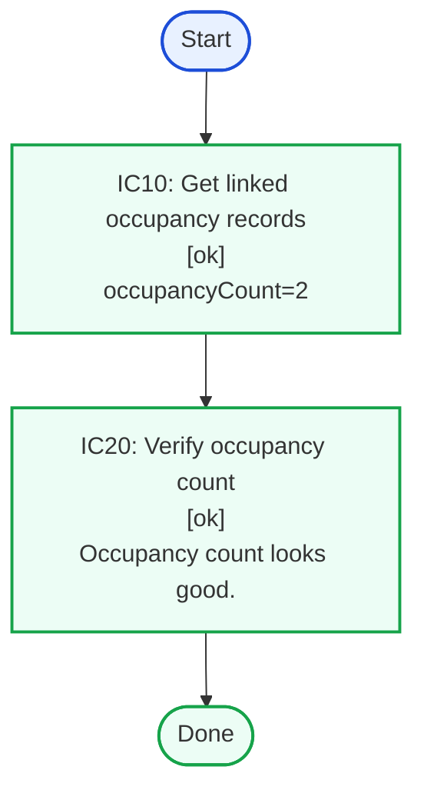
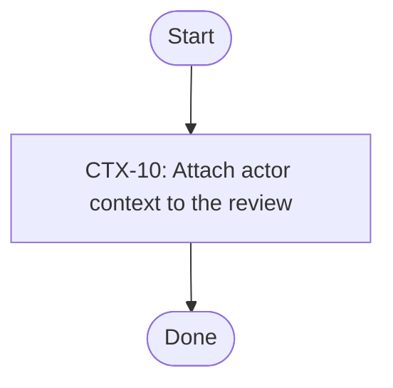
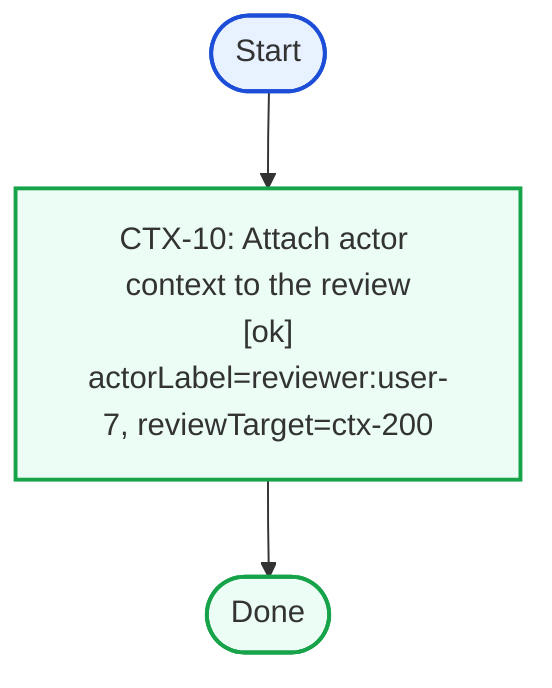
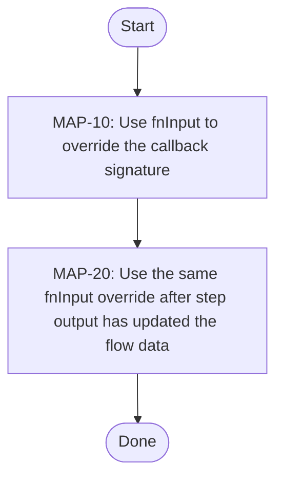
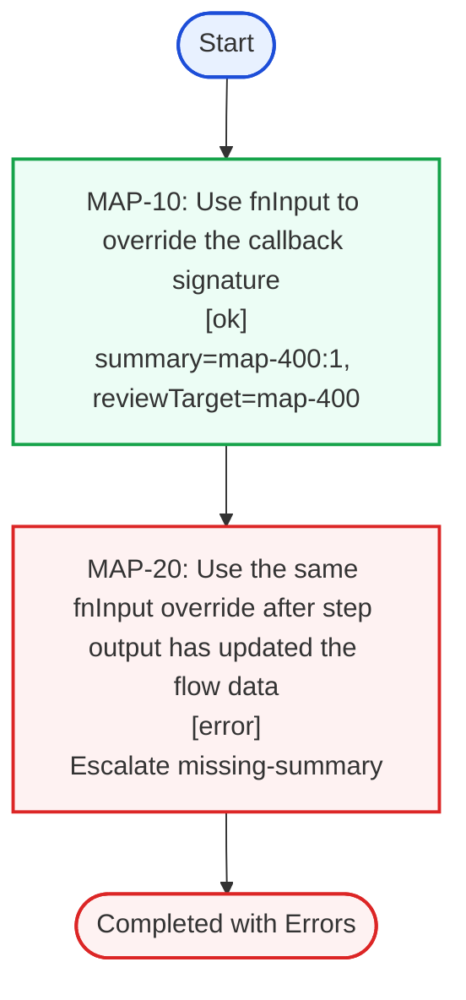
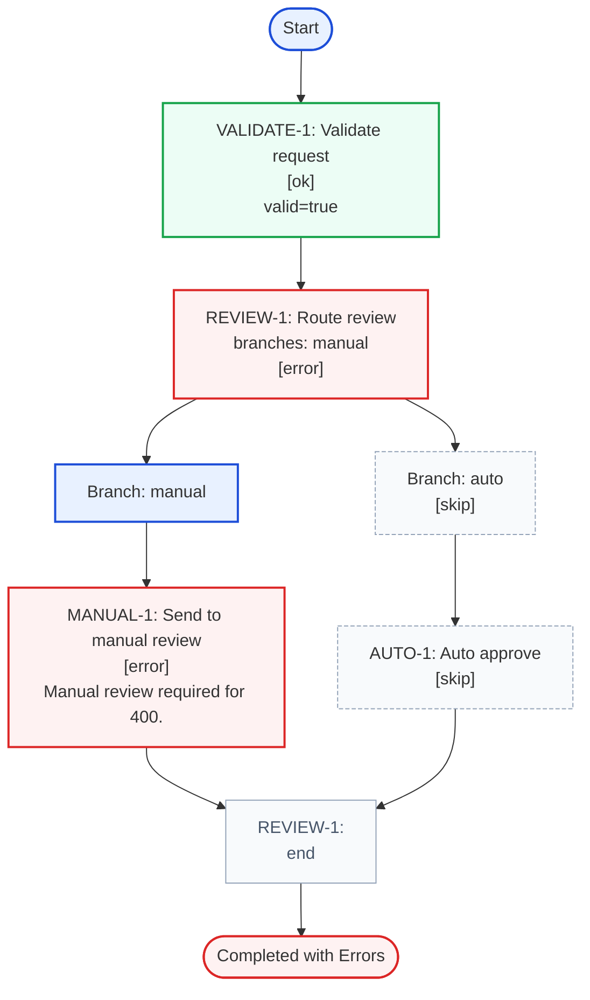

# structured-flow

Model business rules and validation pipelines with typed steps, branches, and execution results.

Structured flow gives you:

- Step-by-step execution with readable ids and descriptions
- Typed `data` and optional `ctx` across the whole flow
- Branching into child flows without leaking child payloads back to the parent flow
- Recorded execution results that can be rendered as HTML tables or Mermaid graphs
- Metadata hooks for step ids and descriptions through `resolver`
- Runtime payload remapping through `map`

- [Core API](#core-api-flow-html)
  - [Ok](#core-api-ok-full-table)
- [Flow metadata](#flow-metadata-flow-html)
  - [Ok](#flow-metadata-ok-full-table)
- [Context-aware flow](#context-flow-flow-html)
  - [Reviewer](#context-flow-reviewer-full-table)
- [Mapped payload flow](#map-flow-flow-html)
  - [Manual](#map-flow-manual-full-table)
- [Resolver-based flow](#resolver-flow-flow-html)
  - [Manual](#resolver-flow-manual-full-table)
- [AUTO-1](#auto-1-flow)
- [MANUAL-1](#manual-1-flow)

# Core API

## Factory variants

`createSyncFlow()` and `createAsyncFlow()` support a few shapes:

```ts
createSyncFlow<Data>()
createAsyncFlow<Data>()

createSyncFlow<StepId, Data>({
  name,
  description,
  resolver,
  map,
})

createSyncFlow(stepId, stepFn, stepOptions?)
createAsyncFlow(stepId, stepFn, stepOptions?)

createSyncFlow(branchId, select, branches, stepOptions?)
createAsyncFlow(branchId, select, branches, stepOptions?)
```

Use the empty generic form when your first `step()` should define the flow. Use the config form when you want flow-level
metadata or typed object step ids. Use the positional forms for short one-step or one-branch flows.

## Flow options

Flow config currently supports:

- `name?: string`: stored on the built flow as metadata
- `description?: string`: stored on the built flow as metadata
- `resolver?: ({ id, description }) => ({ id, description? })`: resolves metadata for object-valued step ids
- `map?: ({ id, data, ctx, stepOptions, params }) => object`: augments callback params, and can optionally return `fnInput: [data, params]` to override the callback signature

`resolver` is metadata-only. It does not change runtime payloads. `map` is runtime-only. By default it augments the
second callback parameter while `data` remains the flow's accumulated data object. When a map returns
`fnInput: [data, params]`, that tuple becomes the callback signature for that node.

## Step and branch options

`step()` and `branch()` both accept `StepOptions`:

```ts
{
  description?: string
  status?: {
    error?: 'ignore' | 'exception'
    exception?: 'error'
  }
  resolver?: ({ id, description }) => ({ id, description? })
  map?: ({ id, data, ctx, stepOptions, params }) => object & {
    fnInput?: [data: object, params: object]
  }
}
```

The flow-level resolver runs by default. A step-level or branch-level resolver can override the metadata for that node.
The flow-level `map` runs before a step-level or branch-level `map`.

## Runtime behavior

- Step callbacks are invoked as `fn(data, params)`
- Branch selectors are invoked as `select(data, params)`
- Without `map`, `params` is `{ ctx }`
- With `map`, its returned fields are merged into `params` and `params.ctx` stays available
- With `map().fnInput`, the callback is invoked with that explicit `[data, params]` tuple instead
- `withContext<Ctx>()` enables `flow.run(data, ctx)` and types downstream callbacks accordingly
- `stepResult({ status, ...payload })` records status and keeps non-status fields as result payload

Status handling:

- `ok` or omitted: continue and merge returned fields into downstream data
- `error`: record failure and continue
- `stop`: stop execution and mark remaining steps as `skip`
- `exception`: recorded when a step throws, unless remapped through `status.exception`
- `skip`: record a skipped result

## Result model

`flow.run(...)` returns `FlowResult`.

- `result.status` is the overall flow status
- `result.stepResults` contains recorded `StepResult` entries in execution order
- branch steps include `selectedBranchKeys` and nested `branches`
- helper utilities such as `collectFailedStepIds()` and `convertResultNode()` can flatten or normalize result inspection

# Examples

## Core API Example

This example uses the short positional form. The first step infers the flow input type and later steps build on the
returned data.

<a id="core-api-code-block"></a>
```ts
const loadOccupancies = createAsyncFlow(
  'IC10',
  async ({ form }: { form: SubmittedForm }, _params) => ({
    occupancyCount: form.occupantCount,
  }),
  { description: 'Get linked occupancy records' }
)
  .step(
    'IC20',
    ({ form }, _params) =>
      stepResult({
        status: form.occupantCount >= 2 ? 'ok' : 'error',
        info: form.occupantCount >= 2 ? 'Occupancy count looks good.' : 'Expected at least two occupancies.',
      }),
    { description: 'Verify occupancy count' }
  )
  .build()
```

### Flow Layout

<a id="core-api-flow-html"></a>
<!-- structured-process-demo:core-api-flow-html:html-table:start -->
<table style="width:100%;border-collapse:collapse;font-size:13px;"><thead><tr><th style="text-align:left;padding:8px;border-bottom:1px solid #d0d7de;width:32%;">Step</th><th style="text-align:left;padding:8px;border-bottom:1px solid #d0d7de;">Branches</th></tr></thead><tbody><tr>
<td style="padding:10px;border-bottom:1px solid #d0d7de;vertical-align:top;width:32%;"><div><strong>IC10</strong></div><div style="margin-top:2px;color:#475569;font-size:12px;">IC10</div><div style="margin-top:4px;color:#334155;font-size:13px;">Get linked occupancy records</div></td>
<td style="padding:10px;border-bottom:1px solid #d0d7de;vertical-align:top;"><div style="color:#94a3b8;">-</div></td>
</tr><tr>
<td style="padding:10px;border-bottom:1px solid #d0d7de;vertical-align:top;width:32%;"><div><strong>IC20</strong></div><div style="margin-top:2px;color:#475569;font-size:12px;">IC20</div><div style="margin-top:4px;color:#334155;font-size:13px;">Verify occupancy count</div></td>
<td style="padding:10px;border-bottom:1px solid #d0d7de;vertical-align:top;"><div style="color:#94a3b8;">-</div></td>
</tr></tbody></table>
<!-- structured-process-demo:core-api-flow-html:html-table:end -->

### Static Graph

<a id="core-api-static-graph"></a>
<div style="display:grid;grid-template-columns:repeat(3,minmax(0,1fr));gap:16px;align-items:start;"><div><p><strong>Result JSON</strong><br>No run result yet.</p></div><div><div>

<!-- structured-process-demo:core-api-static-graph:mermaid:start -->

<!-- structured-process-demo:core-api-static-graph:mermaid:end -->

</div></div><div><table style="width:100%;border-collapse:collapse;font-size:13px;"><thead><tr><th style="text-align:left;padding:8px;border-bottom:1px solid #d0d7de;width:32%;">Step</th><th style="text-align:left;padding:8px;border-bottom:1px solid #d0d7de;">Branches</th></tr></thead><tbody><tr>
<td style="padding:10px;border-bottom:1px solid #d0d7de;vertical-align:top;width:32%;"><div><strong>IC10</strong></div><div style="margin-top:2px;color:#475569;font-size:12px;">IC10</div><div style="margin-top:4px;color:#334155;font-size:13px;">Get linked occupancy records</div></td>
<td style="padding:10px;border-bottom:1px solid #d0d7de;vertical-align:top;"><div style="color:#94a3b8;">-</div></td>
</tr><tr>
<td style="padding:10px;border-bottom:1px solid #d0d7de;vertical-align:top;width:32%;"><div><strong>IC20</strong></div><div style="margin-top:2px;color:#475569;font-size:12px;">IC20</div><div style="margin-top:4px;color:#334155;font-size:13px;">Verify occupancy count</div></td>
<td style="padding:10px;border-bottom:1px solid #d0d7de;vertical-align:top;"><div style="color:#94a3b8;">-</div></td>
</tr></tbody></table></div></div>

### Example Run

<a id="core-api-ok-full-table"></a>
<div style="display:grid;grid-template-columns:repeat(3,minmax(0,1fr));gap:16px;align-items:start;"><div><div>

<p><strong>Initial flow.run() input</strong></p>
<!-- structured-process-demo:core-api-ok-init:json:start -->
<pre style="margin:0;padding:12px;background:#f6f8fa;border:1px solid #d0d7de;border-radius:6px;overflow:auto;font-size:12px;line-height:1.45;">
<code>{
  &quot;form&quot;: {
    &quot;id&quot;: &quot;200&quot;,
    &quot;occupantCount&quot;: 2,
    &quot;requiresManualReview&quot;: false
  }
}</code>
</pre>
<!-- structured-process-demo:core-api-ok-init:json:end -->

<p><strong>Resulting JSON</strong></p>
<!-- structured-process-demo:core-api-ok-result:json:start -->
<pre style="margin:0;padding:12px;background:#f6f8fa;border:1px solid #d0d7de;border-radius:6px;overflow:auto;font-size:12px;line-height:1.45;">
<code>{
  &quot;status&quot;: &quot;ok&quot;,
  &quot;stepResults&quot;: [
    {
      &quot;id&quot;: &quot;IC10&quot;,
      &quot;description&quot;: &quot;Get linked occupancy records&quot;,
      &quot;status&quot;: &quot;ok&quot;,
      &quot;result&quot;: {
        &quot;occupancyCount&quot;: 2
      }
    },
    {
      &quot;id&quot;: &quot;IC20&quot;,
      &quot;description&quot;: &quot;Verify occupancy count&quot;,
      &quot;status&quot;: &quot;ok&quot;,
      &quot;result&quot;: {
        &quot;info&quot;: &quot;Occupancy count looks good.&quot;
      }
    }
  ],
  &quot;failedStepIds&quot;: []
}</code>
</pre>
<!-- structured-process-demo:core-api-ok-result:json:end -->

</div></div><div><div>

<!-- structured-process-demo:core-api-ok:mermaid:start -->

<!-- structured-process-demo:core-api-ok:mermaid:end -->

</div></div><div><p><strong>Overall outcome:</strong> <span style="display:inline-block;padding:2px 8px;border-radius:999px;font-size:12px;font-weight:600;background:#ecfdf5;color:#166534;border:1px solid #86efac;">successful sequence run</span><br><strong>Failed steps:</strong> none</p>
<!-- structured-process-demo:core-api-ok:html-table:start -->
<table style="width:100%;border-collapse:collapse;font-size:14px;">
<thead><tr><th style="text-align:left;padding:8px;border-bottom:1px solid #d0d7de;">Step</th><th style="text-align:left;padding:8px;border-bottom:1px solid #d0d7de;">Description</th><th style="text-align:left;padding:8px;border-bottom:1px solid #d0d7de;">Status</th><th style="text-align:left;padding:8px;border-bottom:1px solid #d0d7de;">Payload</th><th style="text-align:left;padding:8px;border-bottom:1px solid #d0d7de;">Branches</th></tr></thead>
<tbody><tr>
<td style="padding:8px;border-bottom:1px solid #d0d7de;vertical-align:top;">IC10</td>
<td style="padding:8px;border-bottom:1px solid #d0d7de;vertical-align:top;">Get linked occupancy records</td>
<td style="padding:8px;border-bottom:1px solid #d0d7de;vertical-align:top;"><span style="display:inline-block;padding:2px 8px;border-radius:999px;font-size:12px;font-weight:600;background:#ecfdf5;color:#166534;border:1px solid #86efac;">ok</span></td>
<td style="padding:8px;border-bottom:1px solid #d0d7de;vertical-align:top;">{&quot;occupancyCount&quot;:2}</td>
<td style="padding:8px;border-bottom:1px solid #d0d7de;vertical-align:top;"></td>
</tr><tr>
<td style="padding:8px;border-bottom:1px solid #d0d7de;vertical-align:top;">IC20</td>
<td style="padding:8px;border-bottom:1px solid #d0d7de;vertical-align:top;">Verify occupancy count</td>
<td style="padding:8px;border-bottom:1px solid #d0d7de;vertical-align:top;"><span style="display:inline-block;padding:2px 8px;border-radius:999px;font-size:12px;font-weight:600;background:#ecfdf5;color:#166534;border:1px solid #86efac;">ok</span></td>
<td style="padding:8px;border-bottom:1px solid #d0d7de;vertical-align:top;">{&quot;info&quot;:&quot;Occupancy count looks good.&quot;}</td>
<td style="padding:8px;border-bottom:1px solid #d0d7de;vertical-align:top;"></td>
</tr></tbody>
</table>
<!-- structured-process-demo:core-api-ok:html-table:end --></div></div>

## Flow Metadata Example

This flow is created with flow-level `name` and `description`. Those values are stored on the built flow and can be used
by surrounding tooling or documentation.

<a id="flow-metadata-code-block"></a>
```ts
const namedReviewFlow = createSyncFlow<string, MetadataFlowData>({
  name: 'Named Review Flow',
  description: 'Demonstrates flow-level name and description metadata.',
})
  .step(
    'META-10',
    ({ form }, _params) => ({
      reviewTarget: form.id,
    }),
    { description: 'Record the form id as the review target' }
  )
  .build()
```

### Flow Layout

<a id="flow-metadata-flow-html"></a>
<!-- structured-process-demo:flow-metadata-flow-html:html-table:start -->
<table style="width:100%;border-collapse:collapse;font-size:13px;"><thead><tr><th style="text-align:left;padding:8px;border-bottom:1px solid #d0d7de;width:32%;">Step</th><th style="text-align:left;padding:8px;border-bottom:1px solid #d0d7de;">Branches</th></tr></thead><tbody><tr>
<td style="padding:10px;border-bottom:1px solid #d0d7de;vertical-align:top;width:32%;"><div><strong>META-10</strong></div><div style="margin-top:2px;color:#475569;font-size:12px;">META-10</div><div style="margin-top:4px;color:#334155;font-size:13px;">Record the form id as the review target</div></td>
<td style="padding:10px;border-bottom:1px solid #d0d7de;vertical-align:top;"><div style="color:#94a3b8;">-</div></td>
</tr></tbody></table>
<!-- structured-process-demo:flow-metadata-flow-html:html-table:end -->

### Static Graph

<a id="flow-metadata-static-graph"></a>
<div style="display:grid;grid-template-columns:repeat(3,minmax(0,1fr));gap:16px;align-items:start;"><div><p><strong>Result JSON</strong><br>No run result yet.</p></div><div><div>

<!-- structured-process-demo:flow-metadata-static-graph:mermaid:start -->

<!-- structured-process-demo:flow-metadata-static-graph:mermaid:end -->

</div></div><div><table style="width:100%;border-collapse:collapse;font-size:13px;"><thead><tr><th style="text-align:left;padding:8px;border-bottom:1px solid #d0d7de;width:32%;">Step</th><th style="text-align:left;padding:8px;border-bottom:1px solid #d0d7de;">Branches</th></tr></thead><tbody><tr>
<td style="padding:10px;border-bottom:1px solid #d0d7de;vertical-align:top;width:32%;"><div><strong>META-10</strong></div><div style="margin-top:2px;color:#475569;font-size:12px;">META-10</div><div style="margin-top:4px;color:#334155;font-size:13px;">Record the form id as the review target</div></td>
<td style="padding:10px;border-bottom:1px solid #d0d7de;vertical-align:top;"><div style="color:#94a3b8;">-</div></td>
</tr></tbody></table></div></div>

### Example Run

<a id="flow-metadata-ok-full-table"></a>
<div style="display:grid;grid-template-columns:repeat(3,minmax(0,1fr));gap:16px;align-items:start;"><div><div>

<p><strong>Initial flow.run() input</strong></p>
<!-- structured-process-demo:flow-metadata-ok-init:json:start -->
<pre style="margin:0;padding:12px;background:#f6f8fa;border:1px solid #d0d7de;border-radius:6px;overflow:auto;font-size:12px;line-height:1.45;">
<code>{
  &quot;form&quot;: {
    &quot;id&quot;: &quot;meta-200&quot;,
    &quot;occupantCount&quot;: 2,
    &quot;requiresManualReview&quot;: false
  }
}</code>
</pre>
<!-- structured-process-demo:flow-metadata-ok-init:json:end -->

<p><strong>Resulting JSON</strong></p>
<!-- structured-process-demo:flow-metadata-ok-result:json:start -->
<pre style="margin:0;padding:12px;background:#f6f8fa;border:1px solid #d0d7de;border-radius:6px;overflow:auto;font-size:12px;line-height:1.45;">
<code>{
  &quot;status&quot;: &quot;ok&quot;,
  &quot;stepResults&quot;: [
    {
      &quot;id&quot;: &quot;META-10&quot;,
      &quot;description&quot;: &quot;Record the form id as the review target&quot;,
      &quot;status&quot;: &quot;ok&quot;,
      &quot;result&quot;: {
        &quot;reviewTarget&quot;: &quot;meta-200&quot;
      }
    }
  ],
  &quot;failedStepIds&quot;: []
}</code>
</pre>
<!-- structured-process-demo:flow-metadata-ok-result:json:end -->

</div></div><div><div>

<!-- structured-process-demo:flow-metadata-ok:mermaid:start -->

<!-- structured-process-demo:flow-metadata-ok:mermaid:end -->

</div></div><div><p><strong>Overall outcome:</strong> <span style="display:inline-block;padding:2px 8px;border-radius:999px;font-size:12px;font-weight:600;background:#ecfdf5;color:#166534;border:1px solid #86efac;">successful sequence run</span><br><strong>Failed steps:</strong> none</p>
<!-- structured-process-demo:flow-metadata-ok:html-table:start -->
<table style="width:100%;border-collapse:collapse;font-size:14px;">
<thead><tr><th style="text-align:left;padding:8px;border-bottom:1px solid #d0d7de;">Step</th><th style="text-align:left;padding:8px;border-bottom:1px solid #d0d7de;">Description</th><th style="text-align:left;padding:8px;border-bottom:1px solid #d0d7de;">Status</th><th style="text-align:left;padding:8px;border-bottom:1px solid #d0d7de;">Payload</th><th style="text-align:left;padding:8px;border-bottom:1px solid #d0d7de;">Branches</th></tr></thead>
<tbody><tr>
<td style="padding:8px;border-bottom:1px solid #d0d7de;vertical-align:top;">META-10</td>
<td style="padding:8px;border-bottom:1px solid #d0d7de;vertical-align:top;">Record the form id as the review target</td>
<td style="padding:8px;border-bottom:1px solid #d0d7de;vertical-align:top;"><span style="display:inline-block;padding:2px 8px;border-radius:999px;font-size:12px;font-weight:600;background:#ecfdf5;color:#166534;border:1px solid #86efac;">ok</span></td>
<td style="padding:8px;border-bottom:1px solid #d0d7de;vertical-align:top;">{&quot;reviewTarget&quot;:&quot;meta-200&quot;}</td>
<td style="padding:8px;border-bottom:1px solid #d0d7de;vertical-align:top;"></td>
</tr></tbody>
</table>
<!-- structured-process-demo:flow-metadata-ok:html-table:end --></div></div>

## Context Example

This flow uses `withContext()` so `flow.run(data, ctx)` passes a separate context object to each callback through the
`params.ctx` field.

<a id="context-flow-code-block"></a>
```ts
const actorAwareFlow = createSyncFlow<string, ContextFlowData>({
  name: 'Actor-aware Review',
  description: 'Demonstrates withContext() and flow.run(data, ctx).',
})
  .withContext<ContextFlowCtx>()
  .step(
    'CTX-10',
    ({ form }, params) => ({
      actorLabel: `${params.ctx.role}:${params.ctx.actorId}`,
      reviewTarget: form.id,
    }),
    { description: 'Attach actor context to the review' }
  )
  .build()
```

### Flow Layout

<a id="context-flow-flow-html"></a>
<!-- structured-process-demo:context-flow-flow-html:html-table:start -->
<table style="width:100%;border-collapse:collapse;font-size:13px;"><thead><tr><th style="text-align:left;padding:8px;border-bottom:1px solid #d0d7de;width:32%;">Step</th><th style="text-align:left;padding:8px;border-bottom:1px solid #d0d7de;">Branches</th></tr></thead><tbody><tr>
<td style="padding:10px;border-bottom:1px solid #d0d7de;vertical-align:top;width:32%;"><div><strong>CTX-10</strong></div><div style="margin-top:2px;color:#475569;font-size:12px;">CTX-10</div><div style="margin-top:4px;color:#334155;font-size:13px;">Attach actor context to the review</div></td>
<td style="padding:10px;border-bottom:1px solid #d0d7de;vertical-align:top;"><div style="color:#94a3b8;">-</div></td>
</tr></tbody></table>
<!-- structured-process-demo:context-flow-flow-html:html-table:end -->

### Static Graph

<a id="context-flow-static-graph"></a>
<div style="display:grid;grid-template-columns:repeat(3,minmax(0,1fr));gap:16px;align-items:start;"><div><p><strong>Result JSON</strong><br>No run result yet.</p></div><div><div>

<!-- structured-process-demo:context-flow-static-graph:mermaid:start -->

<!-- structured-process-demo:context-flow-static-graph:mermaid:end -->

</div></div><div><table style="width:100%;border-collapse:collapse;font-size:13px;"><thead><tr><th style="text-align:left;padding:8px;border-bottom:1px solid #d0d7de;width:32%;">Step</th><th style="text-align:left;padding:8px;border-bottom:1px solid #d0d7de;">Branches</th></tr></thead><tbody><tr>
<td style="padding:10px;border-bottom:1px solid #d0d7de;vertical-align:top;width:32%;"><div><strong>CTX-10</strong></div><div style="margin-top:2px;color:#475569;font-size:12px;">CTX-10</div><div style="margin-top:4px;color:#334155;font-size:13px;">Attach actor context to the review</div></td>
<td style="padding:10px;border-bottom:1px solid #d0d7de;vertical-align:top;"><div style="color:#94a3b8;">-</div></td>
</tr></tbody></table></div></div>

### Example Run

<a id="context-flow-reviewer-full-table"></a>
<div style="display:grid;grid-template-columns:repeat(3,minmax(0,1fr));gap:16px;align-items:start;"><div><div>

<p><strong>Initial flow.run() input</strong></p>
<!-- structured-process-demo:context-flow-reviewer-init:json:start -->
<pre style="margin:0;padding:12px;background:#f6f8fa;border:1px solid #d0d7de;border-radius:6px;overflow:auto;font-size:12px;line-height:1.45;">
<code>{
  &quot;data&quot;: {
    &quot;form&quot;: {
      &quot;id&quot;: &quot;ctx-200&quot;,
      &quot;occupantCount&quot;: 2,
      &quot;requiresManualReview&quot;: false
    }
  },
  &quot;ctx&quot;: {
    &quot;actorId&quot;: &quot;user-7&quot;,
    &quot;role&quot;: &quot;reviewer&quot;
  }
}</code>
</pre>
<!-- structured-process-demo:context-flow-reviewer-init:json:end -->

<p><strong>Resulting JSON</strong></p>
<!-- structured-process-demo:context-flow-reviewer-result:json:start -->
<pre style="margin:0;padding:12px;background:#f6f8fa;border:1px solid #d0d7de;border-radius:6px;overflow:auto;font-size:12px;line-height:1.45;">
<code>{
  &quot;status&quot;: &quot;ok&quot;,
  &quot;stepResults&quot;: [
    {
      &quot;id&quot;: &quot;CTX-10&quot;,
      &quot;description&quot;: &quot;Attach actor context to the review&quot;,
      &quot;status&quot;: &quot;ok&quot;,
      &quot;result&quot;: {
        &quot;actorLabel&quot;: &quot;reviewer:user-7&quot;,
        &quot;reviewTarget&quot;: &quot;ctx-200&quot;
      }
    }
  ],
  &quot;failedStepIds&quot;: []
}</code>
</pre>
<!-- structured-process-demo:context-flow-reviewer-result:json:end -->

</div></div><div><div>

<!-- structured-process-demo:context-flow-reviewer:mermaid:start -->

<!-- structured-process-demo:context-flow-reviewer:mermaid:end -->

</div></div><div><p><strong>Overall outcome:</strong> <span style="display:inline-block;padding:2px 8px;border-radius:999px;font-size:12px;font-weight:600;background:#ecfdf5;color:#166534;border:1px solid #86efac;">successful sequence run</span><br><strong>Failed steps:</strong> none</p>
<!-- structured-process-demo:context-flow-reviewer:html-table:start -->
<table style="width:100%;border-collapse:collapse;font-size:14px;">
<thead><tr><th style="text-align:left;padding:8px;border-bottom:1px solid #d0d7de;">Step</th><th style="text-align:left;padding:8px;border-bottom:1px solid #d0d7de;">Description</th><th style="text-align:left;padding:8px;border-bottom:1px solid #d0d7de;">Status</th><th style="text-align:left;padding:8px;border-bottom:1px solid #d0d7de;">Payload</th><th style="text-align:left;padding:8px;border-bottom:1px solid #d0d7de;">Branches</th></tr></thead>
<tbody><tr>
<td style="padding:8px;border-bottom:1px solid #d0d7de;vertical-align:top;">CTX-10</td>
<td style="padding:8px;border-bottom:1px solid #d0d7de;vertical-align:top;">Attach actor context to the review</td>
<td style="padding:8px;border-bottom:1px solid #d0d7de;vertical-align:top;"><span style="display:inline-block;padding:2px 8px;border-radius:999px;font-size:12px;font-weight:600;background:#ecfdf5;color:#166534;border:1px solid #86efac;">ok</span></td>
<td style="padding:8px;border-bottom:1px solid #d0d7de;vertical-align:top;">{&quot;actorLabel&quot;:&quot;reviewer:user-7&quot;,&quot;reviewTarget&quot;:&quot;ctx-200&quot;}</td>
<td style="padding:8px;border-bottom:1px solid #d0d7de;vertical-align:top;"></td>
</tr></tbody>
</table>
<!-- structured-process-demo:context-flow-reviewer:html-table:end --></div></div>

## Map Example

This flow demonstrates runtime params augmentation and `fnInput`. The flow-level `map` adds derived fields to the
`params` argument and then overrides the callback signature with `fnInput`.

<a id="map-flow-code-block"></a>
```ts
const mappedReviewFlow = createSyncFlow<string, MapFlowData, MapFlowMapper>({
  name: 'Mapped Review Flow',
  description: 'Demonstrates flow-level map() params augmentation and fnInput overrides.',
  map: ({ data }) => ({
    submissionId: data.form.id,
    occupancyCount: data.form.occupantCount,
    requiresManualReview: data.form.requiresManualReview,
    summary: data.summary,
    fnInput: [
      {
        submissionId: data.form.id,
        occupancyCount: data.form.occupantCount,
        summary: data.summary,
      },
      {
        ctx: undefined,
        submissionId: data.form.id,
        occupancyCount: data.form.occupantCount,
        requiresManualReview: data.form.requiresManualReview,
        summary: data.summary,
      },
    ],
  }),
})
  .step(
    'MAP-10',
    (data, params) => ({
      summary: `${data.submissionId}:${data.occupancyCount}`,
      reviewTarget: params.submissionId,
    }),
    { description: 'Use fnInput to override the callback signature' }
  )
  .step(
    'MAP-20',
    (data, params) =>
      stepResult({
        status: params.requiresManualReview ? 'error' : 'ok',
        info: params.requiresManualReview
          ? `Escalate ${data.summary ?? 'missing-summary'}`
          : `Auto-approve ${data.summary ?? 'missing-summary'}`,
      }),
    {
      description: 'Use the same fnInput override after step output has updated the flow data',
    }
  )
  .build()
```

### Flow Layout

<a id="map-flow-flow-html"></a>
<!-- structured-process-demo:map-flow-flow-html:html-table:start -->
<table style="width:100%;border-collapse:collapse;font-size:13px;"><thead><tr><th style="text-align:left;padding:8px;border-bottom:1px solid #d0d7de;width:32%;">Step</th><th style="text-align:left;padding:8px;border-bottom:1px solid #d0d7de;">Branches</th></tr></thead><tbody><tr>
<td style="padding:10px;border-bottom:1px solid #d0d7de;vertical-align:top;width:32%;"><div><strong>MAP-10</strong></div><div style="margin-top:2px;color:#475569;font-size:12px;">MAP-10</div><div style="margin-top:4px;color:#334155;font-size:13px;">Use fnInput to override the callback signature</div></td>
<td style="padding:10px;border-bottom:1px solid #d0d7de;vertical-align:top;"><div style="color:#94a3b8;">-</div></td>
</tr><tr>
<td style="padding:10px;border-bottom:1px solid #d0d7de;vertical-align:top;width:32%;"><div><strong>MAP-20</strong></div><div style="margin-top:2px;color:#475569;font-size:12px;">MAP-20</div><div style="margin-top:4px;color:#334155;font-size:13px;">Use the same fnInput override after step output has updated the flow data</div></td>
<td style="padding:10px;border-bottom:1px solid #d0d7de;vertical-align:top;"><div style="color:#94a3b8;">-</div></td>
</tr></tbody></table>
<!-- structured-process-demo:map-flow-flow-html:html-table:end -->

### Static Graph

<a id="map-flow-static-graph"></a>
<div style="display:grid;grid-template-columns:repeat(3,minmax(0,1fr));gap:16px;align-items:start;"><div><p><strong>Result JSON</strong><br>No run result yet.</p></div><div><div>

<!-- structured-process-demo:map-flow-static-graph:mermaid:start -->

<!-- structured-process-demo:map-flow-static-graph:mermaid:end -->

</div></div><div><table style="width:100%;border-collapse:collapse;font-size:13px;"><thead><tr><th style="text-align:left;padding:8px;border-bottom:1px solid #d0d7de;width:32%;">Step</th><th style="text-align:left;padding:8px;border-bottom:1px solid #d0d7de;">Branches</th></tr></thead><tbody><tr>
<td style="padding:10px;border-bottom:1px solid #d0d7de;vertical-align:top;width:32%;"><div><strong>MAP-10</strong></div><div style="margin-top:2px;color:#475569;font-size:12px;">MAP-10</div><div style="margin-top:4px;color:#334155;font-size:13px;">Use fnInput to override the callback signature</div></td>
<td style="padding:10px;border-bottom:1px solid #d0d7de;vertical-align:top;"><div style="color:#94a3b8;">-</div></td>
</tr><tr>
<td style="padding:10px;border-bottom:1px solid #d0d7de;vertical-align:top;width:32%;"><div><strong>MAP-20</strong></div><div style="margin-top:2px;color:#475569;font-size:12px;">MAP-20</div><div style="margin-top:4px;color:#334155;font-size:13px;">Use the same fnInput override after step output has updated the flow data</div></td>
<td style="padding:10px;border-bottom:1px solid #d0d7de;vertical-align:top;"><div style="color:#94a3b8;">-</div></td>
</tr></tbody></table></div></div>

### Example Run

<a id="map-flow-manual-full-table"></a>
<div style="display:grid;grid-template-columns:repeat(3,minmax(0,1fr));gap:16px;align-items:start;"><div><div>

<p><strong>Initial flow.run() input</strong></p>
<!-- structured-process-demo:map-flow-manual-init:json:start -->
<pre style="margin:0;padding:12px;background:#f6f8fa;border:1px solid #d0d7de;border-radius:6px;overflow:auto;font-size:12px;line-height:1.45;">
<code>{
  &quot;form&quot;: {
    &quot;id&quot;: &quot;map-400&quot;,
    &quot;occupantCount&quot;: 1,
    &quot;requiresManualReview&quot;: true
  },
  &quot;checks&quot;: [
    &quot;rules&quot;
  ]
}</code>
</pre>
<!-- structured-process-demo:map-flow-manual-init:json:end -->

<p><strong>Resulting JSON</strong></p>
<!-- structured-process-demo:map-flow-manual-result:json:start -->
<pre style="margin:0;padding:12px;background:#f6f8fa;border:1px solid #d0d7de;border-radius:6px;overflow:auto;font-size:12px;line-height:1.45;">
<code>{
  &quot;status&quot;: &quot;error&quot;,
  &quot;stepResults&quot;: [
    {
      &quot;id&quot;: &quot;MAP-10&quot;,
      &quot;description&quot;: &quot;Use fnInput to override the callback signature&quot;,
      &quot;status&quot;: &quot;ok&quot;,
      &quot;result&quot;: {
        &quot;summary&quot;: &quot;map-400:1&quot;,
        &quot;reviewTarget&quot;: &quot;map-400&quot;
      }
    },
    {
      &quot;id&quot;: &quot;MAP-20&quot;,
      &quot;description&quot;: &quot;Use the same fnInput override after step output has updated the flow data&quot;,
      &quot;status&quot;: &quot;error&quot;,
      &quot;result&quot;: {
        &quot;info&quot;: &quot;Escalate missing-summary&quot;
      }
    }
  ],
  &quot;failedStepIds&quot;: [
    &quot;MAP-20&quot;
  ]
}</code>
</pre>
<!-- structured-process-demo:map-flow-manual-result:json:end -->

</div></div><div><div>

<!-- structured-process-demo:map-flow-manual:mermaid:start -->

<!-- structured-process-demo:map-flow-manual:mermaid:end -->

</div></div><div><p><strong>Overall outcome:</strong> <span style="display:inline-block;padding:2px 8px;border-radius:999px;font-size:12px;font-weight:600;background:#fef2f2;color:#b91c1c;border:1px solid #fca5a5;">completed with errors</span><br><strong>Failed steps:</strong> MAP-20</p>
<!-- structured-process-demo:map-flow-manual:html-table:start -->
<table style="width:100%;border-collapse:collapse;font-size:14px;">
<thead><tr><th style="text-align:left;padding:8px;border-bottom:1px solid #d0d7de;">Step</th><th style="text-align:left;padding:8px;border-bottom:1px solid #d0d7de;">Description</th><th style="text-align:left;padding:8px;border-bottom:1px solid #d0d7de;">Status</th><th style="text-align:left;padding:8px;border-bottom:1px solid #d0d7de;">Payload</th><th style="text-align:left;padding:8px;border-bottom:1px solid #d0d7de;">Branches</th></tr></thead>
<tbody><tr>
<td style="padding:8px;border-bottom:1px solid #d0d7de;vertical-align:top;">MAP-10</td>
<td style="padding:8px;border-bottom:1px solid #d0d7de;vertical-align:top;">Use fnInput to override the callback signature</td>
<td style="padding:8px;border-bottom:1px solid #d0d7de;vertical-align:top;"><span style="display:inline-block;padding:2px 8px;border-radius:999px;font-size:12px;font-weight:600;background:#ecfdf5;color:#166534;border:1px solid #86efac;">ok</span></td>
<td style="padding:8px;border-bottom:1px solid #d0d7de;vertical-align:top;">{&quot;summary&quot;:&quot;map-400:1&quot;,&quot;reviewTarget&quot;:&quot;map-400&quot;}</td>
<td style="padding:8px;border-bottom:1px solid #d0d7de;vertical-align:top;"></td>
</tr><tr>
<td style="padding:8px;border-bottom:1px solid #d0d7de;vertical-align:top;">MAP-20</td>
<td style="padding:8px;border-bottom:1px solid #d0d7de;vertical-align:top;">Use the same fnInput override after step output has updated the flow data</td>
<td style="padding:8px;border-bottom:1px solid #d0d7de;vertical-align:top;"><span style="display:inline-block;padding:2px 8px;border-radius:999px;font-size:12px;font-weight:600;background:#fef2f2;color:#b91c1c;border:1px solid #fca5a5;">error</span></td>
<td style="padding:8px;border-bottom:1px solid #d0d7de;vertical-align:top;">{&quot;info&quot;:&quot;Escalate missing-summary&quot;}</td>
<td style="padding:8px;border-bottom:1px solid #d0d7de;vertical-align:top;"></td>
</tr></tbody>
</table>
<!-- structured-process-demo:map-flow-manual:html-table:end --></div></div>

## Resolver And Branch Example

This example uses object-valued step ids with a flow-level resolver. Each object provides the source metadata and can
also provide a default `fn`. The resolver turns that object into the stored `{ id, description }` metadata. A
step-level resolver can override the flow-level resolver for one node when needed.

<a id="resolver-flow-code-block"></a>
```ts
const reviewFlow = createSyncFlow<StepInfo, ReviewData>({
  resolver: resolveStepMeta,
})
  .step({
    id: 'VALIDATE-1',
    description: 'Validate request',
    fn: ({ form }, _params) => ({
      valid: form.id.length > 0,
    }),
  })
  .branch(
    {
      id: 'REVIEW-1',
      description: 'Route review',
    },
    ({ form }, _params) => (form.requiresManualReview ? 'manual' : 'auto'),
    {
      auto: createSyncFlow<StepInfo, ReviewData>({
        resolver: resolveStepMeta,
      }).step({
        id: 'AUTO-1',
        description: 'Auto approve',
        fn: ({ checks }, _params) => ({
          checksSeen: checks.length,
        }),
      }),
      manual: createSyncFlow<StepInfo, ReviewData>({
        resolver: resolveStepMeta,
      }).step({
        id: 'MANUAL-1',
        description: 'Send to manual review',
        fn: ({ form }, _params) =>
          stepResult({
            status: 'error',
            info: `Manual review required for ${form.id}.`,
          }),
      }),
    }
  )
  .build()
```

### Flow Layout

<a id="resolver-flow-flow-html"></a>
<!-- structured-process-demo:resolver-flow-flow-html:html-table:start -->
<table style="width:100%;border-collapse:collapse;font-size:13px;"><thead><tr><th style="text-align:left;padding:8px;border-bottom:1px solid #d0d7de;width:32%;">Step</th><th style="text-align:left;padding:8px;border-bottom:1px solid #d0d7de;">Branches</th></tr></thead><tbody><tr>
<td style="padding:10px;border-bottom:1px solid #d0d7de;vertical-align:top;width:32%;"><div><strong>VALIDATE-1</strong></div><div style="margin-top:2px;color:#475569;font-size:12px;">VALIDATE-1</div><div style="margin-top:4px;color:#334155;font-size:13px;">Validate request</div></td>
<td style="padding:10px;border-bottom:1px solid #d0d7de;vertical-align:top;"><div style="color:#94a3b8;">-</div></td>
</tr><tr>
<td style="padding:10px;border-bottom:1px solid #d0d7de;vertical-align:top;width:32%;"><div><strong>REVIEW-1</strong></div><div style="margin-top:2px;color:#475569;font-size:12px;">REVIEW-1</div><div style="margin-top:4px;color:#334155;font-size:13px;">Route review</div></td>
<td style="padding:10px;border-bottom:1px solid #d0d7de;vertical-align:top;"><div style="display:grid;grid-template-columns:repeat(2,minmax(0,1fr));gap:12px;"><div style="border:1px solid #d0d7de;border-radius:6px;padding:10px;background:#f8fafc;">
<div><strong>auto</strong></div>
<div style="margin-top:8px;"><table style="width:100%;border-collapse:collapse;font-size:13px;"><thead><tr><th style="text-align:left;padding:8px;border-bottom:1px solid #d0d7de;width:32%;">Step</th><th style="text-align:left;padding:8px;border-bottom:1px solid #d0d7de;">Branches</th></tr></thead><tbody><tr>
<td style="padding:10px;border-bottom:1px solid #d0d7de;vertical-align:top;width:32%;"><div><strong>AUTO-1</strong></div><div style="margin-top:2px;color:#475569;font-size:12px;">AUTO-1</div><div style="margin-top:4px;color:#334155;font-size:13px;">Auto approve</div></td>
<td style="padding:10px;border-bottom:1px solid #d0d7de;vertical-align:top;"><div style="color:#94a3b8;">-</div></td>
</tr></tbody></table></div>
</div><div style="border:1px solid #d0d7de;border-radius:6px;padding:10px;background:#f8fafc;">
<div><strong>manual</strong></div>
<div style="margin-top:8px;"><table style="width:100%;border-collapse:collapse;font-size:13px;"><thead><tr><th style="text-align:left;padding:8px;border-bottom:1px solid #d0d7de;width:32%;">Step</th><th style="text-align:left;padding:8px;border-bottom:1px solid #d0d7de;">Branches</th></tr></thead><tbody><tr>
<td style="padding:10px;border-bottom:1px solid #d0d7de;vertical-align:top;width:32%;"><div><strong>MANUAL-1</strong></div><div style="margin-top:2px;color:#475569;font-size:12px;">MANUAL-1</div><div style="margin-top:4px;color:#334155;font-size:13px;">Send to manual review</div></td>
<td style="padding:10px;border-bottom:1px solid #d0d7de;vertical-align:top;"><div style="color:#94a3b8;">-</div></td>
</tr></tbody></table></div>
</div></div></td>
</tr></tbody></table>
<!-- structured-process-demo:resolver-flow-flow-html:html-table:end -->

### Static Graph

<a id="resolver-flow-static-graph"></a>
<div style="display:grid;grid-template-columns:repeat(3,minmax(0,1fr));gap:16px;align-items:start;"><div><p><strong>Result JSON</strong><br>No run result yet.</p></div><div><div>

<!-- structured-process-demo:resolver-flow-static-graph:mermaid:start -->

<!-- structured-process-demo:resolver-flow-static-graph:mermaid:end -->

</div></div><div><table style="width:100%;border-collapse:collapse;font-size:13px;"><thead><tr><th style="text-align:left;padding:8px;border-bottom:1px solid #d0d7de;width:32%;">Step</th><th style="text-align:left;padding:8px;border-bottom:1px solid #d0d7de;">Branches</th></tr></thead><tbody><tr>
<td style="padding:10px;border-bottom:1px solid #d0d7de;vertical-align:top;width:32%;"><div><strong>VALIDATE-1</strong></div><div style="margin-top:2px;color:#475569;font-size:12px;">VALIDATE-1</div><div style="margin-top:4px;color:#334155;font-size:13px;">Validate request</div></td>
<td style="padding:10px;border-bottom:1px solid #d0d7de;vertical-align:top;"><div style="color:#94a3b8;">-</div></td>
</tr><tr>
<td style="padding:10px;border-bottom:1px solid #d0d7de;vertical-align:top;width:32%;"><div><strong>REVIEW-1</strong></div><div style="margin-top:2px;color:#475569;font-size:12px;">REVIEW-1</div><div style="margin-top:4px;color:#334155;font-size:13px;">Route review</div></td>
<td style="padding:10px;border-bottom:1px solid #d0d7de;vertical-align:top;"><div style="display:grid;grid-template-columns:repeat(2,minmax(0,1fr));gap:12px;"><div style="border:1px solid #d0d7de;border-radius:6px;padding:10px;background:#f8fafc;">
<div><strong>auto</strong></div>
<div style="margin-top:8px;"><table style="width:100%;border-collapse:collapse;font-size:13px;"><thead><tr><th style="text-align:left;padding:8px;border-bottom:1px solid #d0d7de;width:32%;">Step</th><th style="text-align:left;padding:8px;border-bottom:1px solid #d0d7de;">Branches</th></tr></thead><tbody><tr>
<td style="padding:10px;border-bottom:1px solid #d0d7de;vertical-align:top;width:32%;"><div><strong>AUTO-1</strong></div><div style="margin-top:2px;color:#475569;font-size:12px;">AUTO-1</div><div style="margin-top:4px;color:#334155;font-size:13px;">Auto approve</div></td>
<td style="padding:10px;border-bottom:1px solid #d0d7de;vertical-align:top;"><div style="color:#94a3b8;">-</div></td>
</tr></tbody></table></div>
</div><div style="border:1px solid #d0d7de;border-radius:6px;padding:10px;background:#f8fafc;">
<div><strong>manual</strong></div>
<div style="margin-top:8px;"><table style="width:100%;border-collapse:collapse;font-size:13px;"><thead><tr><th style="text-align:left;padding:8px;border-bottom:1px solid #d0d7de;width:32%;">Step</th><th style="text-align:left;padding:8px;border-bottom:1px solid #d0d7de;">Branches</th></tr></thead><tbody><tr>
<td style="padding:10px;border-bottom:1px solid #d0d7de;vertical-align:top;width:32%;"><div><strong>MANUAL-1</strong></div><div style="margin-top:2px;color:#475569;font-size:12px;">MANUAL-1</div><div style="margin-top:4px;color:#334155;font-size:13px;">Send to manual review</div></td>
<td style="padding:10px;border-bottom:1px solid #d0d7de;vertical-align:top;"><div style="color:#94a3b8;">-</div></td>
</tr></tbody></table></div>
</div></div></td>
</tr></tbody></table></div></div>

### Example Run

<a id="resolver-flow-manual-full-table"></a>
<div style="display:grid;grid-template-columns:repeat(3,minmax(0,1fr));gap:16px;align-items:start;"><div><div>

<p><strong>Initial flow.run() input</strong></p>
<!-- structured-process-demo:resolver-flow-manual-init:json:start -->
<pre style="margin:0;padding:12px;background:#f6f8fa;border:1px solid #d0d7de;border-radius:6px;overflow:auto;font-size:12px;line-height:1.45;">
<code>{
  &quot;form&quot;: {
    &quot;id&quot;: &quot;400&quot;,
    &quot;occupantCount&quot;: 1,
    &quot;requiresManualReview&quot;: true
  },
  &quot;checks&quot;: [
    &quot;audit&quot;,
    &quot;rules&quot;
  ]
}</code>
</pre>
<!-- structured-process-demo:resolver-flow-manual-init:json:end -->

<p><strong>Resulting JSON</strong></p>
<!-- structured-process-demo:resolver-flow-manual-result:json:start -->
<pre style="margin:0;padding:12px;background:#f6f8fa;border:1px solid #d0d7de;border-radius:6px;overflow:auto;font-size:12px;line-height:1.45;">
<code>{
  &quot;status&quot;: &quot;error&quot;,
  &quot;stepResults&quot;: [
    {
      &quot;id&quot;: &quot;VALIDATE-1&quot;,
      &quot;description&quot;: &quot;Validate request&quot;,
      &quot;status&quot;: &quot;ok&quot;,
      &quot;result&quot;: {
        &quot;valid&quot;: true
      }
    },
    {
      &quot;id&quot;: &quot;REVIEW-1&quot;,
      &quot;description&quot;: &quot;Route review&quot;,
      &quot;status&quot;: &quot;error&quot;,
      &quot;selectedBranchKeys&quot;: [
        &quot;manual&quot;
      ],
      &quot;branches&quot;: [
        {
          &quot;key&quot;: &quot;manual&quot;,
          &quot;status&quot;: &quot;error&quot;,
          &quot;stepResults&quot;: [
            {
              &quot;id&quot;: &quot;MANUAL-1&quot;,
              &quot;description&quot;: &quot;Send to manual review&quot;,
              &quot;status&quot;: &quot;error&quot;,
              &quot;result&quot;: {
                &quot;info&quot;: &quot;Manual review required for 400.&quot;
              }
            }
          ]
        },
        {
          &quot;key&quot;: &quot;auto&quot;,
          &quot;status&quot;: &quot;skip&quot;,
          &quot;stepResults&quot;: [
            {
              &quot;id&quot;: &quot;AUTO-1&quot;,
              &quot;description&quot;: &quot;Auto approve&quot;,
              &quot;status&quot;: &quot;skip&quot;
            }
          ]
        }
      ]
    }
  ],
  &quot;failedStepIds&quot;: [
    &quot;REVIEW-1&quot;,
    &quot;MANUAL-1&quot;
  ]
}</code>
</pre>
<!-- structured-process-demo:resolver-flow-manual-result:json:end -->

</div></div><div><div>

<!-- structured-process-demo:resolver-flow-manual:mermaid:start -->

<!-- structured-process-demo:resolver-flow-manual:mermaid:end -->

</div></div><div><p><strong>Overall outcome:</strong> <span style="display:inline-block;padding:2px 8px;border-radius:999px;font-size:12px;font-weight:600;background:#fef2f2;color:#b91c1c;border:1px solid #fca5a5;">completed with errors</span><br><strong>Failed steps:</strong> REVIEW-1, MANUAL-1</p>
<!-- structured-process-demo:resolver-flow-manual:html-table:start -->
<table style="width:100%;border-collapse:collapse;font-size:14px;">
<thead><tr><th style="text-align:left;padding:8px;border-bottom:1px solid #d0d7de;">Step</th><th style="text-align:left;padding:8px;border-bottom:1px solid #d0d7de;">Description</th><th style="text-align:left;padding:8px;border-bottom:1px solid #d0d7de;">Status</th><th style="text-align:left;padding:8px;border-bottom:1px solid #d0d7de;">Payload</th><th style="text-align:left;padding:8px;border-bottom:1px solid #d0d7de;">Branches</th></tr></thead>
<tbody><tr>
<td style="padding:8px;border-bottom:1px solid #d0d7de;vertical-align:top;">VALIDATE-1</td>
<td style="padding:8px;border-bottom:1px solid #d0d7de;vertical-align:top;">Validate request</td>
<td style="padding:8px;border-bottom:1px solid #d0d7de;vertical-align:top;"><span style="display:inline-block;padding:2px 8px;border-radius:999px;font-size:12px;font-weight:600;background:#ecfdf5;color:#166534;border:1px solid #86efac;">ok</span></td>
<td style="padding:8px;border-bottom:1px solid #d0d7de;vertical-align:top;">{&quot;valid&quot;:true}</td>
<td style="padding:8px;border-bottom:1px solid #d0d7de;vertical-align:top;"></td>
</tr><tr>
<td style="padding:8px;border-bottom:1px solid #d0d7de;vertical-align:top;">REVIEW-1</td>
<td style="padding:8px;border-bottom:1px solid #d0d7de;vertical-align:top;">Route review</td>
<td style="padding:8px;border-bottom:1px solid #d0d7de;vertical-align:top;"><span style="display:inline-block;padding:2px 8px;border-radius:999px;font-size:12px;font-weight:600;background:#fef2f2;color:#b91c1c;border:1px solid #fca5a5;">error</span></td>
<td style="padding:8px;border-bottom:1px solid #d0d7de;vertical-align:top;"></td>
<td style="padding:8px;border-bottom:1px solid #d0d7de;vertical-align:top;"><div style="margin-bottom:10px;padding-left:0px;">
<div><strong>manual</strong> <span style="display:inline-block;padding:2px 8px;border-radius:999px;font-size:12px;font-weight:600;background:#fef2f2;color:#b91c1c;border:1px solid #fca5a5;">error</span></div>
<div style="margin-top:4px;padding-left:12px;">
<div>MANUAL-1: Send to manual review <span style="display:inline-block;padding:2px 8px;border-radius:999px;font-size:12px;font-weight:600;background:#fef2f2;color:#b91c1c;border:1px solid #fca5a5;">error</span></div>
<div style="margin-top:2px;color:#475569;">{&quot;info&quot;:&quot;Manual review required for 400.&quot;}</div>

</div>
</div><div style="margin-bottom:10px;padding-left:0px;">
<div><strong>auto</strong> <span style="display:inline-block;padding:2px 8px;border-radius:999px;font-size:12px;font-weight:600;background:#f8fafc;color:#475569;border:1px solid #cbd5e1;">skip</span></div>
<div style="margin-top:4px;padding-left:12px;">
<div>AUTO-1: Auto approve <span style="display:inline-block;padding:2px 8px;border-radius:999px;font-size:12px;font-weight:600;background:#f8fafc;color:#475569;border:1px solid #cbd5e1;">skip</span></div>


</div>
</div></td>
</tr></tbody>
</table>
<!-- structured-process-demo:resolver-flow-manual:html-table:end --></div></div>

## Referenced leaf flows

<a id="auto-1-flow"></a>
### AUTO-1

Auto approve

**Referenced from**

- Resolver-based flow
<!-- structured-process-demo:auto-1-flow-html:html-table:start -->
<table style="width:100%;border-collapse:collapse;font-size:13px;"><thead><tr><th style="text-align:left;padding:8px;border-bottom:1px solid #d0d7de;width:32%;">Step</th><th style="text-align:left;padding:8px;border-bottom:1px solid #d0d7de;">Branches</th></tr></thead><tbody><tr>
<td style="padding:10px;border-bottom:1px solid #d0d7de;vertical-align:top;width:32%;"><div><strong>AUTO-1</strong></div><div style="margin-top:2px;color:#475569;font-size:12px;">AUTO-1</div><div style="margin-top:4px;color:#334155;font-size:13px;">Auto approve</div></td>
<td style="padding:10px;border-bottom:1px solid #d0d7de;vertical-align:top;"><div style="color:#94a3b8;">-</div></td>
</tr></tbody></table>
<!-- structured-process-demo:auto-1-flow-html:html-table:end -->

<a id="manual-1-flow"></a>
### MANUAL-1

Send to manual review

**Referenced from**

- Resolver-based flow
<!-- structured-process-demo:manual-1-flow-html:html-table:start -->
<table style="width:100%;border-collapse:collapse;font-size:13px;"><thead><tr><th style="text-align:left;padding:8px;border-bottom:1px solid #d0d7de;width:32%;">Step</th><th style="text-align:left;padding:8px;border-bottom:1px solid #d0d7de;">Branches</th></tr></thead><tbody><tr>
<td style="padding:10px;border-bottom:1px solid #d0d7de;vertical-align:top;width:32%;"><div><strong>MANUAL-1</strong></div><div style="margin-top:2px;color:#475569;font-size:12px;">MANUAL-1</div><div style="margin-top:4px;color:#334155;font-size:13px;">Send to manual review</div></td>
<td style="padding:10px;border-bottom:1px solid #d0d7de;vertical-align:top;"><div style="color:#94a3b8;">-</div></td>
</tr></tbody></table>
<!-- structured-process-demo:manual-1-flow-html:html-table:end -->

