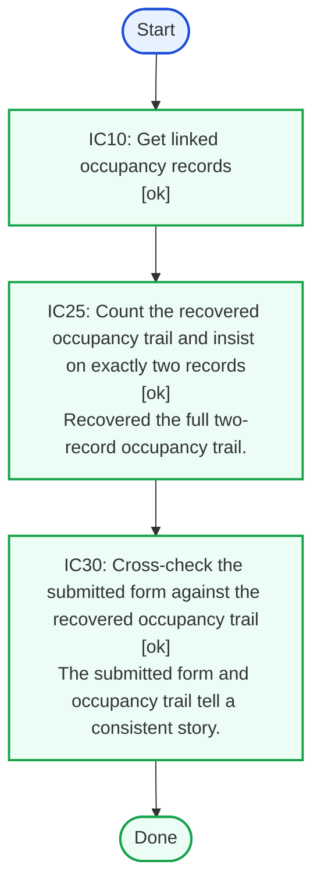
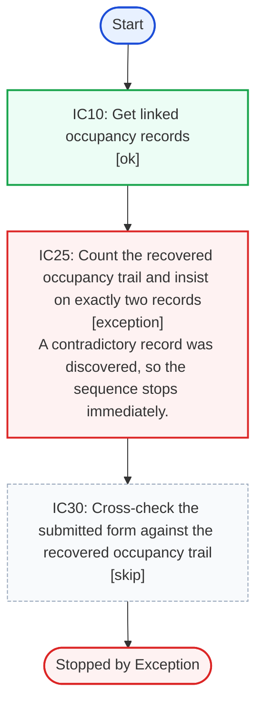
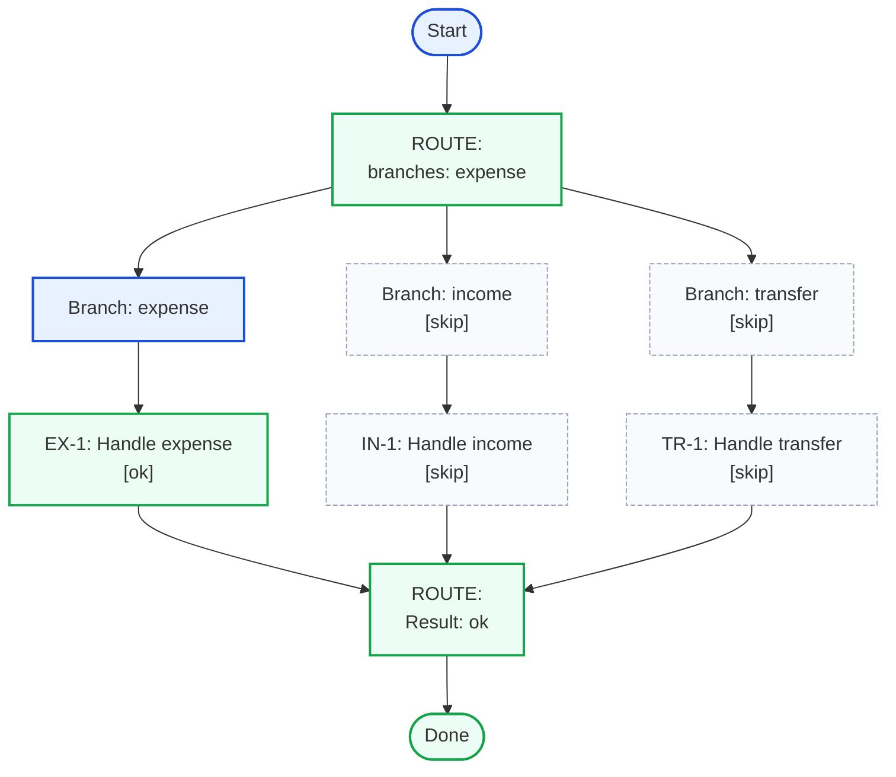
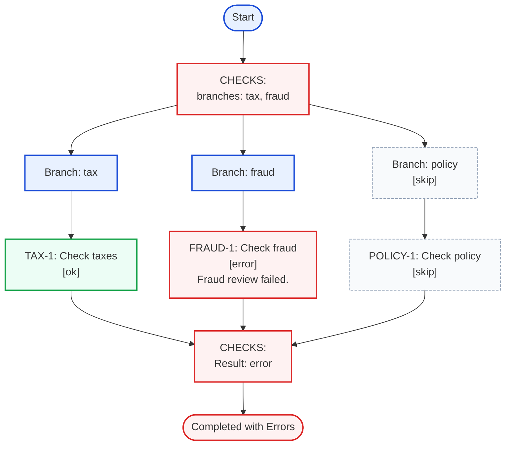
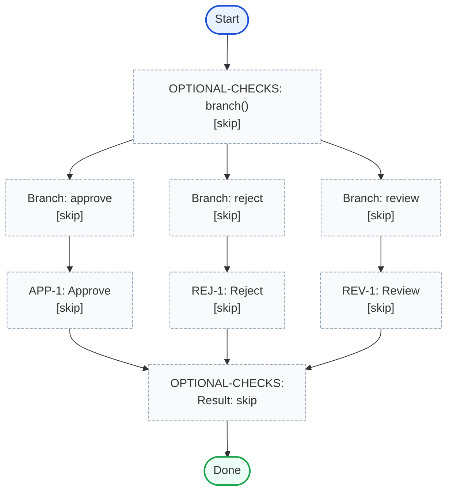

# structured-flow

Need to manage hundreds of business logic validation rules in code? Tired of scattered docs and complex code?
structured-flow helps you structure logic and visualize execution.

<!-- TOC -->
* [structured-flow](#structured-flow)
* [Structured Flow API Example](#structured-flow-api-example)
  * [Flow And Step Execution](#flow-and-step-execution)
  * [Flow](#flow)
  * [Static Graph](#static-graph)
  * [Passing Demo](#passing-demo)
  * [Failing Demo](#failing-demo)
  * [Stop Demo](#stop-demo)
  * [Exception Demo](#exception-demo)
* [branch() examples](#branch-examples)
  * [One Of Three Branches](#one-of-three-branches)
  * [Two Of Three Branches](#two-of-three-branches)
  * [Skipped Branch](#skipped-branch)
<!-- TOC -->

# Structured Flow API Example

This example shows the intended flow of the sequence API and two concrete runs of the same sequence.

- `createSyncFlow<Ctx, Info>()` starts a builder that accepts only synchronous step functions.
- `createAsyncFlow<Ctx, Info>()` starts a builder that accepts synchronous or async step functions.
- `.step(id, description, fn)` appends a step that can extend ctx and return structured step results.
- `.branch(id, select, branches)` appends a branch step that runs one or more child flows selected from `branches`.
- `.build()` returns a sequence with a single `run()` method.
- `FlowResult` contains the accumulated ctx, per-step results, and helper methods like `failedStepIds()`.
- `renderProcessAsMermaidGraph(...)` can render a builder, sequence, or executed sequence result.

## Flow And Step Execution

For a sequence built with `createSyncFlow()`, `run(initialCtx)` executes immediately and returns a
`FlowResult`. For a sequence built with `createAsyncFlow()`, `run(initialCtx)` awaits each step in order and
returns `Promise<FlowResult>`.

When a sequence starts, it copies the initial context and executes steps in order. Each step function receives the
current accumulated context and returns a structured step result object. That return object can contain:

- `result` to control execution flow
- `info` to record step metadata into `stepResults`
- additional fields that are merged into the context only when the result is `ok` or `stop`

Execution continues through `ok`, `error`, and explicit `skip` results. Execution stops early on `stop` or
`exception`, and all remaining steps are recorded as `skip`. If a step throws, the sequence catches it, records that
step as `exception`, and then marks the remaining steps as `skip`.

Branch steps call `select(ctx)` to choose which child flow or flows to run. `select` can return a single branch key,
multiple keys, or a direct step result value like `skip`, `error`, `stop`, or `exception`. Returning an unknown key
fails the branch step. Child flows always start from the parent step's current ctx, but their added ctx fields stay
inside the child flow result and are not merged back into the parent ctx. Nested child step results are recorded under
the parent step result's `branches` array.

The table below summarizes how each recorded `result` value affects execution and context updates:

| Result value | Step executed | Flow continues | Returned fields added to context | Remaining steps auto-recorded as `skip` |
|--------------|---------------|----------------|----------------------------------|-----------------------------------------|
| `ok`         | yes           | yes            | yes                              | no                                      |
| `error`      | yes           | yes            | no                               | no                                      |
| `stop`       | yes           | no             | yes                              | yes                                     |
| `exception`  | yes           | no             | no                               | yes                                     |
| `skip`       | sometimes     | yes            | no                               | no                                      |

## Flow

```ts
type SubmittedForm = { id: string }
type Occupancy = { id: string }

function getOccupancies({ form }: { form: SubmittedForm }) {
  return {
    occupancies: form.id === '123' ? [{ id: 'a' + form.id }] : [{ id: 'a' + form.id }, { id: 'b' + form.id }],
  }
}

function verifyOccupancyCount({ form, occupancies }: { form: SubmittedForm; occupancies: Occupancy[] }) {
  if (form.id === '300') {
    return stepResult({
      result: 'stop',
      info: 'The first two records are enough here, so the sequence can finish early.',
    })
  }

  if (form.id === '400') {
    return stepResult({
      result: 'exception',
      info: 'A contradictory record was discovered, so the sequence stops immediately.',
    })
  }

  return stepResult({
    result: occupancies.length === 2 ? 'ok' : 'error',
    info:
      occupancies.length === 2
        ? 'Recovered the full two-record occupancy trail.'
        : 'Expected two occupancy records but found an incomplete trail.',
  })
}

async function crossCheckFormAndOccupancies({ form }: { form: SubmittedForm; occupancies: Occupancy[] }) {
  return stepResult({
    result: form.id === '400' ? 'error' : 'ok',
    info:
      form.id === '123'
        ? 'The submitted form is acceptable, but the occupancy trail is still incomplete.'
        : 'The submitted form and occupancy trail tell a consistent story.',
  })
}

const sequence = createAsync<{ form: SubmittedForm }, string>()
  .step('IC10', 'Get linked occupancy records', getOccupancies)
  .step('IC25', 'Count the recovered occupancy trail and insist on exactly two records', verifyOccupancyCount)
  .step('IC30', 'Cross-check the submitted form against the recovered occupancy trail', crossCheckFormAndOccupancies)
  .build()
```

## Static Graph

<div style="display:grid;grid-template-columns:repeat(3,minmax(0,1fr));gap:16px;align-items:start;"><div><p><strong>Result JSON</strong><br>Static sequence view does not have a run result yet.</p></div><div><div>

<!-- structured-process-demo:static-graph:mermaid:start -->

<!-- structured-process-demo:static-graph:mermaid:end -->

</div></div><div><!-- structured-process-demo:static-graph:html-table:start -->
<table style="width:100%;border-collapse:collapse;font-size:14px;"><thead><tr><th style="text-align:left;padding:8px;border-bottom:1px solid #d0d7de;">Step</th><th style="text-align:left;padding:8px;border-bottom:1px solid #d0d7de;">Description</th></tr></thead><tbody><tr><td style="padding:8px;border-bottom:1px solid #d0d7de;vertical-align:top;">IC10</td><td style="padding:8px;border-bottom:1px solid #d0d7de;vertical-align:top;">Get linked occupancy records</td></tr><tr><td style="padding:8px;border-bottom:1px solid #d0d7de;vertical-align:top;">IC25</td><td style="padding:8px;border-bottom:1px solid #d0d7de;vertical-align:top;">Count the recovered occupancy trail and insist on exactly two records</td></tr><tr><td style="padding:8px;border-bottom:1px solid #d0d7de;vertical-align:top;">IC30</td><td style="padding:8px;border-bottom:1px solid #d0d7de;vertical-align:top;">Cross-check the submitted form against the recovered occupancy trail</td></tr></tbody></table>
<!-- structured-process-demo:static-graph:html-table:end --></div></div>

## Passing Demo

<div style="display:grid;grid-template-columns:repeat(3,minmax(0,1fr));gap:16px;align-items:start;"><div><div>

<p><strong>Init JSON</strong></p>
<!-- structured-process-demo:passing-demo-init:json:start -->
<pre style="margin:0;padding:12px;background:#f6f8fa;border:1px solid #d0d7de;border-radius:6px;overflow:auto;font-size:12px;line-height:1.45;">
<code>{
  &quot;form&quot;: {
    &quot;id&quot;: &quot;200&quot;
  }
}</code>
</pre>
<!-- structured-process-demo:passing-demo-init:json:end -->

<p><strong>Result JSON</strong></p>
<!-- structured-process-demo:passing-demo-result:json:start -->
<pre style="margin:0;padding:12px;background:#f6f8fa;border:1px solid #d0d7de;border-radius:6px;overflow:auto;font-size:12px;line-height:1.45;">
<code>{
  &quot;ok&quot;: true,
  &quot;failedStepIds&quot;: [],
  &quot;stepResults&quot;: [
    {
      &quot;id&quot;: &quot;IC10&quot;,
      &quot;result&quot;: &quot;ok&quot;
    },
    {
      &quot;id&quot;: &quot;IC25&quot;,
      &quot;result&quot;: &quot;ok&quot;,
      &quot;info&quot;: &quot;Recovered the full two-record occupancy trail.&quot;
    },
    {
      &quot;id&quot;: &quot;IC30&quot;,
      &quot;result&quot;: &quot;ok&quot;,
      &quot;info&quot;: &quot;The submitted form and occupancy trail tell a consistent story.&quot;
    }
  ],
  &quot;ctx&quot;: {
    &quot;form&quot;: {
      &quot;id&quot;: &quot;200&quot;
    },
    &quot;occupancies&quot;: [
      {
        &quot;id&quot;: &quot;a200&quot;
      },
      {
        &quot;id&quot;: &quot;b200&quot;
      }
    ]
  }
}</code>
</pre>
<!-- structured-process-demo:passing-demo-result:json:end -->

</div></div><div><div>

<!-- structured-process-demo:passing-demo:mermaid:start -->

<!-- structured-process-demo:passing-demo:mermaid:end -->

</div></div><div><p><strong>Overall outcome:</strong> <span style="display:inline-block;padding:2px 8px;border-radius:999px;font-size:12px;font-weight:600;background:#ecfdf5;color:#166534;border:1px solid #86efac;">successful sequence run</span><br><strong>Failed steps:</strong> none</p>
<!-- structured-process-demo:passing-demo:html-table:start -->
<table style="width:100%;border-collapse:collapse;font-size:14px;">
<thead><tr><th style="text-align:left;padding:8px;border-bottom:1px solid #d0d7de;">Step</th><th style="text-align:left;padding:8px;border-bottom:1px solid #d0d7de;">Description</th><th style="text-align:left;padding:8px;border-bottom:1px solid #d0d7de;">Result</th><th style="text-align:left;padding:8px;border-bottom:1px solid #d0d7de;">Info</th><th style="text-align:left;padding:8px;border-bottom:1px solid #d0d7de;">Branches</th></tr></thead>
<tbody><tr>
<td style="padding:8px;border-bottom:1px solid #d0d7de;vertical-align:top;">IC10</td>
<td style="padding:8px;border-bottom:1px solid #d0d7de;vertical-align:top;">Get linked occupancy records</td>
<td style="padding:8px;border-bottom:1px solid #d0d7de;vertical-align:top;"><span style="display:inline-block;padding:2px 8px;border-radius:999px;font-size:12px;font-weight:600;background:#ecfdf5;color:#166534;border:1px solid #86efac;">ok</span></td>
<td style="padding:8px;border-bottom:1px solid #d0d7de;vertical-align:top;"></td>
<td style="padding:8px;border-bottom:1px solid #d0d7de;vertical-align:top;"></td>
</tr><tr>
<td style="padding:8px;border-bottom:1px solid #d0d7de;vertical-align:top;">IC25</td>
<td style="padding:8px;border-bottom:1px solid #d0d7de;vertical-align:top;">Count the recovered occupancy trail and insist on exactly two records</td>
<td style="padding:8px;border-bottom:1px solid #d0d7de;vertical-align:top;"><span style="display:inline-block;padding:2px 8px;border-radius:999px;font-size:12px;font-weight:600;background:#ecfdf5;color:#166534;border:1px solid #86efac;">ok</span></td>
<td style="padding:8px;border-bottom:1px solid #d0d7de;vertical-align:top;">Recovered the full two-record occupancy trail.</td>
<td style="padding:8px;border-bottom:1px solid #d0d7de;vertical-align:top;"></td>
</tr><tr>
<td style="padding:8px;border-bottom:1px solid #d0d7de;vertical-align:top;">IC30</td>
<td style="padding:8px;border-bottom:1px solid #d0d7de;vertical-align:top;">Cross-check the submitted form against the recovered occupancy trail</td>
<td style="padding:8px;border-bottom:1px solid #d0d7de;vertical-align:top;"><span style="display:inline-block;padding:2px 8px;border-radius:999px;font-size:12px;font-weight:600;background:#ecfdf5;color:#166534;border:1px solid #86efac;">ok</span></td>
<td style="padding:8px;border-bottom:1px solid #d0d7de;vertical-align:top;">The submitted form and occupancy trail tell a consistent story.</td>
<td style="padding:8px;border-bottom:1px solid #d0d7de;vertical-align:top;"></td>
</tr></tbody>
</table>
<!-- structured-process-demo:passing-demo:html-table:end --></div></div>

## Failing Demo

<div style="display:grid;grid-template-columns:repeat(3,minmax(0,1fr));gap:16px;align-items:start;"><div><div>

<p><strong>Init JSON</strong></p>
<!-- structured-process-demo:failing-demo-init:json:start -->
<pre style="margin:0;padding:12px;background:#f6f8fa;border:1px solid #d0d7de;border-radius:6px;overflow:auto;font-size:12px;line-height:1.45;">
<code>{
  &quot;form&quot;: {
    &quot;id&quot;: &quot;123&quot;
  }
}</code>
</pre>
<!-- structured-process-demo:failing-demo-init:json:end -->

<p><strong>Result JSON</strong></p>
<!-- structured-process-demo:failing-demo-result:json:start -->
<pre style="margin:0;padding:12px;background:#f6f8fa;border:1px solid #d0d7de;border-radius:6px;overflow:auto;font-size:12px;line-height:1.45;">
<code>{
  &quot;ok&quot;: false,
  &quot;failedStepIds&quot;: [
    &quot;IC25&quot;
  ],
  &quot;stepResults&quot;: [
    {
      &quot;id&quot;: &quot;IC10&quot;,
      &quot;result&quot;: &quot;ok&quot;
    },
    {
      &quot;id&quot;: &quot;IC25&quot;,
      &quot;result&quot;: &quot;error&quot;,
      &quot;info&quot;: &quot;Expected two occupancy records but found an incomplete trail.&quot;
    },
    {
      &quot;id&quot;: &quot;IC30&quot;,
      &quot;result&quot;: &quot;ok&quot;,
      &quot;info&quot;: &quot;The submitted form is acceptable, but the occupancy trail is still incomplete.&quot;
    }
  ],
  &quot;ctx&quot;: {
    &quot;form&quot;: {
      &quot;id&quot;: &quot;123&quot;
    },
    &quot;occupancies&quot;: [
      {
        &quot;id&quot;: &quot;a123&quot;
      }
    ]
  }
}</code>
</pre>
<!-- structured-process-demo:failing-demo-result:json:end -->

</div></div><div><div>

<!-- structured-process-demo:failing-demo:mermaid:start -->

<!-- structured-process-demo:failing-demo:mermaid:end -->

</div></div><div><p><strong>Overall outcome:</strong> <span style="display:inline-block;padding:2px 8px;border-radius:999px;font-size:12px;font-weight:600;background:#fef2f2;color:#b91c1c;border:1px solid #fca5a5;">completed with errors</span><br><strong>Failed steps:</strong> IC25</p>
<!-- structured-process-demo:failing-demo:html-table:start -->
<table style="width:100%;border-collapse:collapse;font-size:14px;">
<thead><tr><th style="text-align:left;padding:8px;border-bottom:1px solid #d0d7de;">Step</th><th style="text-align:left;padding:8px;border-bottom:1px solid #d0d7de;">Description</th><th style="text-align:left;padding:8px;border-bottom:1px solid #d0d7de;">Result</th><th style="text-align:left;padding:8px;border-bottom:1px solid #d0d7de;">Info</th><th style="text-align:left;padding:8px;border-bottom:1px solid #d0d7de;">Branches</th></tr></thead>
<tbody><tr>
<td style="padding:8px;border-bottom:1px solid #d0d7de;vertical-align:top;">IC10</td>
<td style="padding:8px;border-bottom:1px solid #d0d7de;vertical-align:top;">Get linked occupancy records</td>
<td style="padding:8px;border-bottom:1px solid #d0d7de;vertical-align:top;"><span style="display:inline-block;padding:2px 8px;border-radius:999px;font-size:12px;font-weight:600;background:#ecfdf5;color:#166534;border:1px solid #86efac;">ok</span></td>
<td style="padding:8px;border-bottom:1px solid #d0d7de;vertical-align:top;"></td>
<td style="padding:8px;border-bottom:1px solid #d0d7de;vertical-align:top;"></td>
</tr><tr>
<td style="padding:8px;border-bottom:1px solid #d0d7de;vertical-align:top;">IC25</td>
<td style="padding:8px;border-bottom:1px solid #d0d7de;vertical-align:top;">Count the recovered occupancy trail and insist on exactly two records</td>
<td style="padding:8px;border-bottom:1px solid #d0d7de;vertical-align:top;"><span style="display:inline-block;padding:2px 8px;border-radius:999px;font-size:12px;font-weight:600;background:#fef2f2;color:#b91c1c;border:1px solid #fca5a5;">error</span></td>
<td style="padding:8px;border-bottom:1px solid #d0d7de;vertical-align:top;">Expected two occupancy records but found an incomplete trail.</td>
<td style="padding:8px;border-bottom:1px solid #d0d7de;vertical-align:top;"></td>
</tr><tr>
<td style="padding:8px;border-bottom:1px solid #d0d7de;vertical-align:top;">IC30</td>
<td style="padding:8px;border-bottom:1px solid #d0d7de;vertical-align:top;">Cross-check the submitted form against the recovered occupancy trail</td>
<td style="padding:8px;border-bottom:1px solid #d0d7de;vertical-align:top;"><span style="display:inline-block;padding:2px 8px;border-radius:999px;font-size:12px;font-weight:600;background:#ecfdf5;color:#166534;border:1px solid #86efac;">ok</span></td>
<td style="padding:8px;border-bottom:1px solid #d0d7de;vertical-align:top;">The submitted form is acceptable, but the occupancy trail is still incomplete.</td>
<td style="padding:8px;border-bottom:1px solid #d0d7de;vertical-align:top;"></td>
</tr></tbody>
</table>
<!-- structured-process-demo:failing-demo:html-table:end --></div></div>

## Stop Demo

<div style="display:grid;grid-template-columns:repeat(3,minmax(0,1fr));gap:16px;align-items:start;"><div><div>

<p><strong>Init JSON</strong></p>
<!-- structured-process-demo:stop-demo-init:json:start -->
<pre style="margin:0;padding:12px;background:#f6f8fa;border:1px solid #d0d7de;border-radius:6px;overflow:auto;font-size:12px;line-height:1.45;">
<code>{
  &quot;form&quot;: {
    &quot;id&quot;: &quot;300&quot;
  }
}</code>
</pre>
<!-- structured-process-demo:stop-demo-init:json:end -->

<p><strong>Result JSON</strong></p>
<!-- structured-process-demo:stop-demo-result:json:start -->
<pre style="margin:0;padding:12px;background:#f6f8fa;border:1px solid #d0d7de;border-radius:6px;overflow:auto;font-size:12px;line-height:1.45;">
<code>{
  &quot;ok&quot;: true,
  &quot;failedStepIds&quot;: [],
  &quot;stepResults&quot;: [
    {
      &quot;id&quot;: &quot;IC10&quot;,
      &quot;result&quot;: &quot;ok&quot;
    },
    {
      &quot;id&quot;: &quot;IC25&quot;,
      &quot;result&quot;: &quot;stop&quot;,
      &quot;info&quot;: &quot;The first two records are enough here, so the sequence can finish early.&quot;
    },
    {
      &quot;id&quot;: &quot;IC30&quot;,
      &quot;result&quot;: &quot;skip&quot;
    }
  ],
  &quot;ctx&quot;: {
    &quot;form&quot;: {
      &quot;id&quot;: &quot;300&quot;
    },
    &quot;occupancies&quot;: [
      {
        &quot;id&quot;: &quot;a300&quot;
      },
      {
        &quot;id&quot;: &quot;b300&quot;
      }
    ]
  }
}</code>
</pre>
<!-- structured-process-demo:stop-demo-result:json:end -->

</div></div><div><div>

<!-- structured-process-demo:stop-demo:mermaid:start -->

<!-- structured-process-demo:stop-demo:mermaid:end -->

</div></div><div><p><strong>Overall outcome:</strong> <span style="display:inline-block;padding:2px 8px;border-radius:999px;font-size:12px;font-weight:600;background:#f0fdf4;color:#166534;border:1px solid #86efac;">completed early</span><br><strong>Failed steps:</strong> none</p>
<!-- structured-process-demo:stop-demo:html-table:start -->
<table style="width:100%;border-collapse:collapse;font-size:14px;">
<thead><tr><th style="text-align:left;padding:8px;border-bottom:1px solid #d0d7de;">Step</th><th style="text-align:left;padding:8px;border-bottom:1px solid #d0d7de;">Description</th><th style="text-align:left;padding:8px;border-bottom:1px solid #d0d7de;">Result</th><th style="text-align:left;padding:8px;border-bottom:1px solid #d0d7de;">Info</th><th style="text-align:left;padding:8px;border-bottom:1px solid #d0d7de;">Branches</th></tr></thead>
<tbody><tr>
<td style="padding:8px;border-bottom:1px solid #d0d7de;vertical-align:top;">IC10</td>
<td style="padding:8px;border-bottom:1px solid #d0d7de;vertical-align:top;">Get linked occupancy records</td>
<td style="padding:8px;border-bottom:1px solid #d0d7de;vertical-align:top;"><span style="display:inline-block;padding:2px 8px;border-radius:999px;font-size:12px;font-weight:600;background:#ecfdf5;color:#166534;border:1px solid #86efac;">ok</span></td>
<td style="padding:8px;border-bottom:1px solid #d0d7de;vertical-align:top;"></td>
<td style="padding:8px;border-bottom:1px solid #d0d7de;vertical-align:top;"></td>
</tr><tr>
<td style="padding:8px;border-bottom:1px solid #d0d7de;vertical-align:top;">IC25</td>
<td style="padding:8px;border-bottom:1px solid #d0d7de;vertical-align:top;">Count the recovered occupancy trail and insist on exactly two records</td>
<td style="padding:8px;border-bottom:1px solid #d0d7de;vertical-align:top;"><span style="display:inline-block;padding:2px 8px;border-radius:999px;font-size:12px;font-weight:600;background:#f0fdf4;color:#166534;border:1px solid #86efac;">stop</span></td>
<td style="padding:8px;border-bottom:1px solid #d0d7de;vertical-align:top;">The first two records are enough here, so the sequence can finish early.</td>
<td style="padding:8px;border-bottom:1px solid #d0d7de;vertical-align:top;"></td>
</tr><tr>
<td style="padding:8px;border-bottom:1px solid #d0d7de;vertical-align:top;">IC30</td>
<td style="padding:8px;border-bottom:1px solid #d0d7de;vertical-align:top;">Cross-check the submitted form against the recovered occupancy trail</td>
<td style="padding:8px;border-bottom:1px solid #d0d7de;vertical-align:top;"><span style="display:inline-block;padding:2px 8px;border-radius:999px;font-size:12px;font-weight:600;background:#f8fafc;color:#475569;border:1px solid #cbd5e1;">skip</span></td>
<td style="padding:8px;border-bottom:1px solid #d0d7de;vertical-align:top;"></td>
<td style="padding:8px;border-bottom:1px solid #d0d7de;vertical-align:top;"></td>
</tr></tbody>
</table>
<!-- structured-process-demo:stop-demo:html-table:end --></div></div>

## Exception Demo

<div style="display:grid;grid-template-columns:repeat(3,minmax(0,1fr));gap:16px;align-items:start;"><div><div>

<p><strong>Init JSON</strong></p>
<!-- structured-process-demo:exception-demo-init:json:start -->
<pre style="margin:0;padding:12px;background:#f6f8fa;border:1px solid #d0d7de;border-radius:6px;overflow:auto;font-size:12px;line-height:1.45;">
<code>{
  &quot;form&quot;: {
    &quot;id&quot;: &quot;400&quot;
  }
}</code>
</pre>
<!-- structured-process-demo:exception-demo-init:json:end -->

<p><strong>Result JSON</strong></p>
<!-- structured-process-demo:exception-demo-result:json:start -->
<pre style="margin:0;padding:12px;background:#f6f8fa;border:1px solid #d0d7de;border-radius:6px;overflow:auto;font-size:12px;line-height:1.45;">
<code>{
  &quot;ok&quot;: false,
  &quot;failedStepIds&quot;: [
    &quot;IC25&quot;
  ],
  &quot;stepResults&quot;: [
    {
      &quot;id&quot;: &quot;IC10&quot;,
      &quot;result&quot;: &quot;ok&quot;
    },
    {
      &quot;id&quot;: &quot;IC25&quot;,
      &quot;result&quot;: &quot;exception&quot;,
      &quot;info&quot;: &quot;A contradictory record was discovered, so the sequence stops immediately.&quot;
    },
    {
      &quot;id&quot;: &quot;IC30&quot;,
      &quot;result&quot;: &quot;skip&quot;
    }
  ],
  &quot;ctx&quot;: {
    &quot;form&quot;: {
      &quot;id&quot;: &quot;400&quot;
    },
    &quot;occupancies&quot;: [
      {
        &quot;id&quot;: &quot;a400&quot;
      },
      {
        &quot;id&quot;: &quot;b400&quot;
      }
    ]
  }
}</code>
</pre>
<!-- structured-process-demo:exception-demo-result:json:end -->

</div></div><div><div>

<!-- structured-process-demo:exception-demo:mermaid:start -->

<!-- structured-process-demo:exception-demo:mermaid:end -->

</div></div><div><p><strong>Overall outcome:</strong> <span style="display:inline-block;padding:2px 8px;border-radius:999px;font-size:12px;font-weight:600;background:#fef2f2;color:#b91c1c;border:1px solid #fca5a5;">stopped by exception</span><br><strong>Failed steps:</strong> IC25</p>
<!-- structured-process-demo:exception-demo:html-table:start -->
<table style="width:100%;border-collapse:collapse;font-size:14px;">
<thead><tr><th style="text-align:left;padding:8px;border-bottom:1px solid #d0d7de;">Step</th><th style="text-align:left;padding:8px;border-bottom:1px solid #d0d7de;">Description</th><th style="text-align:left;padding:8px;border-bottom:1px solid #d0d7de;">Result</th><th style="text-align:left;padding:8px;border-bottom:1px solid #d0d7de;">Info</th><th style="text-align:left;padding:8px;border-bottom:1px solid #d0d7de;">Branches</th></tr></thead>
<tbody><tr>
<td style="padding:8px;border-bottom:1px solid #d0d7de;vertical-align:top;">IC10</td>
<td style="padding:8px;border-bottom:1px solid #d0d7de;vertical-align:top;">Get linked occupancy records</td>
<td style="padding:8px;border-bottom:1px solid #d0d7de;vertical-align:top;"><span style="display:inline-block;padding:2px 8px;border-radius:999px;font-size:12px;font-weight:600;background:#ecfdf5;color:#166534;border:1px solid #86efac;">ok</span></td>
<td style="padding:8px;border-bottom:1px solid #d0d7de;vertical-align:top;"></td>
<td style="padding:8px;border-bottom:1px solid #d0d7de;vertical-align:top;"></td>
</tr><tr>
<td style="padding:8px;border-bottom:1px solid #d0d7de;vertical-align:top;">IC25</td>
<td style="padding:8px;border-bottom:1px solid #d0d7de;vertical-align:top;">Count the recovered occupancy trail and insist on exactly two records</td>
<td style="padding:8px;border-bottom:1px solid #d0d7de;vertical-align:top;"><span style="display:inline-block;padding:2px 8px;border-radius:999px;font-size:12px;font-weight:600;background:#fef2f2;color:#b91c1c;border:1px solid #fca5a5;">exception</span></td>
<td style="padding:8px;border-bottom:1px solid #d0d7de;vertical-align:top;">A contradictory record was discovered, so the sequence stops immediately.</td>
<td style="padding:8px;border-bottom:1px solid #d0d7de;vertical-align:top;"></td>
</tr><tr>
<td style="padding:8px;border-bottom:1px solid #d0d7de;vertical-align:top;">IC30</td>
<td style="padding:8px;border-bottom:1px solid #d0d7de;vertical-align:top;">Cross-check the submitted form against the recovered occupancy trail</td>
<td style="padding:8px;border-bottom:1px solid #d0d7de;vertical-align:top;"><span style="display:inline-block;padding:2px 8px;border-radius:999px;font-size:12px;font-weight:600;background:#f8fafc;color:#475569;border:1px solid #cbd5e1;">skip</span></td>
<td style="padding:8px;border-bottom:1px solid #d0d7de;vertical-align:top;"></td>
<td style="padding:8px;border-bottom:1px solid #d0d7de;vertical-align:top;"></td>
</tr></tbody>
</table>
<!-- structured-process-demo:exception-demo:html-table:end --></div></div>

# branch() examples

## One Of Three Branches

This run selects exactly one branch from three branches.

```ts
type PostingKind = 'income' | 'expense' | 'transfer'

const incomeFlow = createSync<{ amount: number; kind: PostingKind }>()
  .step('IN-1', 'Handle income', ({ amount }) => ({
    normalizedAmount: amount,
  }))
  .build()

const expenseFlow = createSync<{ amount: number; kind: PostingKind }>()
  .step('EX-1', 'Handle expense', ({ amount }) => ({
    normalizedAmount: -amount,
  }))
  .build()

const transferFlow = createSync<{ amount: number; kind: PostingKind }>()
  .step('TR-1', 'Handle transfer', () => ({
    transferSeen: true,
  }))
  .build()

const oneOfThreeBranchFlow = createSync<{ amount: number; kind: PostingKind }>()
  .branch('ROUTE', ({ kind }) => kind, {
    income: incomeFlow,
    expense: expenseFlow,
    transfer: transferFlow,
  })
  .build()
```

<div style="display:grid;grid-template-columns:repeat(3,minmax(0,1fr));gap:16px;align-items:start;"><div><div>

<p><strong>Init JSON</strong></p>
<!-- structured-process-demo:branch-one-of-three-demo-init:json:start -->
<pre style="margin:0;padding:12px;background:#f6f8fa;border:1px solid #d0d7de;border-radius:6px;overflow:auto;font-size:12px;line-height:1.45;">
<code>{
  &quot;amount&quot;: 24,
  &quot;kind&quot;: &quot;expense&quot;
}</code>
</pre>
<!-- structured-process-demo:branch-one-of-three-demo-init:json:end -->

<p><strong>Result JSON</strong></p>
<!-- structured-process-demo:branch-one-of-three-demo-result:json:start -->
<pre style="margin:0;padding:12px;background:#f6f8fa;border:1px solid #d0d7de;border-radius:6px;overflow:auto;font-size:12px;line-height:1.45;">
<code>{
  &quot;ok&quot;: true,
  &quot;failedStepIds&quot;: [],
  &quot;stepResults&quot;: [
    {
      &quot;id&quot;: &quot;ROUTE&quot;,
      &quot;result&quot;: &quot;ok&quot;,
      &quot;branches&quot;: [
        {
          &quot;key&quot;: &quot;expense&quot;,
          &quot;result&quot;: &quot;ok&quot;,
          &quot;ctx&quot;: {
            &quot;amount&quot;: 24,
            &quot;kind&quot;: &quot;expense&quot;,
            &quot;normalizedAmount&quot;: -24
          },
          &quot;steps&quot;: [
            {
              &quot;id&quot;: &quot;EX-1&quot;,
              &quot;description&quot;: &quot;Handle expense&quot;
            }
          ],
          &quot;stepResults&quot;: [
            {
              &quot;id&quot;: &quot;EX-1&quot;,
              &quot;result&quot;: &quot;ok&quot;
            }
          ]
        },
        {
          &quot;key&quot;: &quot;income&quot;,
          &quot;result&quot;: &quot;skip&quot;,
          &quot;ctx&quot;: {
            &quot;amount&quot;: 24,
            &quot;kind&quot;: &quot;expense&quot;
          },
          &quot;steps&quot;: [
            {
              &quot;id&quot;: &quot;IN-1&quot;,
              &quot;description&quot;: &quot;Handle income&quot;
            }
          ],
          &quot;stepResults&quot;: [
            {
              &quot;id&quot;: &quot;IN-1&quot;,
              &quot;result&quot;: &quot;skip&quot;
            }
          ]
        },
        {
          &quot;key&quot;: &quot;transfer&quot;,
          &quot;result&quot;: &quot;skip&quot;,
          &quot;ctx&quot;: {
            &quot;amount&quot;: 24,
            &quot;kind&quot;: &quot;expense&quot;
          },
          &quot;steps&quot;: [
            {
              &quot;id&quot;: &quot;TR-1&quot;,
              &quot;description&quot;: &quot;Handle transfer&quot;
            }
          ],
          &quot;stepResults&quot;: [
            {
              &quot;id&quot;: &quot;TR-1&quot;,
              &quot;result&quot;: &quot;skip&quot;
            }
          ]
        }
      ]
    }
  ],
  &quot;ctx&quot;: {
    &quot;amount&quot;: 24,
    &quot;kind&quot;: &quot;expense&quot;
  }
}</code>
</pre>
<!-- structured-process-demo:branch-one-of-three-demo-result:json:end -->

</div></div><div><div>

<!-- structured-process-demo:branch-one-of-three-demo:mermaid:start -->

<!-- structured-process-demo:branch-one-of-three-demo:mermaid:end -->

</div></div><div><p><strong>Overall outcome:</strong> <span style="display:inline-block;padding:2px 8px;border-radius:999px;font-size:12px;font-weight:600;background:#ecfdf5;color:#166534;border:1px solid #86efac;">successful sequence run</span><br><strong>Failed steps:</strong> none</p>
<!-- structured-process-demo:branch-one-of-three-demo:html-table:start -->
<table style="width:100%;border-collapse:collapse;font-size:14px;">
<thead><tr><th style="text-align:left;padding:8px;border-bottom:1px solid #d0d7de;">Step</th><th style="text-align:left;padding:8px;border-bottom:1px solid #d0d7de;">Description</th><th style="text-align:left;padding:8px;border-bottom:1px solid #d0d7de;">Result</th><th style="text-align:left;padding:8px;border-bottom:1px solid #d0d7de;">Info</th><th style="text-align:left;padding:8px;border-bottom:1px solid #d0d7de;">Branches</th></tr></thead>
<tbody><tr>
<td style="padding:8px;border-bottom:1px solid #d0d7de;vertical-align:top;">ROUTE</td>
<td style="padding:8px;border-bottom:1px solid #d0d7de;vertical-align:top;">Branch</td>
<td style="padding:8px;border-bottom:1px solid #d0d7de;vertical-align:top;"><span style="display:inline-block;padding:2px 8px;border-radius:999px;font-size:12px;font-weight:600;background:#ecfdf5;color:#166534;border:1px solid #86efac;">ok</span></td>
<td style="padding:8px;border-bottom:1px solid #d0d7de;vertical-align:top;"></td>
<td style="padding:8px;border-bottom:1px solid #d0d7de;vertical-align:top;"><div style="margin-bottom:10px;">
<div><strong>expense</strong> <span style="display:inline-block;padding:2px 8px;border-radius:999px;font-size:12px;font-weight:600;background:#ecfdf5;color:#166534;border:1px solid #86efac;">ok</span></div>
<div style="margin-top:2px;color:#475569;">Ctx: {&quot;amount&quot;:24,&quot;kind&quot;:&quot;expense&quot;,&quot;normalizedAmount&quot;:-24}</div>
<div style="margin-top:4px;padding-left:12px;">
<div>EX-1: Handle expense <span style="display:inline-block;padding:2px 8px;border-radius:999px;font-size:12px;font-weight:600;background:#ecfdf5;color:#166534;border:1px solid #86efac;">ok</span></div>

</div>
</div><div style="margin-bottom:10px;">
<div><strong>income</strong> <span style="display:inline-block;padding:2px 8px;border-radius:999px;font-size:12px;font-weight:600;background:#f8fafc;color:#475569;border:1px solid #cbd5e1;">skip</span></div>
<div style="margin-top:2px;color:#475569;">Ctx: {&quot;amount&quot;:24,&quot;kind&quot;:&quot;expense&quot;}</div>
<div style="margin-top:4px;padding-left:12px;">
<div>IN-1: Handle income <span style="display:inline-block;padding:2px 8px;border-radius:999px;font-size:12px;font-weight:600;background:#f8fafc;color:#475569;border:1px solid #cbd5e1;">skip</span></div>

</div>
</div><div style="margin-bottom:10px;">
<div><strong>transfer</strong> <span style="display:inline-block;padding:2px 8px;border-radius:999px;font-size:12px;font-weight:600;background:#f8fafc;color:#475569;border:1px solid #cbd5e1;">skip</span></div>
<div style="margin-top:2px;color:#475569;">Ctx: {&quot;amount&quot;:24,&quot;kind&quot;:&quot;expense&quot;}</div>
<div style="margin-top:4px;padding-left:12px;">
<div>TR-1: Handle transfer <span style="display:inline-block;padding:2px 8px;border-radius:999px;font-size:12px;font-weight:600;background:#f8fafc;color:#475569;border:1px solid #cbd5e1;">skip</span></div>

</div>
</div></td>
</tr></tbody>
</table>
<!-- structured-process-demo:branch-one-of-three-demo:html-table:end --></div></div>

## Two Of Three Branches

This run selects two branches from three branches and records each branch result separately.

```ts
type CheckName = 'tax' | 'fraud' | 'policy'

const taxFlow = createAsync<{ amount: number; checks: CheckName[] }>()
  .step('TAX-1', 'Check taxes', async () => ({
    taxChecked: true,
  }))
  .build()

const fraudFlow = createAsync<{ amount: number; checks: CheckName[] }, string>()
  .step('FRAUD-1', 'Check fraud', async () =>
    stepResult({
      result: 'error',
      info: 'Fraud review failed.',
    })
  )
  .build()

const policyFlow = createAsync<{ amount: number; checks: CheckName[] }>()
  .step('POLICY-1', 'Check policy', async () => ({
    policyChecked: true,
  }))
  .build()

const twoOfThreeBranchFlow = createAsync<{ amount: number; checks: CheckName[] }>()
  .branch('CHECKS', ({ checks }) => checks, {
    tax: taxFlow,
    fraud: fraudFlow,
    policy: policyFlow,
  })
  .build()
```

<div style="display:grid;grid-template-columns:repeat(3,minmax(0,1fr));gap:16px;align-items:start;"><div><div>

<p><strong>Init JSON</strong></p>
<!-- structured-process-demo:branch-two-of-three-demo-init:json:start -->
<pre style="margin:0;padding:12px;background:#f6f8fa;border:1px solid #d0d7de;border-radius:6px;overflow:auto;font-size:12px;line-height:1.45;">
<code>{
  &quot;amount&quot;: 8,
  &quot;checks&quot;: [
    &quot;tax&quot;,
    &quot;fraud&quot;
  ]
}</code>
</pre>
<!-- structured-process-demo:branch-two-of-three-demo-init:json:end -->

<p><strong>Result JSON</strong></p>
<!-- structured-process-demo:branch-two-of-three-demo-result:json:start -->
<pre style="margin:0;padding:12px;background:#f6f8fa;border:1px solid #d0d7de;border-radius:6px;overflow:auto;font-size:12px;line-height:1.45;">
<code>{
  &quot;ok&quot;: false,
  &quot;failedStepIds&quot;: [
    &quot;CHECKS&quot;
  ],
  &quot;stepResults&quot;: [
    {
      &quot;id&quot;: &quot;CHECKS&quot;,
      &quot;result&quot;: &quot;error&quot;,
      &quot;branches&quot;: [
        {
          &quot;key&quot;: &quot;tax&quot;,
          &quot;result&quot;: &quot;ok&quot;,
          &quot;ctx&quot;: {
            &quot;amount&quot;: 8,
            &quot;checks&quot;: [
              &quot;tax&quot;,
              &quot;fraud&quot;
            ],
            &quot;taxChecked&quot;: true
          },
          &quot;steps&quot;: [
            {
              &quot;id&quot;: &quot;TAX-1&quot;,
              &quot;description&quot;: &quot;Check taxes&quot;
            }
          ],
          &quot;stepResults&quot;: [
            {
              &quot;id&quot;: &quot;TAX-1&quot;,
              &quot;result&quot;: &quot;ok&quot;
            }
          ]
        },
        {
          &quot;key&quot;: &quot;fraud&quot;,
          &quot;result&quot;: &quot;error&quot;,
          &quot;ctx&quot;: {
            &quot;amount&quot;: 8,
            &quot;checks&quot;: [
              &quot;tax&quot;,
              &quot;fraud&quot;
            ]
          },
          &quot;steps&quot;: [
            {
              &quot;id&quot;: &quot;FRAUD-1&quot;,
              &quot;description&quot;: &quot;Check fraud&quot;
            }
          ],
          &quot;stepResults&quot;: [
            {
              &quot;id&quot;: &quot;FRAUD-1&quot;,
              &quot;result&quot;: &quot;error&quot;,
              &quot;info&quot;: &quot;Fraud review failed.&quot;
            }
          ]
        },
        {
          &quot;key&quot;: &quot;policy&quot;,
          &quot;result&quot;: &quot;skip&quot;,
          &quot;ctx&quot;: {
            &quot;amount&quot;: 8,
            &quot;checks&quot;: [
              &quot;tax&quot;,
              &quot;fraud&quot;
            ]
          },
          &quot;steps&quot;: [
            {
              &quot;id&quot;: &quot;POLICY-1&quot;,
              &quot;description&quot;: &quot;Check policy&quot;
            }
          ],
          &quot;stepResults&quot;: [
            {
              &quot;id&quot;: &quot;POLICY-1&quot;,
              &quot;result&quot;: &quot;skip&quot;
            }
          ]
        }
      ]
    }
  ],
  &quot;ctx&quot;: {
    &quot;amount&quot;: 8,
    &quot;checks&quot;: [
      &quot;tax&quot;,
      &quot;fraud&quot;
    ]
  }
}</code>
</pre>
<!-- structured-process-demo:branch-two-of-three-demo-result:json:end -->

</div></div><div><div>

<!-- structured-process-demo:branch-two-of-three-demo:mermaid:start -->

<!-- structured-process-demo:branch-two-of-three-demo:mermaid:end -->

</div></div><div><p><strong>Overall outcome:</strong> <span style="display:inline-block;padding:2px 8px;border-radius:999px;font-size:12px;font-weight:600;background:#fef2f2;color:#b91c1c;border:1px solid #fca5a5;">completed with errors</span><br><strong>Failed steps:</strong> CHECKS</p>
<!-- structured-process-demo:branch-two-of-three-demo:html-table:start -->
<table style="width:100%;border-collapse:collapse;font-size:14px;">
<thead><tr><th style="text-align:left;padding:8px;border-bottom:1px solid #d0d7de;">Step</th><th style="text-align:left;padding:8px;border-bottom:1px solid #d0d7de;">Description</th><th style="text-align:left;padding:8px;border-bottom:1px solid #d0d7de;">Result</th><th style="text-align:left;padding:8px;border-bottom:1px solid #d0d7de;">Info</th><th style="text-align:left;padding:8px;border-bottom:1px solid #d0d7de;">Branches</th></tr></thead>
<tbody><tr>
<td style="padding:8px;border-bottom:1px solid #d0d7de;vertical-align:top;">CHECKS</td>
<td style="padding:8px;border-bottom:1px solid #d0d7de;vertical-align:top;">Branch</td>
<td style="padding:8px;border-bottom:1px solid #d0d7de;vertical-align:top;"><span style="display:inline-block;padding:2px 8px;border-radius:999px;font-size:12px;font-weight:600;background:#fef2f2;color:#b91c1c;border:1px solid #fca5a5;">error</span></td>
<td style="padding:8px;border-bottom:1px solid #d0d7de;vertical-align:top;"></td>
<td style="padding:8px;border-bottom:1px solid #d0d7de;vertical-align:top;"><div style="margin-bottom:10px;">
<div><strong>tax</strong> <span style="display:inline-block;padding:2px 8px;border-radius:999px;font-size:12px;font-weight:600;background:#ecfdf5;color:#166534;border:1px solid #86efac;">ok</span></div>
<div style="margin-top:2px;color:#475569;">Ctx: {&quot;amount&quot;:8,&quot;checks&quot;:[&quot;tax&quot;,&quot;fraud&quot;],&quot;taxChecked&quot;:true}</div>
<div style="margin-top:4px;padding-left:12px;">
<div>TAX-1: Check taxes <span style="display:inline-block;padding:2px 8px;border-radius:999px;font-size:12px;font-weight:600;background:#ecfdf5;color:#166534;border:1px solid #86efac;">ok</span></div>

</div>
</div><div style="margin-bottom:10px;">
<div><strong>fraud</strong> <span style="display:inline-block;padding:2px 8px;border-radius:999px;font-size:12px;font-weight:600;background:#fef2f2;color:#b91c1c;border:1px solid #fca5a5;">error</span></div>
<div style="margin-top:2px;color:#475569;">Ctx: {&quot;amount&quot;:8,&quot;checks&quot;:[&quot;tax&quot;,&quot;fraud&quot;]}</div>
<div style="margin-top:4px;padding-left:12px;">
<div>FRAUD-1: Check fraud <span style="display:inline-block;padding:2px 8px;border-radius:999px;font-size:12px;font-weight:600;background:#fef2f2;color:#b91c1c;border:1px solid #fca5a5;">error</span></div>
<div style="margin-top:2px;color:#475569;">Fraud review failed.</div>
</div>
</div><div style="margin-bottom:10px;">
<div><strong>policy</strong> <span style="display:inline-block;padding:2px 8px;border-radius:999px;font-size:12px;font-weight:600;background:#f8fafc;color:#475569;border:1px solid #cbd5e1;">skip</span></div>
<div style="margin-top:2px;color:#475569;">Ctx: {&quot;amount&quot;:8,&quot;checks&quot;:[&quot;tax&quot;,&quot;fraud&quot;]}</div>
<div style="margin-top:4px;padding-left:12px;">
<div>POLICY-1: Check policy <span style="display:inline-block;padding:2px 8px;border-radius:999px;font-size:12px;font-weight:600;background:#f8fafc;color:#475569;border:1px solid #cbd5e1;">skip</span></div>

</div>
</div></td>
</tr></tbody>
</table>
<!-- structured-process-demo:branch-two-of-three-demo:html-table:end --></div></div>

## Skipped Branch

This run returns `skip` directly from the selector, so no child branch flow is executed.

```ts
const approveFlow = createSync<{ shouldRunChecks: boolean }>()
  .step('APP-1', 'Approve', () => ({
    approved: true,
  }))
  .build()

const rejectFlow = createSync<{ shouldRunChecks: boolean }>()
  .step('REJ-1', 'Reject', () => ({
    rejected: true,
  }))
  .build()

const reviewFlow = createSync<{ shouldRunChecks: boolean }>()
  .step('REV-1', 'Review', () => ({
    reviewed: true,
  }))
  .build()

const skippedBranchFlow = createSync<{ shouldRunChecks: boolean }>()
  .branch('OPTIONAL-CHECKS', ({ shouldRunChecks }) => (shouldRunChecks ? 'review' : 'skip'), {
    approve: approveFlow,
    reject: rejectFlow,
    review: reviewFlow,
  })
  .build()
```

<div style="display:grid;grid-template-columns:repeat(3,minmax(0,1fr));gap:16px;align-items:start;"><div><div>

<p><strong>Init JSON</strong></p>
<!-- structured-process-demo:branch-skip-demo-init:json:start -->
<pre style="margin:0;padding:12px;background:#f6f8fa;border:1px solid #d0d7de;border-radius:6px;overflow:auto;font-size:12px;line-height:1.45;">
<code>{
  &quot;shouldRunChecks&quot;: false
}</code>
</pre>
<!-- structured-process-demo:branch-skip-demo-init:json:end -->

<p><strong>Result JSON</strong></p>
<!-- structured-process-demo:branch-skip-demo-result:json:start -->
<pre style="margin:0;padding:12px;background:#f6f8fa;border:1px solid #d0d7de;border-radius:6px;overflow:auto;font-size:12px;line-height:1.45;">
<code>{
  &quot;ok&quot;: true,
  &quot;failedStepIds&quot;: [],
  &quot;stepResults&quot;: [
    {
      &quot;id&quot;: &quot;OPTIONAL-CHECKS&quot;,
      &quot;result&quot;: &quot;skip&quot;,
      &quot;branches&quot;: [
        {
          &quot;key&quot;: &quot;approve&quot;,
          &quot;result&quot;: &quot;skip&quot;,
          &quot;ctx&quot;: {
            &quot;shouldRunChecks&quot;: false
          },
          &quot;steps&quot;: [
            {
              &quot;id&quot;: &quot;APP-1&quot;,
              &quot;description&quot;: &quot;Approve&quot;
            }
          ],
          &quot;stepResults&quot;: [
            {
              &quot;id&quot;: &quot;APP-1&quot;,
              &quot;result&quot;: &quot;skip&quot;
            }
          ]
        },
        {
          &quot;key&quot;: &quot;reject&quot;,
          &quot;result&quot;: &quot;skip&quot;,
          &quot;ctx&quot;: {
            &quot;shouldRunChecks&quot;: false
          },
          &quot;steps&quot;: [
            {
              &quot;id&quot;: &quot;REJ-1&quot;,
              &quot;description&quot;: &quot;Reject&quot;
            }
          ],
          &quot;stepResults&quot;: [
            {
              &quot;id&quot;: &quot;REJ-1&quot;,
              &quot;result&quot;: &quot;skip&quot;
            }
          ]
        },
        {
          &quot;key&quot;: &quot;review&quot;,
          &quot;result&quot;: &quot;skip&quot;,
          &quot;ctx&quot;: {
            &quot;shouldRunChecks&quot;: false
          },
          &quot;steps&quot;: [
            {
              &quot;id&quot;: &quot;REV-1&quot;,
              &quot;description&quot;: &quot;Review&quot;
            }
          ],
          &quot;stepResults&quot;: [
            {
              &quot;id&quot;: &quot;REV-1&quot;,
              &quot;result&quot;: &quot;skip&quot;
            }
          ]
        }
      ]
    }
  ],
  &quot;ctx&quot;: {
    &quot;shouldRunChecks&quot;: false
  }
}</code>
</pre>
<!-- structured-process-demo:branch-skip-demo-result:json:end -->

</div></div><div><div>

<!-- structured-process-demo:branch-skip-demo:mermaid:start -->

<!-- structured-process-demo:branch-skip-demo:mermaid:end -->

</div></div><div><p><strong>Overall outcome:</strong> <span style="display:inline-block;padding:2px 8px;border-radius:999px;font-size:12px;font-weight:600;background:#ecfdf5;color:#166534;border:1px solid #86efac;">done</span><br><strong>Failed steps:</strong> none</p>
<!-- structured-process-demo:branch-skip-demo:html-table:start -->
<table style="width:100%;border-collapse:collapse;font-size:14px;">
<thead><tr><th style="text-align:left;padding:8px;border-bottom:1px solid #d0d7de;">Step</th><th style="text-align:left;padding:8px;border-bottom:1px solid #d0d7de;">Description</th><th style="text-align:left;padding:8px;border-bottom:1px solid #d0d7de;">Result</th><th style="text-align:left;padding:8px;border-bottom:1px solid #d0d7de;">Info</th><th style="text-align:left;padding:8px;border-bottom:1px solid #d0d7de;">Branches</th></tr></thead>
<tbody><tr>
<td style="padding:8px;border-bottom:1px solid #d0d7de;vertical-align:top;">OPTIONAL-CHECKS</td>
<td style="padding:8px;border-bottom:1px solid #d0d7de;vertical-align:top;">Branch</td>
<td style="padding:8px;border-bottom:1px solid #d0d7de;vertical-align:top;"><span style="display:inline-block;padding:2px 8px;border-radius:999px;font-size:12px;font-weight:600;background:#f8fafc;color:#475569;border:1px solid #cbd5e1;">skip</span></td>
<td style="padding:8px;border-bottom:1px solid #d0d7de;vertical-align:top;"></td>
<td style="padding:8px;border-bottom:1px solid #d0d7de;vertical-align:top;"><div style="margin-bottom:10px;">
<div><strong>approve</strong> <span style="display:inline-block;padding:2px 8px;border-radius:999px;font-size:12px;font-weight:600;background:#f8fafc;color:#475569;border:1px solid #cbd5e1;">skip</span></div>
<div style="margin-top:2px;color:#475569;">Ctx: {&quot;shouldRunChecks&quot;:false}</div>
<div style="margin-top:4px;padding-left:12px;">
<div>APP-1: Approve <span style="display:inline-block;padding:2px 8px;border-radius:999px;font-size:12px;font-weight:600;background:#f8fafc;color:#475569;border:1px solid #cbd5e1;">skip</span></div>

</div>
</div><div style="margin-bottom:10px;">
<div><strong>reject</strong> <span style="display:inline-block;padding:2px 8px;border-radius:999px;font-size:12px;font-weight:600;background:#f8fafc;color:#475569;border:1px solid #cbd5e1;">skip</span></div>
<div style="margin-top:2px;color:#475569;">Ctx: {&quot;shouldRunChecks&quot;:false}</div>
<div style="margin-top:4px;padding-left:12px;">
<div>REJ-1: Reject <span style="display:inline-block;padding:2px 8px;border-radius:999px;font-size:12px;font-weight:600;background:#f8fafc;color:#475569;border:1px solid #cbd5e1;">skip</span></div>

</div>
</div><div style="margin-bottom:10px;">
<div><strong>review</strong> <span style="display:inline-block;padding:2px 8px;border-radius:999px;font-size:12px;font-weight:600;background:#f8fafc;color:#475569;border:1px solid #cbd5e1;">skip</span></div>
<div style="margin-top:2px;color:#475569;">Ctx: {&quot;shouldRunChecks&quot;:false}</div>
<div style="margin-top:4px;padding-left:12px;">
<div>REV-1: Review <span style="display:inline-block;padding:2px 8px;border-radius:999px;font-size:12px;font-weight:600;background:#f8fafc;color:#475569;border:1px solid #cbd5e1;">skip</span></div>

</div>
</div></td>
</tr></tbody>
</table>
<!-- structured-process-demo:branch-skip-demo:html-table:end --></div></div>
