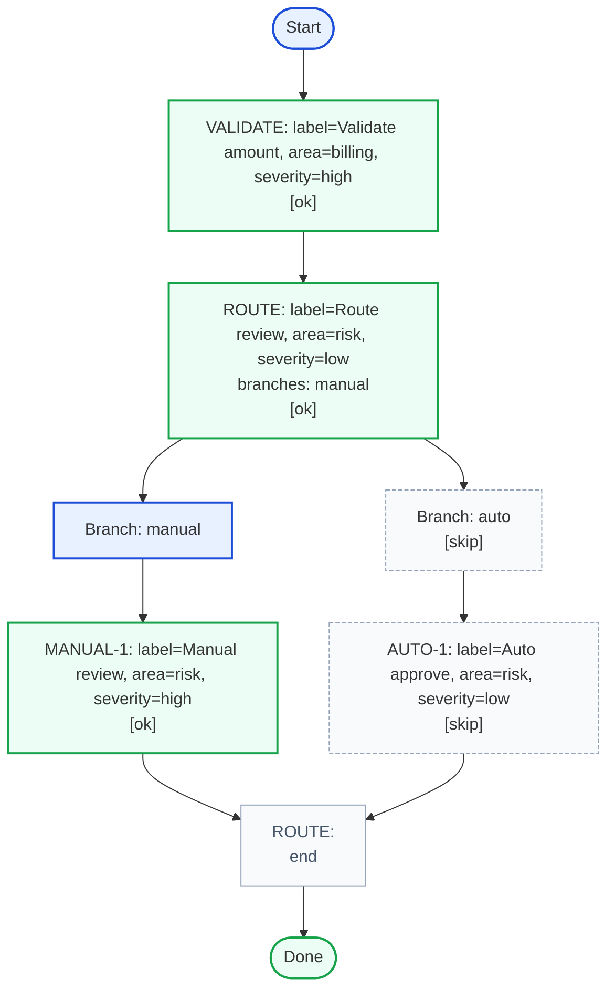
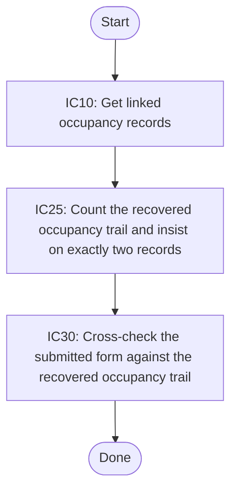
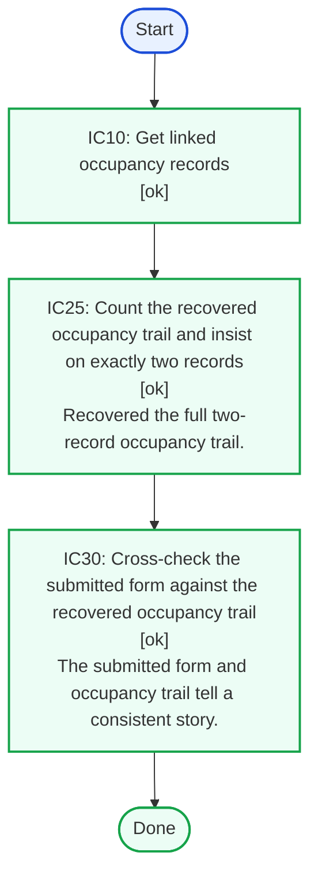
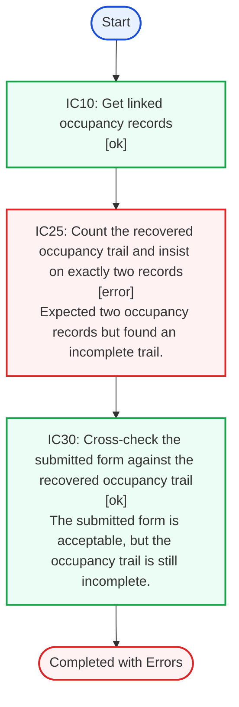
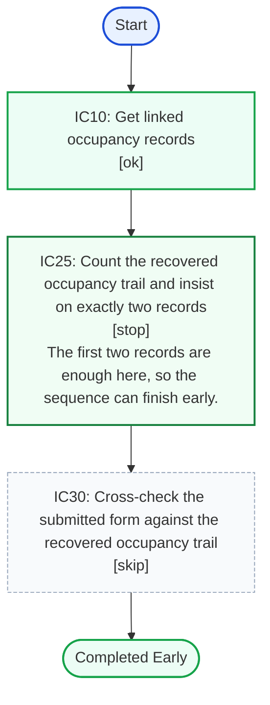
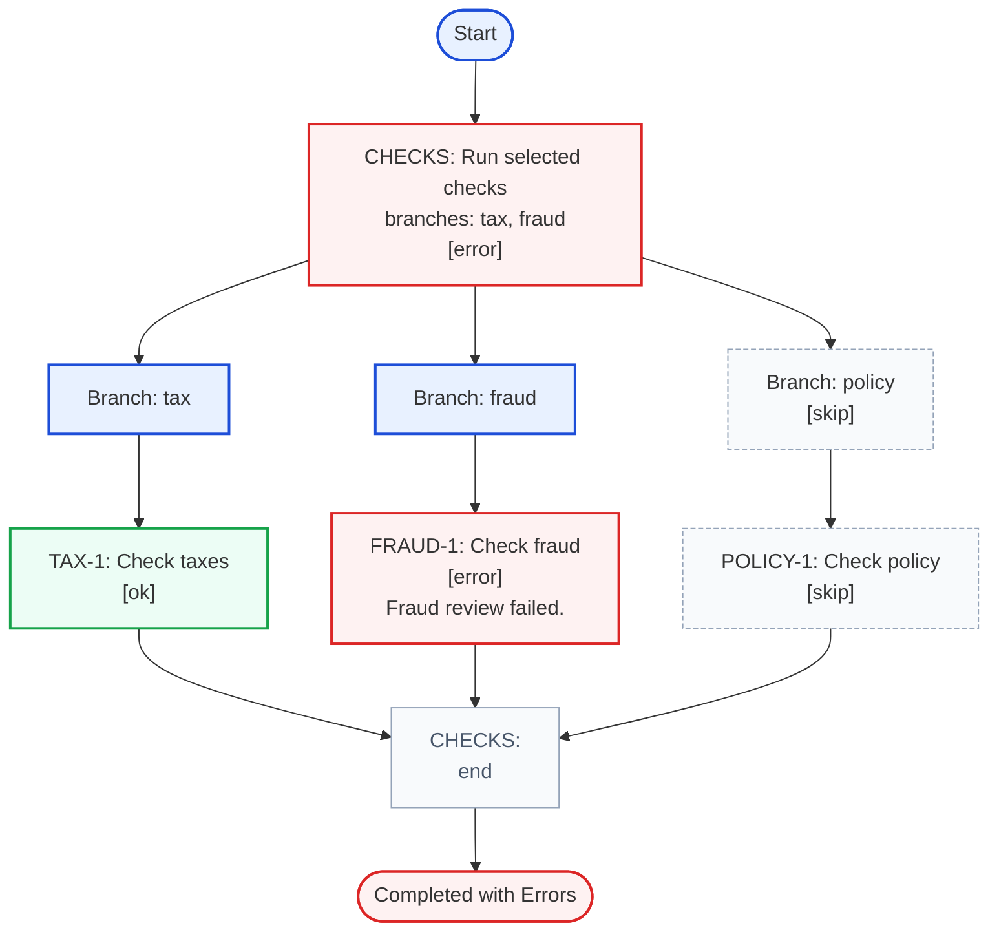
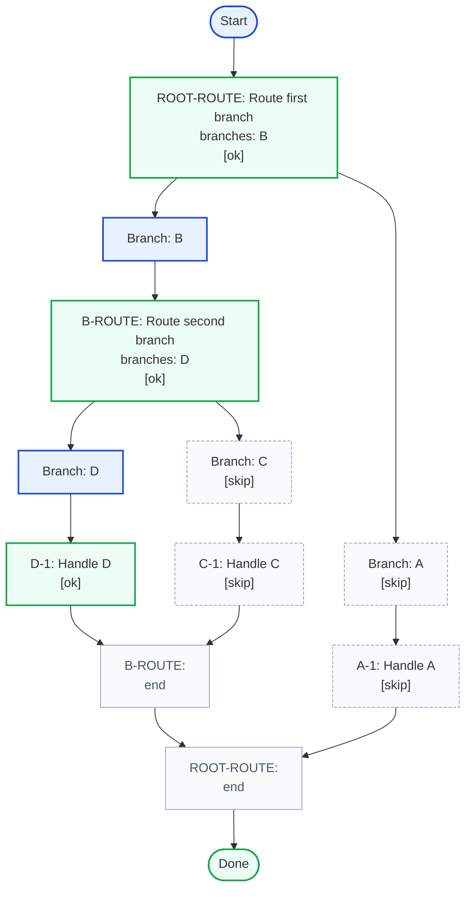
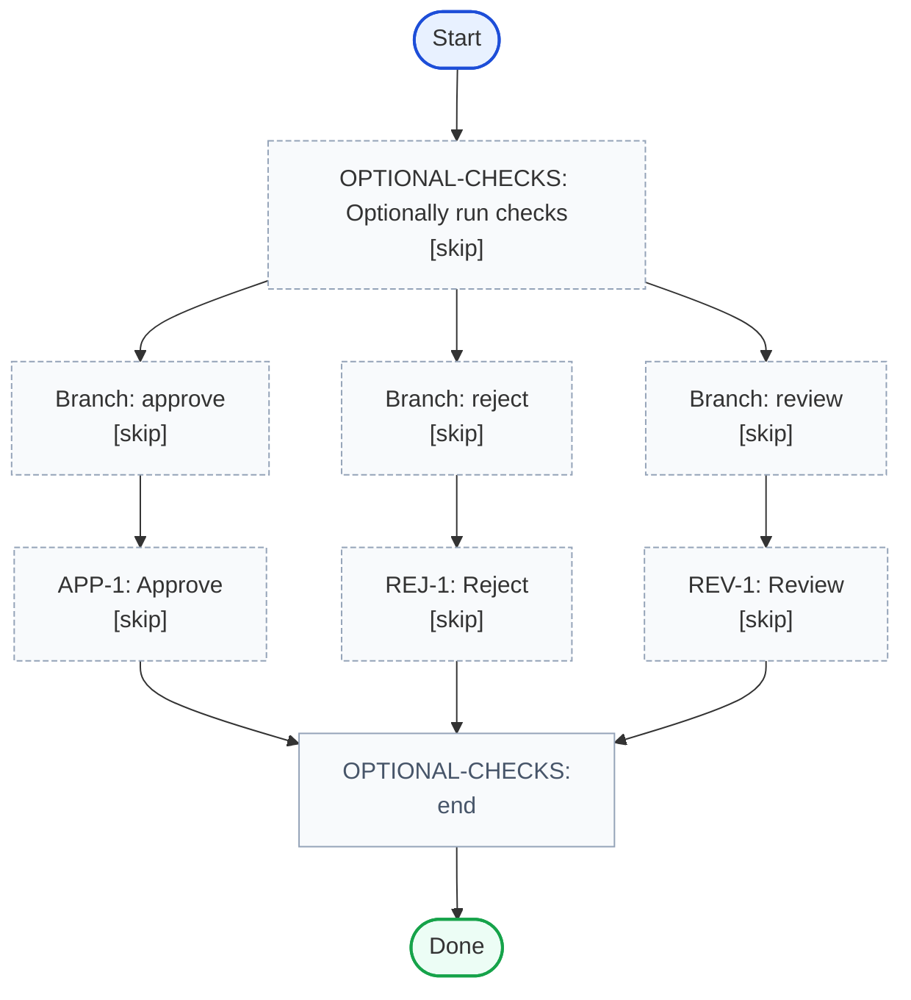

```mermaid
flowchart TD
  start([Start])
  step_0["ROUTE: Route posting kind
branches: expense
[ok]"]
  branch_0_end["ROUTE:
end"]
  branch_0_end --> done
  class branch_0_end join
  branch_0_0_start["Branch: expense"]
  step_0 --> branch_0_0_start
  branch_0_0_step_0["EX-1: Handle expense
[ok]"]
  branch_0_0_start --> branch_0_0_step_0
  branch_0_0_step_0 --> branch_0_end
  class branch_0_0_step_0 success
  class branch_0_0_start executed
  branch_0_1_start["Branch: income
[skip]"]
  step_0 --> branch_0_1_start
  branch_0_1_step_0["IN-1: Handle income
[skip]"]
  branch_0_1_start --> branch_0_1_step_0
  branch_0_1_step_0 --> branch_0_end
  class branch_0_1_step_0 neutral
  class branch_0_1_start neutral
  branch_0_2_start["Branch: transfer
[skip]"]
  step_0 --> branch_0_2_start
  branch_0_2_step_0["TR-1: Handle transfer
[skip]"]
  branch_0_2_start --> branch_0_2_step_0
  branch_0_2_step_0 --> branch_0_end
  class branch_0_2_step_0 neutral
  class branch_0_2_start neutral
  done([Done])
  start --> step_0
  classDef executed fill:#e8f1ff,stroke:#1d4ed8,stroke-width:2px
  classDef success fill:#ecfdf5,stroke:#16a34a,stroke-width:2px
  classDef complete fill:#f0fdf4,stroke:#15803d,stroke-width:2px
  classDef failure fill:#fef2f2,stroke:#dc2626,stroke-width:2px
  classDef neutral fill:#f8fafc,stroke:#94a3b8,stroke-dasharray: 4 2
  classDef join fill:#f8fafc,stroke:#94a3b8,stroke-width:1px,color:#475569
  class step_0 success
  class start executed
  class done success
```

# structured-flow

Model business rules or validation steps with code in a structured way.

Structured flow gives you:

- A way to define a flow of steps with a human-readable API and descriptions
- API that enforces correctness over hundreds of rules and prevents errors
- Ready made tools to visualize and document the flow and its execution
    - Mermaid graphs: the flow and flow results
    - Markdown HTML tables
- Evidence of processesed rules
- Simple API for modeling complex structures
- Full type enforcement: types are enforced for rule functions and flows
- Promotes splitting the program code in to smaller functions. Instead of a deep nested validation logic, there's small
  functions that are called by the flow

<!-- TOC -->

* [Core API](#core-api)
    * [Flow And Step Execution](#flow-and-step-execution)
    * [Handling results](#handling-results)
    * [Rendering results](#rendering-results)
* [Code examples](#code-examples)
    * [Structured StepDescription](#structured-stepdescription)
    * [Step results and execution visualized](#step-results-and-execution-visualized)
        * [Flow](#flow)
        * [Static Graph](#static-graph)
        * [Passing Demo](#passing-demo)
        * [Failing Demo](#failing-demo)
        * [Stop Demo](#stop-demo)
        * [Exception Demo](#exception-demo)
    * [branch() examples](#branch-examples)
        * [One Of Three Branches](#one-of-three-branches)
        * [Two Of Three Branches](#two-of-three-branches)
        * [Nested Branch](#nested-branch)
        * [Skipped Branch](#skipped-branch)
<!-- TOC -->

# Core API

```ts
type SubmittedForm = { id: string }
type Occupancy = { id: string }

function getOccupancies(_ctx: { form: SubmittedForm }) {
  return {
    occupancies: [] as Occupancy[],
  }
}

function verifyOccupancyCount(_ctx: { form: SubmittedForm; occupancies: Occupancy[] }) {
  return stepResult({
    result: 'ok',
    info: 'Count looks good.',
  })
}

async function crossCheckFormAndOccupancies(_ctx: { form: SubmittedForm; occupancies: Occupancy[] }) {
  return stepResult({
    result: 'ok',
    info: 'Cross-check passed.',
  })
}

// Ctx is inferred from the first step function parameter. Here it becomes `{ form: SubmittedForm }`.
const validations = createAsyncFlow('IC10', 'Get linked occupancy records', getOccupancies)
  // Fields returned from a step are added to the ctx for following steps when the result is `ok` or `stop`.
  // `getOccupancies()` adds `occupancies`, so later steps receive `{ form, occupancies }`.
  .step('IC25', 'Count the recovered occupancy trail', verifyOccupancyCount)
  .step('IC30', 'Cross-check the submitted form against the occupancy trail', crossCheckFormAndOccupancies)
  .build()

// run() returns `FlowResult` which can be used to inspect the results
const result = await validations.run({form: {id: '200'}})

if (!result.ok) {
  throw new Error(`Validation failed: ${result.failedStepIds().join(', ')}`)
}
```

## Flow And Step Execution

Each step receives the initial or acculated context object and each step function returns a `StepResult`.

`StepResult` contains the following fields:

- `result` controls execution of the flow and the execution of the following steps
    - `ok` or undefined mean that the step was completed successfully.
    - `error` means that the step failed and execution continues.
    - Thrown errors are recorded as `exception`m but exception can be returned with code also
    - `stop` means that the step failed and execution stops.
    - `skip` does not continue
- `info` is copied into `stepResults`
- other returned fields are added to the ctx

A branch step calls the selector function and can return one key, many keys, or a direct status like `skip`, `error`,
`stop`, or
`exception`. Child flows run from the parent ctx, but their ctx additions stay inside the branch result.

A list step iterates the current ctx when it is an array. It supports:
- `.list<State>(id, description, runItem)`
- `.list<State>(id, description, flow)`
- `.list<State>(id, description, mapItem, flow)`

Function mode receives `{ ctx, item, state? }`. Flow mode passes `{ ctx, item, state? }` to the child flow. Mapper mode can
return `true`, `false`, `undefined`, or a mapped object with `item`, optional `ctx`, optional `state`, and optional immediate
`result`/`info`.

The table below shows how each recorded `result` affects execution and ctx updates:

| Result value      | Step executed | Flow continues | Returned fields added to context | Remaining steps auto-recorded as `skip` |
|-------------------|---------------|----------------|----------------------------------|-----------------------------------------|
| `ok` or undefined | yes           | yes            | yes                              | no                                      |
| `error`           | yes           | yes            | no                               | no                                      |
| `stop`            | yes           | no             | yes                              | yes                                     |
| `exception`       | yes           | no             | no                               | yes                                     |
| `skip`            | sometimes     | yes            | no                               | no                                      |

## Handling results

- `FlowResult` exposes `ok`, `finalCtx`, `stepResults`, and `failedStepIds()`.
- Use `result.ok` for the top-level pass/fail check.
- `result.failedStepIds()` returns failed ids from the main flow and nested branch flows.
- `result.failedStepIds({ branchPrefix: true })` prefixes nested branch failures with their parent branch step ids.
- Each `stepResult` records `id`, `result`, optional `info`, optional `addToCtx`, and optional nested `branches`.
- `result.enrichResult()` returns an enriched results object which contains the step's `description` to each recorded
  step result, including nested branch results.

## Rendering results

- `renderProcessAsMermaidGraph(flow)` renders a static graph from a builder or built flow.
- `renderProcessAsMermaidGraph(result)` renders an executed graph with step statuses and `info`.

# Code examples

## Structured StepDescription

This example uses an object-valued `StepDescription` for both `step()` and `branch()`. The generated JSON below shows
the stored flow definition.

```ts
type StepMeta = {
  label: string
  area: 'billing' | 'risk'
  severity: 'low' | 'high'
}

const autoReviewFlow = createSyncFlow(
  'AUTO-1',
  { label: 'Auto approve', area: 'risk', severity: 'low' },
  ({ amount, normalizedAmount }: { amount: number; normalizedAmount: number }) => ({
    autoApproved: normalizedAmount <= Math.abs(amount),
  })
)

const manualReviewFlow = createSyncFlow(
  'MANUAL-1',
  { label: 'Manual review', area: 'risk', severity: 'high' },
  ({ normalizedAmount }: { amount: number; normalizedAmount: number }) => ({
    queuedForReview: normalizedAmount > 1000,
  })
)

const structuredStepDescriptionFlow = createSyncFlow<StepMeta>(
  'VALIDATE',
  { label: 'Validate amount', area: 'billing', severity: 'high' },
  ({ amount }) => ({
    normalizedAmount: Math.abs(amount),
  })
)
  .branch(
    'ROUTE',
    { label: 'Route review', area: 'risk', severity: 'low' },
    ({ normalizedAmount }) => (normalizedAmount > 1000 ? 'manual' : 'auto'),
    {
      auto: autoReviewFlow,
      manual: manualReviewFlow,
    }
  )
  .build()
```

<p><strong>Internal flow configuration JSON</strong></p>

<!-- structured-process-demo:structured-step-description-flow-json:json:start -->
<pre style="margin:0;padding:12px;background:#f6f8fa;border:1px solid #d0d7de;border-radius:6px;overflow:auto;font-size:12px;line-height:1.45;">
<code>{
  &quot;steps&quot;: [
    {
      &quot;id&quot;: &quot;VALIDATE&quot;,
      &quot;description&quot;: {
        &quot;label&quot;: &quot;Validate amount&quot;,
        &quot;area&quot;: &quot;billing&quot;,
        &quot;severity&quot;: &quot;high&quot;
      },
      &quot;fn&quot;: {
        &quot;kind&quot;: &quot;arrow-function&quot;,
        &quot;async&quot;: false,
        &quot;params&quot;: &quot;({ amount })&quot;,
        &quot;bodyPreview&quot;: &quot;({ normalizedAmount: Math.abs(amount) })&quot;
      }
    },
    {
      &quot;id&quot;: &quot;ROUTE&quot;,
      &quot;description&quot;: {
        &quot;label&quot;: &quot;Route review&quot;,
        &quot;area&quot;: &quot;risk&quot;,
        &quot;severity&quot;: &quot;low&quot;
      },
      &quot;fn&quot;: {
        &quot;kind&quot;: &quot;arrow-function&quot;,
        &quot;async&quot;: false,
        &quot;params&quot;: &quot;(ctx)&quot;,
        &quot;bodyPreview&quot;: &quot;new BranchSync(id, ctx, selectBranches, normalizedBranches).execute()&quot;
      }
    }
  ],
  &quot;mode&quot;: &quot;sync&quot;
}</code>
</pre>
<!-- structured-process-demo:structured-step-description-flow-json:json:end -->

<div style="display:grid;grid-template-columns:repeat(3,minmax(0,1fr));gap:16px;align-items:start;"><div><div>

<p><strong>Initial JSON parameter</strong></p>
<!-- structured-process-demo:structured-step-description-demo-init:json:start -->
<pre style="margin:0;padding:12px;background:#f6f8fa;border:1px solid #d0d7de;border-radius:6px;overflow:auto;font-size:12px;line-height:1.45;">
<code>{
  &quot;amount&quot;: -1400
}</code>
</pre>
<!-- structured-process-demo:structured-step-description-demo-init:json:end -->

<p><strong>Resulting JSON</strong></p>
<!-- structured-process-demo:structured-step-description-demo-result:json:start -->
<pre style="margin:0;padding:12px;background:#f6f8fa;border:1px solid #d0d7de;border-radius:6px;overflow:auto;font-size:12px;line-height:1.45;">
<code>{
  &quot;ok&quot;: true,
  &quot;failedStepIds&quot;: [],
  &quot;stepResults&quot;: [
    {
      &quot;id&quot;: &quot;VALIDATE&quot;,
      &quot;result&quot;: &quot;ok&quot;,
      &quot;addToCtx&quot;: {
        &quot;normalizedAmount&quot;: 1400
      }
    },
    {
      &quot;id&quot;: &quot;ROUTE&quot;,
      &quot;result&quot;: &quot;ok&quot;,
      &quot;branches&quot;: [
        {
          &quot;key&quot;: &quot;manual&quot;,
          &quot;result&quot;: &quot;ok&quot;,
          &quot;finalCtx&quot;: {
            &quot;amount&quot;: -1400,
            &quot;normalizedAmount&quot;: 1400,
            &quot;queuedForReview&quot;: true
          },
          &quot;steps&quot;: [
            {
              &quot;id&quot;: &quot;MANUAL-1&quot;,
              &quot;description&quot;: {
                &quot;label&quot;: &quot;Manual review&quot;,
                &quot;area&quot;: &quot;risk&quot;,
                &quot;severity&quot;: &quot;high&quot;
              }
            }
          ],
          &quot;stepResults&quot;: [
            {
              &quot;id&quot;: &quot;MANUAL-1&quot;,
              &quot;result&quot;: &quot;ok&quot;,
              &quot;addToCtx&quot;: {
                &quot;queuedForReview&quot;: true
              }
            }
          ]
        },
        {
          &quot;key&quot;: &quot;auto&quot;,
          &quot;result&quot;: &quot;skip&quot;,
          &quot;finalCtx&quot;: {
            &quot;amount&quot;: -1400,
            &quot;normalizedAmount&quot;: 1400
          },
          &quot;steps&quot;: [
            {
              &quot;id&quot;: &quot;AUTO-1&quot;,
              &quot;description&quot;: {
                &quot;label&quot;: &quot;Auto approve&quot;,
                &quot;area&quot;: &quot;risk&quot;,
                &quot;severity&quot;: &quot;low&quot;
              }
            }
          ],
          &quot;stepResults&quot;: [
            {
              &quot;id&quot;: &quot;AUTO-1&quot;,
              &quot;result&quot;: &quot;skip&quot;
            }
          ]
        }
      ]
    }
  ],
  &quot;finalCtx&quot;: {
    &quot;amount&quot;: -1400,
    &quot;normalizedAmount&quot;: 1400
  }
}</code>
</pre>
<!-- structured-process-demo:structured-step-description-demo-result:json:end -->

</div></div><div><div>

<!-- structured-process-demo:structured-step-description-demo:mermaid:start -->

<!-- structured-process-demo:structured-step-description-demo:mermaid:end -->

</div></div><div><p><strong>Overall outcome:</strong> <span style="display:inline-block;padding:2px 8px;border-radius:999px;font-size:12px;font-weight:600;background:#ecfdf5;color:#166534;border:1px solid #86efac;">successful sequence run</span><br><strong>Failed steps:</strong> none</p>
<!-- structured-process-demo:structured-step-description-demo:html-table:start -->
<table style="width:100%;border-collapse:collapse;font-size:14px;">
<thead><tr><th style="text-align:left;padding:8px;border-bottom:1px solid #d0d7de;">Step</th><th style="text-align:left;padding:8px;border-bottom:1px solid #d0d7de;">Description</th><th style="text-align:left;padding:8px;border-bottom:1px solid #d0d7de;">Result</th><th style="text-align:left;padding:8px;border-bottom:1px solid #d0d7de;">Info</th><th style="text-align:left;padding:8px;border-bottom:1px solid #d0d7de;">Add to ctx</th><th style="text-align:left;padding:8px;border-bottom:1px solid #d0d7de;">Branches</th></tr></thead>
<tbody><tr>
<td style="padding:8px;border-bottom:1px solid #d0d7de;vertical-align:top;">VALIDATE</td>
<td style="padding:8px;border-bottom:1px solid #d0d7de;vertical-align:top;">{&quot;label&quot;:&quot;Validate amount&quot;,&quot;area&quot;:&quot;billing&quot;,&quot;severity&quot;:&quot;high&quot;}</td>
<td style="padding:8px;border-bottom:1px solid #d0d7de;vertical-align:top;"><span style="display:inline-block;padding:2px 8px;border-radius:999px;font-size:12px;font-weight:600;background:#ecfdf5;color:#166534;border:1px solid #86efac;">ok</span></td>
<td style="padding:8px;border-bottom:1px solid #d0d7de;vertical-align:top;"></td>
<td style="padding:8px;border-bottom:1px solid #d0d7de;vertical-align:top;">{&quot;normalizedAmount&quot;:1400}</td>
<td style="padding:8px;border-bottom:1px solid #d0d7de;vertical-align:top;"></td>
</tr><tr>
<td style="padding:8px;border-bottom:1px solid #d0d7de;vertical-align:top;">ROUTE</td>
<td style="padding:8px;border-bottom:1px solid #d0d7de;vertical-align:top;">{&quot;label&quot;:&quot;Route review&quot;,&quot;area&quot;:&quot;risk&quot;,&quot;severity&quot;:&quot;low&quot;}</td>
<td style="padding:8px;border-bottom:1px solid #d0d7de;vertical-align:top;"><span style="display:inline-block;padding:2px 8px;border-radius:999px;font-size:12px;font-weight:600;background:#ecfdf5;color:#166534;border:1px solid #86efac;">ok</span></td>
<td style="padding:8px;border-bottom:1px solid #d0d7de;vertical-align:top;"></td>
<td style="padding:8px;border-bottom:1px solid #d0d7de;vertical-align:top;"></td>
<td style="padding:8px;border-bottom:1px solid #d0d7de;vertical-align:top;"><div style="margin-bottom:10px;padding-left:0px;">
<div><strong>manual</strong> <span style="display:inline-block;padding:2px 8px;border-radius:999px;font-size:12px;font-weight:600;background:#ecfdf5;color:#166534;border:1px solid #86efac;">ok</span></div>
<div style="margin-top:2px;color:#475569;">Final ctx: {&quot;amount&quot;:-1400,&quot;normalizedAmount&quot;:1400,&quot;queuedForReview&quot;:true}</div>
<div style="margin-top:4px;padding-left:12px;">
<div>MANUAL-1: {&quot;label&quot;:&quot;Manual review&quot;,&quot;area&quot;:&quot;risk&quot;,&quot;severity&quot;:&quot;high&quot;} <span style="display:inline-block;padding:2px 8px;border-radius:999px;font-size:12px;font-weight:600;background:#ecfdf5;color:#166534;border:1px solid #86efac;">ok</span></div>

<div style="margin-top:2px;color:#475569;">Add to ctx: {&quot;queuedForReview&quot;:true}</div>

</div>
</div><div style="margin-bottom:10px;padding-left:0px;">
<div><strong>auto</strong> <span style="display:inline-block;padding:2px 8px;border-radius:999px;font-size:12px;font-weight:600;background:#f8fafc;color:#475569;border:1px solid #cbd5e1;">skip</span></div>
<div style="margin-top:2px;color:#475569;">Final ctx: {&quot;amount&quot;:-1400,&quot;normalizedAmount&quot;:1400}</div>
<div style="margin-top:4px;padding-left:12px;">
<div>AUTO-1: {&quot;label&quot;:&quot;Auto approve&quot;,&quot;area&quot;:&quot;risk&quot;,&quot;severity&quot;:&quot;low&quot;} <span style="display:inline-block;padding:2px 8px;border-radius:999px;font-size:12px;font-weight:600;background:#f8fafc;color:#475569;border:1px solid #cbd5e1;">skip</span></div>


</div>
</div></td>
</tr></tbody>
</table>
<!-- structured-process-demo:structured-step-description-demo:html-table:end --></div></div>

## Step results and execution visualized

### Flow

This is the source flow used by the graph and run examples below.

```ts
type SubmittedForm = { id: string }
type Occupancy = { id: string }

function getOccupancies({ form }: { form: SubmittedForm }) {
  return {
    occupancies: form.id === '123' ? [{ id: 'a' + form.id }] : [{ id: 'a' + form.id }, { id: 'b' + form.id }],
  }
}

function verifyOccupancyCount({ form, occupancies }: { form: SubmittedForm; occupancies: Occupancy[] }) {
  if (form.id === '300') {
    return stepResult({
      result: 'stop',
      info: 'The first two records are enough here, so the sequence can finish early.',
    })
  }

  if (form.id === '400') {
    return stepResult({
      result: 'exception',
      info: 'A contradictory record was discovered, so the sequence stops immediately.',
    })
  }

  return stepResult({
    result: occupancies.length === 2 ? 'ok' : 'error',
    info:
      occupancies.length === 2
        ? 'Recovered the full two-record occupancy trail.'
        : 'Expected two occupancy records but found an incomplete trail.',
  })
}

async function crossCheckFormAndOccupancies({ form }: { form: SubmittedForm; occupancies: Occupancy[] }) {
  return stepResult({
    result: form.id === '400' ? 'error' : 'ok',
    info:
      form.id === '123'
        ? 'The submitted form is acceptable, but the occupancy trail is still incomplete.'
        : 'The submitted form and occupancy trail tell a consistent story.',
  })
}

const sequence = createAsyncFlow('IC10', 'Get linked occupancy records', getOccupancies)
  .step('IC25', 'Count the recovered occupancy trail and insist on exactly two records', verifyOccupancyCount)
  .step('IC30', 'Cross-check the submitted form against the recovered occupancy trail', crossCheckFormAndOccupancies)
  .build()
```

### Static Graph

This is the same flow before execution.

<div style="display:grid;grid-template-columns:repeat(3,minmax(0,1fr));gap:16px;align-items:start;"><div><p><strong>Result JSON</strong><br>No run result yet.</p></div><div><div>

<!-- structured-process-demo:static-graph:mermaid:start -->

<!-- structured-process-demo:static-graph:mermaid:end -->

</div></div><div><!-- structured-process-demo:static-graph:html-table:start -->
<table style="width:100%;border-collapse:collapse;font-size:14px;"><thead><tr><th style="text-align:left;padding:8px;border-bottom:1px solid #d0d7de;">Step</th><th style="text-align:left;padding:8px;border-bottom:1px solid #d0d7de;">Description</th></tr></thead><tbody><tr><td style="padding:8px;border-bottom:1px solid #d0d7de;vertical-align:top;">IC10</td><td style="padding:8px;border-bottom:1px solid #d0d7de;vertical-align:top;">Get linked occupancy records</td></tr><tr><td style="padding:8px;border-bottom:1px solid #d0d7de;vertical-align:top;">IC25</td><td style="padding:8px;border-bottom:1px solid #d0d7de;vertical-align:top;">Count the recovered occupancy trail and insist on exactly two records</td></tr><tr><td style="padding:8px;border-bottom:1px solid #d0d7de;vertical-align:top;">IC30</td><td style="padding:8px;border-bottom:1px solid #d0d7de;vertical-align:top;">Cross-check the submitted form against the recovered occupancy trail</td></tr></tbody></table>
<!-- structured-process-demo:static-graph:html-table:end --></div></div>

### Passing Demo

Happy path: every step runs and the flow ends with `ok`.

<div style="display:grid;grid-template-columns:repeat(3,minmax(0,1fr));gap:16px;align-items:start;"><div><div>

<p><strong>Initial JSON parameter</strong></p>
<!-- structured-process-demo:passing-demo-init:json:start -->
<pre style="margin:0;padding:12px;background:#f6f8fa;border:1px solid #d0d7de;border-radius:6px;overflow:auto;font-size:12px;line-height:1.45;">
<code>{
  &quot;form&quot;: {
    &quot;id&quot;: &quot;200&quot;
  }
}</code>
</pre>
<!-- structured-process-demo:passing-demo-init:json:end -->

<p><strong>Resulting JSON</strong></p>
<!-- structured-process-demo:passing-demo-result:json:start -->
<pre style="margin:0;padding:12px;background:#f6f8fa;border:1px solid #d0d7de;border-radius:6px;overflow:auto;font-size:12px;line-height:1.45;">
<code>{
  &quot;ok&quot;: true,
  &quot;failedStepIds&quot;: [],
  &quot;stepResults&quot;: [
    {
      &quot;id&quot;: &quot;IC10&quot;,
      &quot;result&quot;: &quot;ok&quot;,
      &quot;addToCtx&quot;: {
        &quot;occupancies&quot;: [
          {
            &quot;id&quot;: &quot;a200&quot;
          },
          {
            &quot;id&quot;: &quot;b200&quot;
          }
        ]
      }
    },
    {
      &quot;id&quot;: &quot;IC25&quot;,
      &quot;result&quot;: &quot;ok&quot;,
      &quot;info&quot;: &quot;Recovered the full two-record occupancy trail.&quot;
    },
    {
      &quot;id&quot;: &quot;IC30&quot;,
      &quot;result&quot;: &quot;ok&quot;,
      &quot;info&quot;: &quot;The submitted form and occupancy trail tell a consistent story.&quot;
    }
  ],
  &quot;finalCtx&quot;: {
    &quot;form&quot;: {
      &quot;id&quot;: &quot;200&quot;
    },
    &quot;occupancies&quot;: [
      {
        &quot;id&quot;: &quot;a200&quot;
      },
      {
        &quot;id&quot;: &quot;b200&quot;
      }
    ]
  }
}</code>
</pre>
<!-- structured-process-demo:passing-demo-result:json:end -->

</div></div><div><div>

<!-- structured-process-demo:passing-demo:mermaid:start -->

<!-- structured-process-demo:passing-demo:mermaid:end -->

</div></div><div><p><strong>Overall outcome:</strong> <span style="display:inline-block;padding:2px 8px;border-radius:999px;font-size:12px;font-weight:600;background:#ecfdf5;color:#166534;border:1px solid #86efac;">successful sequence run</span><br><strong>Failed steps:</strong> none</p>
<!-- structured-process-demo:passing-demo:html-table:start -->
<table style="width:100%;border-collapse:collapse;font-size:14px;">
<thead><tr><th style="text-align:left;padding:8px;border-bottom:1px solid #d0d7de;">Step</th><th style="text-align:left;padding:8px;border-bottom:1px solid #d0d7de;">Description</th><th style="text-align:left;padding:8px;border-bottom:1px solid #d0d7de;">Result</th><th style="text-align:left;padding:8px;border-bottom:1px solid #d0d7de;">Info</th><th style="text-align:left;padding:8px;border-bottom:1px solid #d0d7de;">Add to ctx</th><th style="text-align:left;padding:8px;border-bottom:1px solid #d0d7de;">Branches</th></tr></thead>
<tbody><tr>
<td style="padding:8px;border-bottom:1px solid #d0d7de;vertical-align:top;">IC10</td>
<td style="padding:8px;border-bottom:1px solid #d0d7de;vertical-align:top;">Get linked occupancy records</td>
<td style="padding:8px;border-bottom:1px solid #d0d7de;vertical-align:top;"><span style="display:inline-block;padding:2px 8px;border-radius:999px;font-size:12px;font-weight:600;background:#ecfdf5;color:#166534;border:1px solid #86efac;">ok</span></td>
<td style="padding:8px;border-bottom:1px solid #d0d7de;vertical-align:top;"></td>
<td style="padding:8px;border-bottom:1px solid #d0d7de;vertical-align:top;">{&quot;occupancies&quot;:[{&quot;id&quot;:&quot;a200&quot;},{&quot;id&quot;:&quot;b200&quot;}]}</td>
<td style="padding:8px;border-bottom:1px solid #d0d7de;vertical-align:top;"></td>
</tr><tr>
<td style="padding:8px;border-bottom:1px solid #d0d7de;vertical-align:top;">IC25</td>
<td style="padding:8px;border-bottom:1px solid #d0d7de;vertical-align:top;">Count the recovered occupancy trail and insist on exactly two records</td>
<td style="padding:8px;border-bottom:1px solid #d0d7de;vertical-align:top;"><span style="display:inline-block;padding:2px 8px;border-radius:999px;font-size:12px;font-weight:600;background:#ecfdf5;color:#166534;border:1px solid #86efac;">ok</span></td>
<td style="padding:8px;border-bottom:1px solid #d0d7de;vertical-align:top;">Recovered the full two-record occupancy trail.</td>
<td style="padding:8px;border-bottom:1px solid #d0d7de;vertical-align:top;"></td>
<td style="padding:8px;border-bottom:1px solid #d0d7de;vertical-align:top;"></td>
</tr><tr>
<td style="padding:8px;border-bottom:1px solid #d0d7de;vertical-align:top;">IC30</td>
<td style="padding:8px;border-bottom:1px solid #d0d7de;vertical-align:top;">Cross-check the submitted form against the recovered occupancy trail</td>
<td style="padding:8px;border-bottom:1px solid #d0d7de;vertical-align:top;"><span style="display:inline-block;padding:2px 8px;border-radius:999px;font-size:12px;font-weight:600;background:#ecfdf5;color:#166534;border:1px solid #86efac;">ok</span></td>
<td style="padding:8px;border-bottom:1px solid #d0d7de;vertical-align:top;">The submitted form and occupancy trail tell a consistent story.</td>
<td style="padding:8px;border-bottom:1px solid #d0d7de;vertical-align:top;"></td>
<td style="padding:8px;border-bottom:1px solid #d0d7de;vertical-align:top;"></td>
</tr></tbody>
</table>
<!-- structured-process-demo:passing-demo:html-table:end --></div></div>

### Failing Demo

A step returns `error`. Execution continues, but the overall result is failed.

<div style="display:grid;grid-template-columns:repeat(3,minmax(0,1fr));gap:16px;align-items:start;"><div><div>

<p><strong>Initial JSON parameter</strong></p>
<!-- structured-process-demo:failing-demo-init:json:start -->
<pre style="margin:0;padding:12px;background:#f6f8fa;border:1px solid #d0d7de;border-radius:6px;overflow:auto;font-size:12px;line-height:1.45;">
<code>{
  &quot;form&quot;: {
    &quot;id&quot;: &quot;123&quot;
  }
}</code>
</pre>
<!-- structured-process-demo:failing-demo-init:json:end -->

<p><strong>Resulting JSON</strong></p>
<!-- structured-process-demo:failing-demo-result:json:start -->
<pre style="margin:0;padding:12px;background:#f6f8fa;border:1px solid #d0d7de;border-radius:6px;overflow:auto;font-size:12px;line-height:1.45;">
<code>{
  &quot;ok&quot;: false,
  &quot;failedStepIds&quot;: [
    &quot;IC25&quot;
  ],
  &quot;stepResults&quot;: [
    {
      &quot;id&quot;: &quot;IC10&quot;,
      &quot;result&quot;: &quot;ok&quot;,
      &quot;addToCtx&quot;: {
        &quot;occupancies&quot;: [
          {
            &quot;id&quot;: &quot;a123&quot;
          }
        ]
      }
    },
    {
      &quot;id&quot;: &quot;IC25&quot;,
      &quot;result&quot;: &quot;error&quot;,
      &quot;info&quot;: &quot;Expected two occupancy records but found an incomplete trail.&quot;
    },
    {
      &quot;id&quot;: &quot;IC30&quot;,
      &quot;result&quot;: &quot;ok&quot;,
      &quot;info&quot;: &quot;The submitted form is acceptable, but the occupancy trail is still incomplete.&quot;
    }
  ],
  &quot;finalCtx&quot;: {
    &quot;form&quot;: {
      &quot;id&quot;: &quot;123&quot;
    },
    &quot;occupancies&quot;: [
      {
        &quot;id&quot;: &quot;a123&quot;
      }
    ]
  }
}</code>
</pre>
<!-- structured-process-demo:failing-demo-result:json:end -->

</div></div><div><div>

<!-- structured-process-demo:failing-demo:mermaid:start -->

<!-- structured-process-demo:failing-demo:mermaid:end -->

</div></div><div><p><strong>Overall outcome:</strong> <span style="display:inline-block;padding:2px 8px;border-radius:999px;font-size:12px;font-weight:600;background:#fef2f2;color:#b91c1c;border:1px solid #fca5a5;">completed with errors</span><br><strong>Failed steps:</strong> IC25</p>
<!-- structured-process-demo:failing-demo:html-table:start -->
<table style="width:100%;border-collapse:collapse;font-size:14px;">
<thead><tr><th style="text-align:left;padding:8px;border-bottom:1px solid #d0d7de;">Step</th><th style="text-align:left;padding:8px;border-bottom:1px solid #d0d7de;">Description</th><th style="text-align:left;padding:8px;border-bottom:1px solid #d0d7de;">Result</th><th style="text-align:left;padding:8px;border-bottom:1px solid #d0d7de;">Info</th><th style="text-align:left;padding:8px;border-bottom:1px solid #d0d7de;">Add to ctx</th><th style="text-align:left;padding:8px;border-bottom:1px solid #d0d7de;">Branches</th></tr></thead>
<tbody><tr>
<td style="padding:8px;border-bottom:1px solid #d0d7de;vertical-align:top;">IC10</td>
<td style="padding:8px;border-bottom:1px solid #d0d7de;vertical-align:top;">Get linked occupancy records</td>
<td style="padding:8px;border-bottom:1px solid #d0d7de;vertical-align:top;"><span style="display:inline-block;padding:2px 8px;border-radius:999px;font-size:12px;font-weight:600;background:#ecfdf5;color:#166534;border:1px solid #86efac;">ok</span></td>
<td style="padding:8px;border-bottom:1px solid #d0d7de;vertical-align:top;"></td>
<td style="padding:8px;border-bottom:1px solid #d0d7de;vertical-align:top;">{&quot;occupancies&quot;:[{&quot;id&quot;:&quot;a123&quot;}]}</td>
<td style="padding:8px;border-bottom:1px solid #d0d7de;vertical-align:top;"></td>
</tr><tr>
<td style="padding:8px;border-bottom:1px solid #d0d7de;vertical-align:top;">IC25</td>
<td style="padding:8px;border-bottom:1px solid #d0d7de;vertical-align:top;">Count the recovered occupancy trail and insist on exactly two records</td>
<td style="padding:8px;border-bottom:1px solid #d0d7de;vertical-align:top;"><span style="display:inline-block;padding:2px 8px;border-radius:999px;font-size:12px;font-weight:600;background:#fef2f2;color:#b91c1c;border:1px solid #fca5a5;">error</span></td>
<td style="padding:8px;border-bottom:1px solid #d0d7de;vertical-align:top;">Expected two occupancy records but found an incomplete trail.</td>
<td style="padding:8px;border-bottom:1px solid #d0d7de;vertical-align:top;"></td>
<td style="padding:8px;border-bottom:1px solid #d0d7de;vertical-align:top;"></td>
</tr><tr>
<td style="padding:8px;border-bottom:1px solid #d0d7de;vertical-align:top;">IC30</td>
<td style="padding:8px;border-bottom:1px solid #d0d7de;vertical-align:top;">Cross-check the submitted form against the recovered occupancy trail</td>
<td style="padding:8px;border-bottom:1px solid #d0d7de;vertical-align:top;"><span style="display:inline-block;padding:2px 8px;border-radius:999px;font-size:12px;font-weight:600;background:#ecfdf5;color:#166534;border:1px solid #86efac;">ok</span></td>
<td style="padding:8px;border-bottom:1px solid #d0d7de;vertical-align:top;">The submitted form is acceptable, but the occupancy trail is still incomplete.</td>
<td style="padding:8px;border-bottom:1px solid #d0d7de;vertical-align:top;"></td>
<td style="padding:8px;border-bottom:1px solid #d0d7de;vertical-align:top;"></td>
</tr></tbody>
</table>
<!-- structured-process-demo:failing-demo:html-table:end --></div></div>

### Stop Demo

A step returns `stop`, so later steps are recorded as `skip`.

<div style="display:grid;grid-template-columns:repeat(3,minmax(0,1fr));gap:16px;align-items:start;"><div><div>

<p><strong>Initial JSON parameter</strong></p>
<!-- structured-process-demo:stop-demo-init:json:start -->
<pre style="margin:0;padding:12px;background:#f6f8fa;border:1px solid #d0d7de;border-radius:6px;overflow:auto;font-size:12px;line-height:1.45;">
<code>{
  &quot;form&quot;: {
    &quot;id&quot;: &quot;300&quot;
  }
}</code>
</pre>
<!-- structured-process-demo:stop-demo-init:json:end -->

<p><strong>Resulting JSON</strong></p>
<!-- structured-process-demo:stop-demo-result:json:start -->
<pre style="margin:0;padding:12px;background:#f6f8fa;border:1px solid #d0d7de;border-radius:6px;overflow:auto;font-size:12px;line-height:1.45;">
<code>{
  &quot;ok&quot;: true,
  &quot;failedStepIds&quot;: [],
  &quot;stepResults&quot;: [
    {
      &quot;id&quot;: &quot;IC10&quot;,
      &quot;result&quot;: &quot;ok&quot;,
      &quot;addToCtx&quot;: {
        &quot;occupancies&quot;: [
          {
            &quot;id&quot;: &quot;a300&quot;
          },
          {
            &quot;id&quot;: &quot;b300&quot;
          }
        ]
      }
    },
    {
      &quot;id&quot;: &quot;IC25&quot;,
      &quot;result&quot;: &quot;stop&quot;,
      &quot;info&quot;: &quot;The first two records are enough here, so the sequence can finish early.&quot;
    },
    {
      &quot;id&quot;: &quot;IC30&quot;,
      &quot;result&quot;: &quot;skip&quot;
    }
  ],
  &quot;finalCtx&quot;: {
    &quot;form&quot;: {
      &quot;id&quot;: &quot;300&quot;
    },
    &quot;occupancies&quot;: [
      {
        &quot;id&quot;: &quot;a300&quot;
      },
      {
        &quot;id&quot;: &quot;b300&quot;
      }
    ]
  }
}</code>
</pre>
<!-- structured-process-demo:stop-demo-result:json:end -->

</div></div><div><div>

<!-- structured-process-demo:stop-demo:mermaid:start -->

<!-- structured-process-demo:stop-demo:mermaid:end -->

</div></div><div><p><strong>Overall outcome:</strong> <span style="display:inline-block;padding:2px 8px;border-radius:999px;font-size:12px;font-weight:600;background:#f0fdf4;color:#166534;border:1px solid #86efac;">completed early</span><br><strong>Failed steps:</strong> none</p>
<!-- structured-process-demo:stop-demo:html-table:start -->
<table style="width:100%;border-collapse:collapse;font-size:14px;">
<thead><tr><th style="text-align:left;padding:8px;border-bottom:1px solid #d0d7de;">Step</th><th style="text-align:left;padding:8px;border-bottom:1px solid #d0d7de;">Description</th><th style="text-align:left;padding:8px;border-bottom:1px solid #d0d7de;">Result</th><th style="text-align:left;padding:8px;border-bottom:1px solid #d0d7de;">Info</th><th style="text-align:left;padding:8px;border-bottom:1px solid #d0d7de;">Add to ctx</th><th style="text-align:left;padding:8px;border-bottom:1px solid #d0d7de;">Branches</th></tr></thead>
<tbody><tr>
<td style="padding:8px;border-bottom:1px solid #d0d7de;vertical-align:top;">IC10</td>
<td style="padding:8px;border-bottom:1px solid #d0d7de;vertical-align:top;">Get linked occupancy records</td>
<td style="padding:8px;border-bottom:1px solid #d0d7de;vertical-align:top;"><span style="display:inline-block;padding:2px 8px;border-radius:999px;font-size:12px;font-weight:600;background:#ecfdf5;color:#166534;border:1px solid #86efac;">ok</span></td>
<td style="padding:8px;border-bottom:1px solid #d0d7de;vertical-align:top;"></td>
<td style="padding:8px;border-bottom:1px solid #d0d7de;vertical-align:top;">{&quot;occupancies&quot;:[{&quot;id&quot;:&quot;a300&quot;},{&quot;id&quot;:&quot;b300&quot;}]}</td>
<td style="padding:8px;border-bottom:1px solid #d0d7de;vertical-align:top;"></td>
</tr><tr>
<td style="padding:8px;border-bottom:1px solid #d0d7de;vertical-align:top;">IC25</td>
<td style="padding:8px;border-bottom:1px solid #d0d7de;vertical-align:top;">Count the recovered occupancy trail and insist on exactly two records</td>
<td style="padding:8px;border-bottom:1px solid #d0d7de;vertical-align:top;"><span style="display:inline-block;padding:2px 8px;border-radius:999px;font-size:12px;font-weight:600;background:#f0fdf4;color:#166534;border:1px solid #86efac;">stop</span></td>
<td style="padding:8px;border-bottom:1px solid #d0d7de;vertical-align:top;">The first two records are enough here, so the sequence can finish early.</td>
<td style="padding:8px;border-bottom:1px solid #d0d7de;vertical-align:top;"></td>
<td style="padding:8px;border-bottom:1px solid #d0d7de;vertical-align:top;"></td>
</tr><tr>
<td style="padding:8px;border-bottom:1px solid #d0d7de;vertical-align:top;">IC30</td>
<td style="padding:8px;border-bottom:1px solid #d0d7de;vertical-align:top;">Cross-check the submitted form against the recovered occupancy trail</td>
<td style="padding:8px;border-bottom:1px solid #d0d7de;vertical-align:top;"><span style="display:inline-block;padding:2px 8px;border-radius:999px;font-size:12px;font-weight:600;background:#f8fafc;color:#475569;border:1px solid #cbd5e1;">skip</span></td>
<td style="padding:8px;border-bottom:1px solid #d0d7de;vertical-align:top;"></td>
<td style="padding:8px;border-bottom:1px solid #d0d7de;vertical-align:top;"></td>
<td style="padding:8px;border-bottom:1px solid #d0d7de;vertical-align:top;"></td>
</tr></tbody>
</table>
<!-- structured-process-demo:stop-demo:html-table:end --></div></div>

### Exception Demo

An exception ends the flow immediately and marks the rest as `skip`.

<div style="display:grid;grid-template-columns:repeat(3,minmax(0,1fr));gap:16px;align-items:start;"><div><div>

<p><strong>Initial JSON parameter</strong></p>
<!-- structured-process-demo:exception-demo-init:json:start -->
<pre style="margin:0;padding:12px;background:#f6f8fa;border:1px solid #d0d7de;border-radius:6px;overflow:auto;font-size:12px;line-height:1.45;">
<code>{
  &quot;form&quot;: {
    &quot;id&quot;: &quot;400&quot;
  }
}</code>
</pre>
<!-- structured-process-demo:exception-demo-init:json:end -->

<p><strong>Resulting JSON</strong></p>
<!-- structured-process-demo:exception-demo-result:json:start -->
<pre style="margin:0;padding:12px;background:#f6f8fa;border:1px solid #d0d7de;border-radius:6px;overflow:auto;font-size:12px;line-height:1.45;">
<code>{
  &quot;ok&quot;: false,
  &quot;failedStepIds&quot;: [
    &quot;IC25&quot;
  ],
  &quot;stepResults&quot;: [
    {
      &quot;id&quot;: &quot;IC10&quot;,
      &quot;result&quot;: &quot;ok&quot;,
      &quot;addToCtx&quot;: {
        &quot;occupancies&quot;: [
          {
            &quot;id&quot;: &quot;a400&quot;
          },
          {
            &quot;id&quot;: &quot;b400&quot;
          }
        ]
      }
    },
    {
      &quot;id&quot;: &quot;IC25&quot;,
      &quot;result&quot;: &quot;exception&quot;,
      &quot;info&quot;: &quot;A contradictory record was discovered, so the sequence stops immediately.&quot;
    },
    {
      &quot;id&quot;: &quot;IC30&quot;,
      &quot;result&quot;: &quot;skip&quot;
    }
  ],
  &quot;finalCtx&quot;: {
    &quot;form&quot;: {
      &quot;id&quot;: &quot;400&quot;
    },
    &quot;occupancies&quot;: [
      {
        &quot;id&quot;: &quot;a400&quot;
      },
      {
        &quot;id&quot;: &quot;b400&quot;
      }
    ]
  }
}</code>
</pre>
<!-- structured-process-demo:exception-demo-result:json:end -->

</div></div><div><div>

<!-- structured-process-demo:exception-demo:mermaid:start -->

<!-- structured-process-demo:exception-demo:mermaid:end -->

</div></div><div><p><strong>Overall outcome:</strong> <span style="display:inline-block;padding:2px 8px;border-radius:999px;font-size:12px;font-weight:600;background:#fef2f2;color:#b91c1c;border:1px solid #fca5a5;">stopped by exception</span><br><strong>Failed steps:</strong> IC25</p>
<!-- structured-process-demo:exception-demo:html-table:start -->
<table style="width:100%;border-collapse:collapse;font-size:14px;">
<thead><tr><th style="text-align:left;padding:8px;border-bottom:1px solid #d0d7de;">Step</th><th style="text-align:left;padding:8px;border-bottom:1px solid #d0d7de;">Description</th><th style="text-align:left;padding:8px;border-bottom:1px solid #d0d7de;">Result</th><th style="text-align:left;padding:8px;border-bottom:1px solid #d0d7de;">Info</th><th style="text-align:left;padding:8px;border-bottom:1px solid #d0d7de;">Add to ctx</th><th style="text-align:left;padding:8px;border-bottom:1px solid #d0d7de;">Branches</th></tr></thead>
<tbody><tr>
<td style="padding:8px;border-bottom:1px solid #d0d7de;vertical-align:top;">IC10</td>
<td style="padding:8px;border-bottom:1px solid #d0d7de;vertical-align:top;">Get linked occupancy records</td>
<td style="padding:8px;border-bottom:1px solid #d0d7de;vertical-align:top;"><span style="display:inline-block;padding:2px 8px;border-radius:999px;font-size:12px;font-weight:600;background:#ecfdf5;color:#166534;border:1px solid #86efac;">ok</span></td>
<td style="padding:8px;border-bottom:1px solid #d0d7de;vertical-align:top;"></td>
<td style="padding:8px;border-bottom:1px solid #d0d7de;vertical-align:top;">{&quot;occupancies&quot;:[{&quot;id&quot;:&quot;a400&quot;},{&quot;id&quot;:&quot;b400&quot;}]}</td>
<td style="padding:8px;border-bottom:1px solid #d0d7de;vertical-align:top;"></td>
</tr><tr>
<td style="padding:8px;border-bottom:1px solid #d0d7de;vertical-align:top;">IC25</td>
<td style="padding:8px;border-bottom:1px solid #d0d7de;vertical-align:top;">Count the recovered occupancy trail and insist on exactly two records</td>
<td style="padding:8px;border-bottom:1px solid #d0d7de;vertical-align:top;"><span style="display:inline-block;padding:2px 8px;border-radius:999px;font-size:12px;font-weight:600;background:#fef2f2;color:#b91c1c;border:1px solid #fca5a5;">exception</span></td>
<td style="padding:8px;border-bottom:1px solid #d0d7de;vertical-align:top;">A contradictory record was discovered, so the sequence stops immediately.</td>
<td style="padding:8px;border-bottom:1px solid #d0d7de;vertical-align:top;"></td>
<td style="padding:8px;border-bottom:1px solid #d0d7de;vertical-align:top;"></td>
</tr><tr>
<td style="padding:8px;border-bottom:1px solid #d0d7de;vertical-align:top;">IC30</td>
<td style="padding:8px;border-bottom:1px solid #d0d7de;vertical-align:top;">Cross-check the submitted form against the recovered occupancy trail</td>
<td style="padding:8px;border-bottom:1px solid #d0d7de;vertical-align:top;"><span style="display:inline-block;padding:2px 8px;border-radius:999px;font-size:12px;font-weight:600;background:#f8fafc;color:#475569;border:1px solid #cbd5e1;">skip</span></td>
<td style="padding:8px;border-bottom:1px solid #d0d7de;vertical-align:top;"></td>
<td style="padding:8px;border-bottom:1px solid #d0d7de;vertical-align:top;"></td>
<td style="padding:8px;border-bottom:1px solid #d0d7de;vertical-align:top;"></td>
</tr></tbody>
</table>
<!-- structured-process-demo:exception-demo:html-table:end --></div></div>

## branch() examples

### One Of Three Branches

Selector returns one branch key.

```ts
type PostingKind = 'income' | 'expense' | 'transfer'

const incomeFlow = createSyncFlow('IN-1', 'Handle income', ({ amount }: { amount: number; kind: PostingKind }) => ({
  normalizedAmount: amount,
}))

const expenseFlow = createSyncFlow('EX-1', 'Handle expense', ({ amount }: { amount: number; kind: PostingKind }) => ({
  normalizedAmount: -amount,
}))

const transferFlow = createSyncFlow('TR-1', 'Handle transfer', ({ kind }: { amount: number; kind: PostingKind }) => ({
  transferSeen: kind === 'transfer',
}))

const oneOfThreeBranchFlow = createSyncFlow(
  'ROUTE',
  'Route posting kind',
  ({ kind }: { amount: number; kind: PostingKind }) => kind,
  {
    income: incomeFlow,
    expense: expenseFlow,
    transfer: transferFlow,
  }
).build()
```

<div style="display:grid;grid-template-columns:repeat(3,minmax(0,1fr));gap:16px;align-items:start;"><div><div>

<p><strong>Initial JSON parameter</strong></p>
<!-- structured-process-demo:branch-one-of-three-demo-init:json:start -->
<pre style="margin:0;padding:12px;background:#f6f8fa;border:1px solid #d0d7de;border-radius:6px;overflow:auto;font-size:12px;line-height:1.45;">
<code>{
  &quot;amount&quot;: 24,
  &quot;kind&quot;: &quot;expense&quot;
}</code>
</pre>
<!-- structured-process-demo:branch-one-of-three-demo-init:json:end -->

<p><strong>Resulting JSON</strong></p>
<!-- structured-process-demo:branch-one-of-three-demo-result:json:start -->
<pre style="margin:0;padding:12px;background:#f6f8fa;border:1px solid #d0d7de;border-radius:6px;overflow:auto;font-size:12px;line-height:1.45;">
<code>{
  &quot;ok&quot;: true,
  &quot;failedStepIds&quot;: [],
  &quot;stepResults&quot;: [
    {
      &quot;id&quot;: &quot;ROUTE&quot;,
      &quot;result&quot;: &quot;ok&quot;,
      &quot;branches&quot;: [
        {
          &quot;key&quot;: &quot;expense&quot;,
          &quot;result&quot;: &quot;ok&quot;,
          &quot;finalCtx&quot;: {
            &quot;amount&quot;: 24,
            &quot;kind&quot;: &quot;expense&quot;,
            &quot;normalizedAmount&quot;: -24
          },
          &quot;steps&quot;: [
            {
              &quot;id&quot;: &quot;EX-1&quot;,
              &quot;description&quot;: &quot;Handle expense&quot;
            }
          ],
          &quot;stepResults&quot;: [
            {
              &quot;id&quot;: &quot;EX-1&quot;,
              &quot;result&quot;: &quot;ok&quot;,
              &quot;addToCtx&quot;: {
                &quot;normalizedAmount&quot;: -24
              }
            }
          ]
        },
        {
          &quot;key&quot;: &quot;income&quot;,
          &quot;result&quot;: &quot;skip&quot;,
          &quot;finalCtx&quot;: {
            &quot;amount&quot;: 24,
            &quot;kind&quot;: &quot;expense&quot;
          },
          &quot;steps&quot;: [
            {
              &quot;id&quot;: &quot;IN-1&quot;,
              &quot;description&quot;: &quot;Handle income&quot;
            }
          ],
          &quot;stepResults&quot;: [
            {
              &quot;id&quot;: &quot;IN-1&quot;,
              &quot;result&quot;: &quot;skip&quot;
            }
          ]
        },
        {
          &quot;key&quot;: &quot;transfer&quot;,
          &quot;result&quot;: &quot;skip&quot;,
          &quot;finalCtx&quot;: {
            &quot;amount&quot;: 24,
            &quot;kind&quot;: &quot;expense&quot;
          },
          &quot;steps&quot;: [
            {
              &quot;id&quot;: &quot;TR-1&quot;,
              &quot;description&quot;: &quot;Handle transfer&quot;
            }
          ],
          &quot;stepResults&quot;: [
            {
              &quot;id&quot;: &quot;TR-1&quot;,
              &quot;result&quot;: &quot;skip&quot;
            }
          ]
        }
      ]
    }
  ],
  &quot;finalCtx&quot;: {
    &quot;amount&quot;: 24,
    &quot;kind&quot;: &quot;expense&quot;
  }
}</code>
</pre>
<!-- structured-process-demo:branch-one-of-three-demo-result:json:end -->

</div></div><div><div>

<!-- structured-process-demo:branch-one-of-three-demo:mermaid:start -->

<!-- structured-process-demo:branch-one-of-three-demo:mermaid:end -->

</div></div><div><p><strong>Overall outcome:</strong> <span style="display:inline-block;padding:2px 8px;border-radius:999px;font-size:12px;font-weight:600;background:#ecfdf5;color:#166534;border:1px solid #86efac;">successful sequence run</span><br><strong>Failed steps:</strong> none</p>
<!-- structured-process-demo:branch-one-of-three-demo:html-table:start -->
<table style="width:100%;border-collapse:collapse;font-size:14px;">
<thead><tr><th style="text-align:left;padding:8px;border-bottom:1px solid #d0d7de;">Step</th><th style="text-align:left;padding:8px;border-bottom:1px solid #d0d7de;">Description</th><th style="text-align:left;padding:8px;border-bottom:1px solid #d0d7de;">Result</th><th style="text-align:left;padding:8px;border-bottom:1px solid #d0d7de;">Info</th><th style="text-align:left;padding:8px;border-bottom:1px solid #d0d7de;">Add to ctx</th><th style="text-align:left;padding:8px;border-bottom:1px solid #d0d7de;">Branches</th></tr></thead>
<tbody><tr>
<td style="padding:8px;border-bottom:1px solid #d0d7de;vertical-align:top;">ROUTE</td>
<td style="padding:8px;border-bottom:1px solid #d0d7de;vertical-align:top;">Route posting kind</td>
<td style="padding:8px;border-bottom:1px solid #d0d7de;vertical-align:top;"><span style="display:inline-block;padding:2px 8px;border-radius:999px;font-size:12px;font-weight:600;background:#ecfdf5;color:#166534;border:1px solid #86efac;">ok</span></td>
<td style="padding:8px;border-bottom:1px solid #d0d7de;vertical-align:top;"></td>
<td style="padding:8px;border-bottom:1px solid #d0d7de;vertical-align:top;"></td>
<td style="padding:8px;border-bottom:1px solid #d0d7de;vertical-align:top;"><div style="margin-bottom:10px;padding-left:0px;">
<div><strong>expense</strong> <span style="display:inline-block;padding:2px 8px;border-radius:999px;font-size:12px;font-weight:600;background:#ecfdf5;color:#166534;border:1px solid #86efac;">ok</span></div>
<div style="margin-top:2px;color:#475569;">Final ctx: {&quot;amount&quot;:24,&quot;kind&quot;:&quot;expense&quot;,&quot;normalizedAmount&quot;:-24}</div>
<div style="margin-top:4px;padding-left:12px;">
<div>EX-1: Handle expense <span style="display:inline-block;padding:2px 8px;border-radius:999px;font-size:12px;font-weight:600;background:#ecfdf5;color:#166534;border:1px solid #86efac;">ok</span></div>

<div style="margin-top:2px;color:#475569;">Add to ctx: {&quot;normalizedAmount&quot;:-24}</div>

</div>
</div><div style="margin-bottom:10px;padding-left:0px;">
<div><strong>income</strong> <span style="display:inline-block;padding:2px 8px;border-radius:999px;font-size:12px;font-weight:600;background:#f8fafc;color:#475569;border:1px solid #cbd5e1;">skip</span></div>
<div style="margin-top:2px;color:#475569;">Final ctx: {&quot;amount&quot;:24,&quot;kind&quot;:&quot;expense&quot;}</div>
<div style="margin-top:4px;padding-left:12px;">
<div>IN-1: Handle income <span style="display:inline-block;padding:2px 8px;border-radius:999px;font-size:12px;font-weight:600;background:#f8fafc;color:#475569;border:1px solid #cbd5e1;">skip</span></div>


</div>
</div><div style="margin-bottom:10px;padding-left:0px;">
<div><strong>transfer</strong> <span style="display:inline-block;padding:2px 8px;border-radius:999px;font-size:12px;font-weight:600;background:#f8fafc;color:#475569;border:1px solid #cbd5e1;">skip</span></div>
<div style="margin-top:2px;color:#475569;">Final ctx: {&quot;amount&quot;:24,&quot;kind&quot;:&quot;expense&quot;}</div>
<div style="margin-top:4px;padding-left:12px;">
<div>TR-1: Handle transfer <span style="display:inline-block;padding:2px 8px;border-radius:999px;font-size:12px;font-weight:600;background:#f8fafc;color:#475569;border:1px solid #cbd5e1;">skip</span></div>


</div>
</div></td>
</tr></tbody>
</table>
<!-- structured-process-demo:branch-one-of-three-demo:html-table:end --></div></div>

### Two Of Three Branches

Selector returns multiple branch keys.

```ts
type CheckName = 'tax' | 'fraud' | 'policy'

const taxFlow = createAsyncFlow(
  'TAX-1',
  'Check taxes',
  async ({ checks }: { amount: number; checks: CheckName[] }) => ({
    taxChecked: checks.includes('tax'),
  })
)

const fraudFlow = createAsyncFlow(
  'FRAUD-1',
  'Check fraud',
  async ({ checks }: { amount: number; checks: CheckName[] }) =>
    stepResult({
      result: checks.includes('fraud') ? 'error' : 'skip',
      info: 'Fraud review failed.',
    })
)

const policyFlow = createAsyncFlow(
  'POLICY-1',
  'Check policy',
  async ({ checks }: { amount: number; checks: CheckName[] }) => ({
    policyChecked: checks.includes('policy'),
  })
)

const twoOfThreeBranchFlow = createAsyncFlow(
  'CHECKS',
  'Run selected checks',
  ({ checks }: { amount: number; checks: CheckName[] }) => checks,
  {
    tax: taxFlow,
    fraud: fraudFlow,
    policy: policyFlow,
  }
).build()
```

<div style="display:grid;grid-template-columns:repeat(3,minmax(0,1fr));gap:16px;align-items:start;"><div><div>

<p><strong>Initial JSON parameter</strong></p>
<!-- structured-process-demo:branch-two-of-three-demo-init:json:start -->
<pre style="margin:0;padding:12px;background:#f6f8fa;border:1px solid #d0d7de;border-radius:6px;overflow:auto;font-size:12px;line-height:1.45;">
<code>{
  &quot;amount&quot;: 8,
  &quot;checks&quot;: [
    &quot;tax&quot;,
    &quot;fraud&quot;
  ]
}</code>
</pre>
<!-- structured-process-demo:branch-two-of-three-demo-init:json:end -->

<p><strong>Resulting JSON</strong></p>
<!-- structured-process-demo:branch-two-of-three-demo-result:json:start -->
<pre style="margin:0;padding:12px;background:#f6f8fa;border:1px solid #d0d7de;border-radius:6px;overflow:auto;font-size:12px;line-height:1.45;">
<code>{
  &quot;ok&quot;: false,
  &quot;failedStepIds&quot;: [
    &quot;CHECKS&quot;,
    &quot;FRAUD-1&quot;
  ],
  &quot;stepResults&quot;: [
    {
      &quot;id&quot;: &quot;CHECKS&quot;,
      &quot;result&quot;: &quot;error&quot;,
      &quot;branches&quot;: [
        {
          &quot;key&quot;: &quot;tax&quot;,
          &quot;result&quot;: &quot;ok&quot;,
          &quot;finalCtx&quot;: {
            &quot;amount&quot;: 8,
            &quot;checks&quot;: [
              &quot;tax&quot;,
              &quot;fraud&quot;
            ],
            &quot;taxChecked&quot;: true
          },
          &quot;steps&quot;: [
            {
              &quot;id&quot;: &quot;TAX-1&quot;,
              &quot;description&quot;: &quot;Check taxes&quot;
            }
          ],
          &quot;stepResults&quot;: [
            {
              &quot;id&quot;: &quot;TAX-1&quot;,
              &quot;result&quot;: &quot;ok&quot;,
              &quot;addToCtx&quot;: {
                &quot;taxChecked&quot;: true
              }
            }
          ]
        },
        {
          &quot;key&quot;: &quot;fraud&quot;,
          &quot;result&quot;: &quot;error&quot;,
          &quot;finalCtx&quot;: {
            &quot;amount&quot;: 8,
            &quot;checks&quot;: [
              &quot;tax&quot;,
              &quot;fraud&quot;
            ]
          },
          &quot;steps&quot;: [
            {
              &quot;id&quot;: &quot;FRAUD-1&quot;,
              &quot;description&quot;: &quot;Check fraud&quot;
            }
          ],
          &quot;stepResults&quot;: [
            {
              &quot;id&quot;: &quot;FRAUD-1&quot;,
              &quot;result&quot;: &quot;error&quot;,
              &quot;info&quot;: &quot;Fraud review failed.&quot;
            }
          ]
        },
        {
          &quot;key&quot;: &quot;policy&quot;,
          &quot;result&quot;: &quot;skip&quot;,
          &quot;finalCtx&quot;: {
            &quot;amount&quot;: 8,
            &quot;checks&quot;: [
              &quot;tax&quot;,
              &quot;fraud&quot;
            ]
          },
          &quot;steps&quot;: [
            {
              &quot;id&quot;: &quot;POLICY-1&quot;,
              &quot;description&quot;: &quot;Check policy&quot;
            }
          ],
          &quot;stepResults&quot;: [
            {
              &quot;id&quot;: &quot;POLICY-1&quot;,
              &quot;result&quot;: &quot;skip&quot;
            }
          ]
        }
      ]
    }
  ],
  &quot;finalCtx&quot;: {
    &quot;amount&quot;: 8,
    &quot;checks&quot;: [
      &quot;tax&quot;,
      &quot;fraud&quot;
    ]
  }
}</code>
</pre>
<!-- structured-process-demo:branch-two-of-three-demo-result:json:end -->

</div></div><div><div>

<!-- structured-process-demo:branch-two-of-three-demo:mermaid:start -->

<!-- structured-process-demo:branch-two-of-three-demo:mermaid:end -->

</div></div><div><p><strong>Overall outcome:</strong> <span style="display:inline-block;padding:2px 8px;border-radius:999px;font-size:12px;font-weight:600;background:#fef2f2;color:#b91c1c;border:1px solid #fca5a5;">completed with errors</span><br><strong>Failed steps:</strong> CHECKS, FRAUD-1</p>
<!-- structured-process-demo:branch-two-of-three-demo:html-table:start -->
<table style="width:100%;border-collapse:collapse;font-size:14px;">
<thead><tr><th style="text-align:left;padding:8px;border-bottom:1px solid #d0d7de;">Step</th><th style="text-align:left;padding:8px;border-bottom:1px solid #d0d7de;">Description</th><th style="text-align:left;padding:8px;border-bottom:1px solid #d0d7de;">Result</th><th style="text-align:left;padding:8px;border-bottom:1px solid #d0d7de;">Info</th><th style="text-align:left;padding:8px;border-bottom:1px solid #d0d7de;">Add to ctx</th><th style="text-align:left;padding:8px;border-bottom:1px solid #d0d7de;">Branches</th></tr></thead>
<tbody><tr>
<td style="padding:8px;border-bottom:1px solid #d0d7de;vertical-align:top;">CHECKS</td>
<td style="padding:8px;border-bottom:1px solid #d0d7de;vertical-align:top;">Run selected checks</td>
<td style="padding:8px;border-bottom:1px solid #d0d7de;vertical-align:top;"><span style="display:inline-block;padding:2px 8px;border-radius:999px;font-size:12px;font-weight:600;background:#fef2f2;color:#b91c1c;border:1px solid #fca5a5;">error</span></td>
<td style="padding:8px;border-bottom:1px solid #d0d7de;vertical-align:top;"></td>
<td style="padding:8px;border-bottom:1px solid #d0d7de;vertical-align:top;"></td>
<td style="padding:8px;border-bottom:1px solid #d0d7de;vertical-align:top;"><div style="margin-bottom:10px;padding-left:0px;">
<div><strong>tax</strong> <span style="display:inline-block;padding:2px 8px;border-radius:999px;font-size:12px;font-weight:600;background:#ecfdf5;color:#166534;border:1px solid #86efac;">ok</span></div>
<div style="margin-top:2px;color:#475569;">Final ctx: {&quot;amount&quot;:8,&quot;checks&quot;:[&quot;tax&quot;,&quot;fraud&quot;],&quot;taxChecked&quot;:true}</div>
<div style="margin-top:4px;padding-left:12px;">
<div>TAX-1: Check taxes <span style="display:inline-block;padding:2px 8px;border-radius:999px;font-size:12px;font-weight:600;background:#ecfdf5;color:#166534;border:1px solid #86efac;">ok</span></div>

<div style="margin-top:2px;color:#475569;">Add to ctx: {&quot;taxChecked&quot;:true}</div>

</div>
</div><div style="margin-bottom:10px;padding-left:0px;">
<div><strong>fraud</strong> <span style="display:inline-block;padding:2px 8px;border-radius:999px;font-size:12px;font-weight:600;background:#fef2f2;color:#b91c1c;border:1px solid #fca5a5;">error</span></div>
<div style="margin-top:2px;color:#475569;">Final ctx: {&quot;amount&quot;:8,&quot;checks&quot;:[&quot;tax&quot;,&quot;fraud&quot;]}</div>
<div style="margin-top:4px;padding-left:12px;">
<div>FRAUD-1: Check fraud <span style="display:inline-block;padding:2px 8px;border-radius:999px;font-size:12px;font-weight:600;background:#fef2f2;color:#b91c1c;border:1px solid #fca5a5;">error</span></div>
<div style="margin-top:2px;color:#475569;">Fraud review failed.</div>


</div>
</div><div style="margin-bottom:10px;padding-left:0px;">
<div><strong>policy</strong> <span style="display:inline-block;padding:2px 8px;border-radius:999px;font-size:12px;font-weight:600;background:#f8fafc;color:#475569;border:1px solid #cbd5e1;">skip</span></div>
<div style="margin-top:2px;color:#475569;">Final ctx: {&quot;amount&quot;:8,&quot;checks&quot;:[&quot;tax&quot;,&quot;fraud&quot;]}</div>
<div style="margin-top:4px;padding-left:12px;">
<div>POLICY-1: Check policy <span style="display:inline-block;padding:2px 8px;border-radius:999px;font-size:12px;font-weight:600;background:#f8fafc;color:#475569;border:1px solid #cbd5e1;">skip</span></div>


</div>
</div></td>
</tr></tbody>
</table>
<!-- structured-process-demo:branch-two-of-three-demo:html-table:end --></div></div>

### Nested Branch

A branch can route into another branch flow.

```ts
type FirstBranch = 'A' | 'B'
type SecondBranch = 'C' | 'D'

const branchAFlow = createSyncFlow(
  'A-1',
  'Handle A',
  ({ firstBranch }: { firstBranch: FirstBranch; secondBranch: SecondBranch }) => ({
    visitedA: firstBranch === 'A',
  })
)

const branchCFlow = createSyncFlow(
  'C-1',
  'Handle C',
  ({ secondBranch }: { firstBranch: FirstBranch; secondBranch: SecondBranch }) => ({
    visitedC: secondBranch === 'C',
  })
)

const branchDFlow = createSyncFlow(
  'D-1',
  'Handle D',
  ({ secondBranch }: { firstBranch: FirstBranch; secondBranch: SecondBranch }) => ({
    visitedD: secondBranch === 'D',
  })
)

const branchBFlow = createSyncFlow(
  'B-ROUTE',
  'Route second branch',
  ({ secondBranch }: { firstBranch: FirstBranch; secondBranch: SecondBranch }) => secondBranch,
  {
    C: branchCFlow,
    D: branchDFlow,
  }
)

const nestedBranchFlow = createSyncFlow(
  'ROOT-ROUTE',
  'Route first branch',
  ({ firstBranch }: { firstBranch: FirstBranch; secondBranch: SecondBranch }) => firstBranch,
  {
    A: branchAFlow,
    B: branchBFlow,
  }
).build()
```

<div style="display:grid;grid-template-columns:repeat(3,minmax(0,1fr));gap:16px;align-items:start;"><div><div>

<p><strong>Initial JSON parameter</strong></p>
<!-- structured-process-demo:nested-branch-demo-init:json:start -->
<pre style="margin:0;padding:12px;background:#f6f8fa;border:1px solid #d0d7de;border-radius:6px;overflow:auto;font-size:12px;line-height:1.45;">
<code>{
  &quot;firstBranch&quot;: &quot;B&quot;,
  &quot;secondBranch&quot;: &quot;D&quot;
}</code>
</pre>
<!-- structured-process-demo:nested-branch-demo-init:json:end -->

<p><strong>Resulting JSON</strong></p>
<!-- structured-process-demo:nested-branch-demo-result:json:start -->
<pre style="margin:0;padding:12px;background:#f6f8fa;border:1px solid #d0d7de;border-radius:6px;overflow:auto;font-size:12px;line-height:1.45;">
<code>{
  &quot;ok&quot;: true,
  &quot;failedStepIds&quot;: [],
  &quot;stepResults&quot;: [
    {
      &quot;id&quot;: &quot;ROOT-ROUTE&quot;,
      &quot;result&quot;: &quot;ok&quot;,
      &quot;branches&quot;: [
        {
          &quot;key&quot;: &quot;B&quot;,
          &quot;result&quot;: &quot;ok&quot;,
          &quot;finalCtx&quot;: {
            &quot;firstBranch&quot;: &quot;B&quot;,
            &quot;secondBranch&quot;: &quot;D&quot;
          },
          &quot;steps&quot;: [
            {
              &quot;id&quot;: &quot;B-ROUTE&quot;,
              &quot;description&quot;: &quot;Route second branch&quot;
            }
          ],
          &quot;stepResults&quot;: [
            {
              &quot;id&quot;: &quot;B-ROUTE&quot;,
              &quot;result&quot;: &quot;ok&quot;,
              &quot;branches&quot;: [
                {
                  &quot;key&quot;: &quot;D&quot;,
                  &quot;result&quot;: &quot;ok&quot;,
                  &quot;finalCtx&quot;: {
                    &quot;firstBranch&quot;: &quot;B&quot;,
                    &quot;secondBranch&quot;: &quot;D&quot;,
                    &quot;visitedD&quot;: true
                  },
                  &quot;steps&quot;: [
                    {
                      &quot;id&quot;: &quot;D-1&quot;,
                      &quot;description&quot;: &quot;Handle D&quot;
                    }
                  ],
                  &quot;stepResults&quot;: [
                    {
                      &quot;id&quot;: &quot;D-1&quot;,
                      &quot;result&quot;: &quot;ok&quot;,
                      &quot;addToCtx&quot;: {
                        &quot;visitedD&quot;: true
                      }
                    }
                  ]
                },
                {
                  &quot;key&quot;: &quot;C&quot;,
                  &quot;result&quot;: &quot;skip&quot;,
                  &quot;finalCtx&quot;: {
                    &quot;firstBranch&quot;: &quot;B&quot;,
                    &quot;secondBranch&quot;: &quot;D&quot;
                  },
                  &quot;steps&quot;: [
                    {
                      &quot;id&quot;: &quot;C-1&quot;,
                      &quot;description&quot;: &quot;Handle C&quot;
                    }
                  ],
                  &quot;stepResults&quot;: [
                    {
                      &quot;id&quot;: &quot;C-1&quot;,
                      &quot;result&quot;: &quot;skip&quot;
                    }
                  ]
                }
              ]
            }
          ]
        },
        {
          &quot;key&quot;: &quot;A&quot;,
          &quot;result&quot;: &quot;skip&quot;,
          &quot;finalCtx&quot;: {
            &quot;firstBranch&quot;: &quot;B&quot;,
            &quot;secondBranch&quot;: &quot;D&quot;
          },
          &quot;steps&quot;: [
            {
              &quot;id&quot;: &quot;A-1&quot;,
              &quot;description&quot;: &quot;Handle A&quot;
            }
          ],
          &quot;stepResults&quot;: [
            {
              &quot;id&quot;: &quot;A-1&quot;,
              &quot;result&quot;: &quot;skip&quot;
            }
          ]
        }
      ]
    }
  ],
  &quot;finalCtx&quot;: {
    &quot;firstBranch&quot;: &quot;B&quot;,
    &quot;secondBranch&quot;: &quot;D&quot;
  }
}</code>
</pre>
<!-- structured-process-demo:nested-branch-demo-result:json:end -->

</div></div><div><div>

<!-- structured-process-demo:nested-branch-demo:mermaid:start -->

<!-- structured-process-demo:nested-branch-demo:mermaid:end -->

</div></div><div><p><strong>Overall outcome:</strong> <span style="display:inline-block;padding:2px 8px;border-radius:999px;font-size:12px;font-weight:600;background:#ecfdf5;color:#166534;border:1px solid #86efac;">successful sequence run</span><br><strong>Failed steps:</strong> none</p>
<!-- structured-process-demo:nested-branch-demo:html-table:start -->
<table style="width:100%;border-collapse:collapse;font-size:14px;">
<thead><tr><th style="text-align:left;padding:8px;border-bottom:1px solid #d0d7de;">Step</th><th style="text-align:left;padding:8px;border-bottom:1px solid #d0d7de;">Description</th><th style="text-align:left;padding:8px;border-bottom:1px solid #d0d7de;">Result</th><th style="text-align:left;padding:8px;border-bottom:1px solid #d0d7de;">Info</th><th style="text-align:left;padding:8px;border-bottom:1px solid #d0d7de;">Add to ctx</th><th style="text-align:left;padding:8px;border-bottom:1px solid #d0d7de;">Branches</th></tr></thead>
<tbody><tr>
<td style="padding:8px;border-bottom:1px solid #d0d7de;vertical-align:top;">ROOT-ROUTE</td>
<td style="padding:8px;border-bottom:1px solid #d0d7de;vertical-align:top;">Route first branch</td>
<td style="padding:8px;border-bottom:1px solid #d0d7de;vertical-align:top;"><span style="display:inline-block;padding:2px 8px;border-radius:999px;font-size:12px;font-weight:600;background:#ecfdf5;color:#166534;border:1px solid #86efac;">ok</span></td>
<td style="padding:8px;border-bottom:1px solid #d0d7de;vertical-align:top;"></td>
<td style="padding:8px;border-bottom:1px solid #d0d7de;vertical-align:top;"></td>
<td style="padding:8px;border-bottom:1px solid #d0d7de;vertical-align:top;"><div style="margin-bottom:10px;padding-left:0px;">
<div><strong>B</strong> <span style="display:inline-block;padding:2px 8px;border-radius:999px;font-size:12px;font-weight:600;background:#ecfdf5;color:#166534;border:1px solid #86efac;">ok</span></div>
<div style="margin-top:2px;color:#475569;">Final ctx: {&quot;firstBranch&quot;:&quot;B&quot;,&quot;secondBranch&quot;:&quot;D&quot;}</div>
<div style="margin-top:4px;padding-left:12px;">
<div>B-ROUTE: Route second branch <span style="display:inline-block;padding:2px 8px;border-radius:999px;font-size:12px;font-weight:600;background:#ecfdf5;color:#166534;border:1px solid #86efac;">ok</span></div>


<div style="margin-bottom:10px;padding-left:24px;">
<div><strong>D</strong> <span style="display:inline-block;padding:2px 8px;border-radius:999px;font-size:12px;font-weight:600;background:#ecfdf5;color:#166534;border:1px solid #86efac;">ok</span></div>
<div style="margin-top:2px;color:#475569;">Final ctx: {&quot;firstBranch&quot;:&quot;B&quot;,&quot;secondBranch&quot;:&quot;D&quot;,&quot;visitedD&quot;:true}</div>
<div style="margin-top:4px;padding-left:36px;">
<div>D-1: Handle D <span style="display:inline-block;padding:2px 8px;border-radius:999px;font-size:12px;font-weight:600;background:#ecfdf5;color:#166534;border:1px solid #86efac;">ok</span></div>

<div style="margin-top:2px;color:#475569;">Add to ctx: {&quot;visitedD&quot;:true}</div>

</div>
</div><div style="margin-bottom:10px;padding-left:24px;">
<div><strong>C</strong> <span style="display:inline-block;padding:2px 8px;border-radius:999px;font-size:12px;font-weight:600;background:#f8fafc;color:#475569;border:1px solid #cbd5e1;">skip</span></div>
<div style="margin-top:2px;color:#475569;">Final ctx: {&quot;firstBranch&quot;:&quot;B&quot;,&quot;secondBranch&quot;:&quot;D&quot;}</div>
<div style="margin-top:4px;padding-left:36px;">
<div>C-1: Handle C <span style="display:inline-block;padding:2px 8px;border-radius:999px;font-size:12px;font-weight:600;background:#f8fafc;color:#475569;border:1px solid #cbd5e1;">skip</span></div>


</div>
</div>
</div>
</div><div style="margin-bottom:10px;padding-left:0px;">
<div><strong>A</strong> <span style="display:inline-block;padding:2px 8px;border-radius:999px;font-size:12px;font-weight:600;background:#f8fafc;color:#475569;border:1px solid #cbd5e1;">skip</span></div>
<div style="margin-top:2px;color:#475569;">Final ctx: {&quot;firstBranch&quot;:&quot;B&quot;,&quot;secondBranch&quot;:&quot;D&quot;}</div>
<div style="margin-top:4px;padding-left:12px;">
<div>A-1: Handle A <span style="display:inline-block;padding:2px 8px;border-radius:999px;font-size:12px;font-weight:600;background:#f8fafc;color:#475569;border:1px solid #cbd5e1;">skip</span></div>


</div>
</div></td>
</tr></tbody>
</table>
<!-- structured-process-demo:nested-branch-demo:html-table:end --></div></div>

### Skipped Branch

Selector returns 'skip' status instead of branch keys.

```ts
const approveFlow = createSyncFlow('APP-1', 'Approve', ({ shouldRunChecks }: { shouldRunChecks: boolean }) => ({
  approved: !shouldRunChecks,
}))

const rejectFlow = createSyncFlow('REJ-1', 'Reject', ({ shouldRunChecks }: { shouldRunChecks: boolean }) => ({
  rejected: !shouldRunChecks,
}))

const reviewFlow = createSyncFlow('REV-1', 'Review', ({ shouldRunChecks }: { shouldRunChecks: boolean }) => ({
  reviewed: shouldRunChecks,
}))

const skippedBranchFlow = createSyncFlow(
  'OPTIONAL-CHECKS',
  'Optionally run checks',
  ({ shouldRunChecks }: { shouldRunChecks: boolean }) => (shouldRunChecks ? 'review' : 'skip'),
  {
    approve: approveFlow,
    reject: rejectFlow,
    review: reviewFlow,
  }
).build()
```

<div style="display:grid;grid-template-columns:repeat(3,minmax(0,1fr));gap:16px;align-items:start;"><div><div>

<p><strong>Initial JSON parameter</strong></p>
<!-- structured-process-demo:branch-skip-demo-init:json:start -->
<pre style="margin:0;padding:12px;background:#f6f8fa;border:1px solid #d0d7de;border-radius:6px;overflow:auto;font-size:12px;line-height:1.45;">
<code>{
  &quot;shouldRunChecks&quot;: false
}</code>
</pre>
<!-- structured-process-demo:branch-skip-demo-init:json:end -->

<p><strong>Resulting JSON</strong></p>
<!-- structured-process-demo:branch-skip-demo-result:json:start -->
<pre style="margin:0;padding:12px;background:#f6f8fa;border:1px solid #d0d7de;border-radius:6px;overflow:auto;font-size:12px;line-height:1.45;">
<code>{
  &quot;ok&quot;: true,
  &quot;failedStepIds&quot;: [],
  &quot;stepResults&quot;: [
    {
      &quot;id&quot;: &quot;OPTIONAL-CHECKS&quot;,
      &quot;result&quot;: &quot;skip&quot;,
      &quot;branches&quot;: [
        {
          &quot;key&quot;: &quot;approve&quot;,
          &quot;result&quot;: &quot;skip&quot;,
          &quot;finalCtx&quot;: {
            &quot;shouldRunChecks&quot;: false
          },
          &quot;steps&quot;: [
            {
              &quot;id&quot;: &quot;APP-1&quot;,
              &quot;description&quot;: &quot;Approve&quot;
            }
          ],
          &quot;stepResults&quot;: [
            {
              &quot;id&quot;: &quot;APP-1&quot;,
              &quot;result&quot;: &quot;skip&quot;
            }
          ]
        },
        {
          &quot;key&quot;: &quot;reject&quot;,
          &quot;result&quot;: &quot;skip&quot;,
          &quot;finalCtx&quot;: {
            &quot;shouldRunChecks&quot;: false
          },
          &quot;steps&quot;: [
            {
              &quot;id&quot;: &quot;REJ-1&quot;,
              &quot;description&quot;: &quot;Reject&quot;
            }
          ],
          &quot;stepResults&quot;: [
            {
              &quot;id&quot;: &quot;REJ-1&quot;,
              &quot;result&quot;: &quot;skip&quot;
            }
          ]
        },
        {
          &quot;key&quot;: &quot;review&quot;,
          &quot;result&quot;: &quot;skip&quot;,
          &quot;finalCtx&quot;: {
            &quot;shouldRunChecks&quot;: false
          },
          &quot;steps&quot;: [
            {
              &quot;id&quot;: &quot;REV-1&quot;,
              &quot;description&quot;: &quot;Review&quot;
            }
          ],
          &quot;stepResults&quot;: [
            {
              &quot;id&quot;: &quot;REV-1&quot;,
              &quot;result&quot;: &quot;skip&quot;
            }
          ]
        }
      ]
    }
  ],
  &quot;finalCtx&quot;: {
    &quot;shouldRunChecks&quot;: false
  }
}</code>
</pre>
<!-- structured-process-demo:branch-skip-demo-result:json:end -->

</div></div><div><div>

<!-- structured-process-demo:branch-skip-demo:mermaid:start -->

<!-- structured-process-demo:branch-skip-demo:mermaid:end -->

</div></div><div><p><strong>Overall outcome:</strong> <span style="display:inline-block;padding:2px 8px;border-radius:999px;font-size:12px;font-weight:600;background:#ecfdf5;color:#166534;border:1px solid #86efac;">done</span><br><strong>Failed steps:</strong> none</p>
<!-- structured-process-demo:branch-skip-demo:html-table:start -->
<table style="width:100%;border-collapse:collapse;font-size:14px;">
<thead><tr><th style="text-align:left;padding:8px;border-bottom:1px solid #d0d7de;">Step</th><th style="text-align:left;padding:8px;border-bottom:1px solid #d0d7de;">Description</th><th style="text-align:left;padding:8px;border-bottom:1px solid #d0d7de;">Result</th><th style="text-align:left;padding:8px;border-bottom:1px solid #d0d7de;">Info</th><th style="text-align:left;padding:8px;border-bottom:1px solid #d0d7de;">Add to ctx</th><th style="text-align:left;padding:8px;border-bottom:1px solid #d0d7de;">Branches</th></tr></thead>
<tbody><tr>
<td style="padding:8px;border-bottom:1px solid #d0d7de;vertical-align:top;">OPTIONAL-CHECKS</td>
<td style="padding:8px;border-bottom:1px solid #d0d7de;vertical-align:top;">Optionally run checks</td>
<td style="padding:8px;border-bottom:1px solid #d0d7de;vertical-align:top;"><span style="display:inline-block;padding:2px 8px;border-radius:999px;font-size:12px;font-weight:600;background:#f8fafc;color:#475569;border:1px solid #cbd5e1;">skip</span></td>
<td style="padding:8px;border-bottom:1px solid #d0d7de;vertical-align:top;"></td>
<td style="padding:8px;border-bottom:1px solid #d0d7de;vertical-align:top;"></td>
<td style="padding:8px;border-bottom:1px solid #d0d7de;vertical-align:top;"><div style="margin-bottom:10px;padding-left:0px;">
<div><strong>approve</strong> <span style="display:inline-block;padding:2px 8px;border-radius:999px;font-size:12px;font-weight:600;background:#f8fafc;color:#475569;border:1px solid #cbd5e1;">skip</span></div>
<div style="margin-top:2px;color:#475569;">Final ctx: {&quot;shouldRunChecks&quot;:false}</div>
<div style="margin-top:4px;padding-left:12px;">
<div>APP-1: Approve <span style="display:inline-block;padding:2px 8px;border-radius:999px;font-size:12px;font-weight:600;background:#f8fafc;color:#475569;border:1px solid #cbd5e1;">skip</span></div>


</div>
</div><div style="margin-bottom:10px;padding-left:0px;">
<div><strong>reject</strong> <span style="display:inline-block;padding:2px 8px;border-radius:999px;font-size:12px;font-weight:600;background:#f8fafc;color:#475569;border:1px solid #cbd5e1;">skip</span></div>
<div style="margin-top:2px;color:#475569;">Final ctx: {&quot;shouldRunChecks&quot;:false}</div>
<div style="margin-top:4px;padding-left:12px;">
<div>REJ-1: Reject <span style="display:inline-block;padding:2px 8px;border-radius:999px;font-size:12px;font-weight:600;background:#f8fafc;color:#475569;border:1px solid #cbd5e1;">skip</span></div>


</div>
</div><div style="margin-bottom:10px;padding-left:0px;">
<div><strong>review</strong> <span style="display:inline-block;padding:2px 8px;border-radius:999px;font-size:12px;font-weight:600;background:#f8fafc;color:#475569;border:1px solid #cbd5e1;">skip</span></div>
<div style="margin-top:2px;color:#475569;">Final ctx: {&quot;shouldRunChecks&quot;:false}</div>
<div style="margin-top:4px;padding-left:12px;">
<div>REV-1: Review <span style="display:inline-block;padding:2px 8px;border-radius:999px;font-size:12px;font-weight:600;background:#f8fafc;color:#475569;border:1px solid #cbd5e1;">skip</span></div>


</div>
</div></td>
</tr></tbody>
</table>
<!-- structured-process-demo:branch-skip-demo:html-table:end --></div></div>
